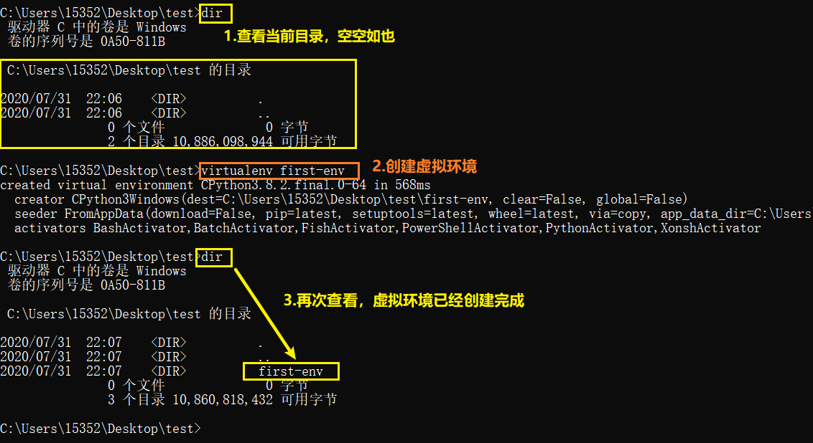
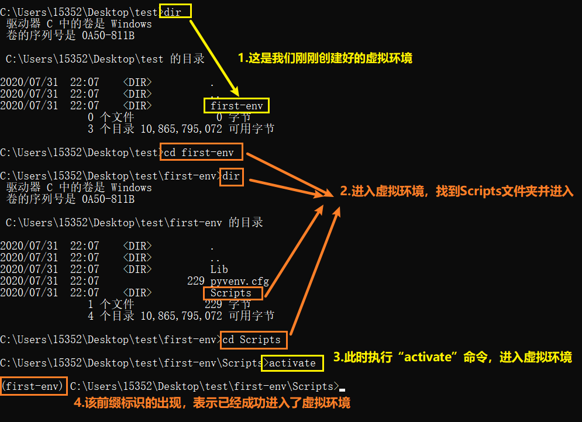

[toc]

# Python配置虚拟环境

## 01.Why——为什么需要虚拟环境？

到目前位置，我们所有的第三方包安装都是直接通过`pip install xx`的方式进行安装的，这样安装会将那个包安装到你的**系统级**的`Python`环境中。但是这样有一个问题，就是如果你现在用`Django 3.0`写了个网站，然后你的领导跟你说，之前有一个旧项目是用`Django 2.0`开发的，让你来维护，但是`Django 3.0`不再兼容`Django 2.0`的一些语法了。因为在**同一个环境中**，是**不能**安装同一个包的两个版本的。这时候就会碰到一个问题，我如何在我的电脑中同时拥有`Django 3.0`和`Django 2.0`两套环境呢？这时候我们就可以通过虚拟环境来解决这个问题。


## 02.What——虚拟环境原理介绍

虚拟环境相当于一个抽屉，在这个抽屉中安装的任何软件包都不会影响到其他抽屉。并且在项目中，我可以指定这个项目的虚拟环境来配合我的项目。比如我们现在有一个项目是基于`Django 3.0`版本，又有一个项目是基于`Django 3.0`的版本，那么这时候就可以创建两个虚拟环境，在这两个虚拟环境中分别安装`Django 3.0`和`Django 3.0`来适配我们的项目。

不要把虚拟环境想的多么神秘，其实，**一个虚拟环境就是一个文件夹**。

不同的项目用不同的虚拟环境，既解决的环境的依赖问题，也不至于让系统级环境越来越越大。


## 03.How——如何创建并使用虚拟环境

### 3.1 `virtualenv`

<a href="https://virtualenv.pypa.io/" target="_blank">virtualenv官方文档</a>

#### 3.1.1 安装`virtualenv`：

`virtualenv`是用来创建虚拟环境的软件工具，我们可以通过`pip`或者`pip3`来安装：

```bash
pip install virtualenv
pip3 install virtualenv
```

#### 3.1.2 创建虚拟环境：

创建虚拟环境非常简单，通过以下命令就可以创建了：

```bash
virtualenv [虚拟环境的名字]
```

如果你当前的`Python3/Scripts`的查找路径在`Python2/Scripts`的前面，那么将会使用`python3`作为这个虚拟环境的解释器。如果`python2/Scripts`在`python3/Scripts`前面，那么将会使用`Python2`来作为这个虚拟环境的解释器。



#### 3.1.3 进入虚拟环境

虚拟环境创建好了以后，那么可以进入到这个虚拟环境中，然后安装一些第三方包，进入虚拟环境在不同的操作系统中有不同的方式，一般分为两种，第一种是`Windows`，第二种是`*nix`：

1. `windows`进入虚拟环境：进入到虚拟环境的`Scripts`文件夹中，然后执行`activate`。
2. `*nix`进入虚拟环境：`source /path/to/virtualenv/bin/activate`



一旦你进入到了这个虚拟环境中，你安装包，卸载包都是在这个虚拟环境中，**不会**影响到外面的环境。

#### 3.1.4 退出虚拟环境

退出虚拟环境很简单，通过一个命令就可以完成：`deactivate`。

#### 3.1.5 创建虚拟环境的时候指定`Python`解释器

在电脑的环境变量中，一般是不会去更改一些环境变量的顺序的。也就是说比如你的`Python2/Scripts`在`Python3/Scripts`的前面，那么你不会经常去更改他们的位置。但是这时候我确实是想在创建虚拟环境的时候用`Python3`这个版本，这时候可以通过`-p`参数来指定具体的`Python`解释器：

```shell
virtualenv -p C:\Python36\python.exe [virutalenv name]
```

------

### 3.2 ` virtualenvwrapper`

`virtualenv`的不足：

* 创建虚拟环境时：需要在命令行进入指定目录再执行`virtualenv`命令。当虚拟环境的个数越来越多时，它们可能分布在电脑的各个地方，不易管理
* 进入虚拟环境时：需要在命令行进入目标虚拟环境所在目录，然后再执行`activate`，不能做到任意目录下激活。

`virtualenvwrapper`这个软件包可以让我们管理虚拟环境变得更加简单。不用再跑到某个目录下通过`virtualenv`来创建虚拟环境，并且激活的时候也不用跑到具体的目录下去激活。

上面我们虽然学习了virtualenv，但学习它更多是为了了解虚拟环境的概念。实际开发中，一般不直接用virtualenv，而是可以安装使用virtualenvwrapper，毕竟这个用起来方便的多。

<a href="https://pypi.org/project/virtualenvwrapper/" target="_blank">virtualenvwrapper说明与文档</a>

#### 3.2.1 安装`virtualenvwrapper`

1. *nix：`pip install virtualenvwrapper`。
2. windows：`pip install virtualenvwrapper-win`。

#### 3.2.2 `virtualenvwrapper`基本使用

1. 创建虚拟环境：

   ```shell
    mkvirtualenv my_env
   ```

   那么会在你**当前用户家目录**下创建一个`Env`的文件夹，然后将**所有**的虚拟环境都安装到这个目录下。
   如果你电脑中安装了`python2`和`python3`，并且两个版本中都安装了`virtualenvwrapper`，那么将会使用环境变量中第一个出现的`Python`版本来作为这个虚拟环境的`Python`解释器。

2. 切换到某个虚拟环境：

   在任何目录下，使用`workon`命令都可以直接进入目标虚拟环境

   ```shell
    workon [虚拟环境名]
   ```

3. 退出当前虚拟环境：

   ```shell
    deactivate
   ```

4. 删除某个虚拟环境：

   ```shell
    rmvirtualenv [虚拟环境名]
   ```

5. 列出所有虚拟环境：

   ```shell
    lsvirtualenv
   ```

6. 进入到虚拟环境所在的目录：

   ```shell
    cdvirtualenv [虚拟环境名]
   ```

#### 3.2.3 修改`mkvirtualenv`的默认路径：

在`我的电脑->右键->属性->高级系统设置->环境变量->系统变量`中添加一个参数`WORKON_HOME`，将这个参数的值设置为你需要的路径。

#### 3.2.4 创建虚拟环境的时候指定`Python`版本：

在使用`mkvirtualenv`的时候，可以指定`--python`的参数来指定具体的`python`路径：

```
mkvirtualenv --python==C:\Python36\python.exe [虚拟环境名]
```