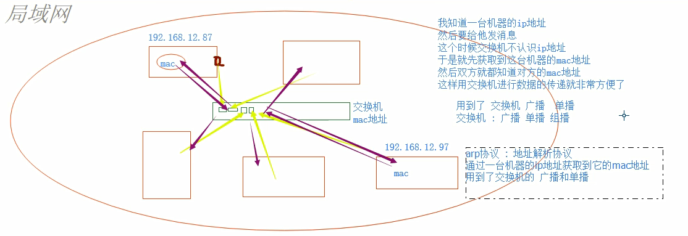
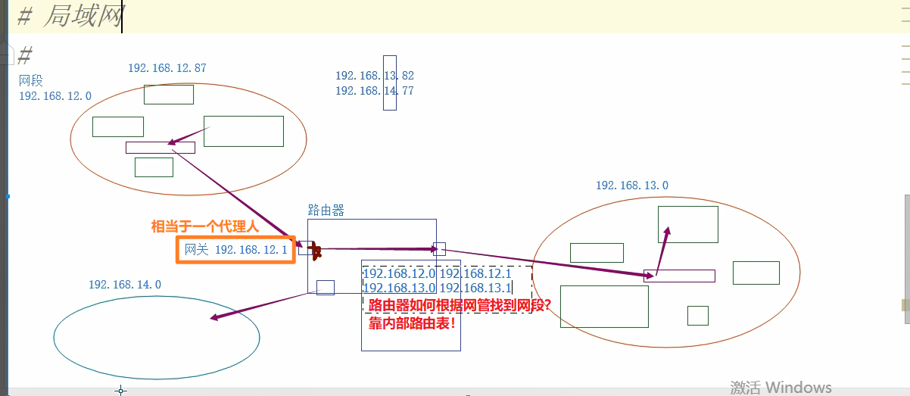

# Python网络编程

学习目标

* 网络的概念

* 基于原生的网络模块来实现通信
* 完成一些简单的程序
* 了解一些协议的特点，扬长避短

## 01.网络的概念

如何辨别你这个人？

* 学号：临时的编号、变化的
* 身份证号：唯一标识、不变的

如何区分一台计算机？

* 不变的：
  * MAC地址（网卡出厂时的出厂号，每个厂家都有自己的前缀序列，所以不会重复，全球唯一）
  * 能够唯一的标识你的机器
* 变化的：IP地址
  * 为什么有了MAC，还要IP？
    * 你有身份证号，学号和姓名就不用了吗？当然不是，只是为了适应不同的“搜素范围”，在中国找你，肯定要用身份证号，在你班里找你，用姓名就行了。
  * 能够更好更方便的找到你的机器

局域网通信



* 连在同一台“交换机”上的电脑组成的网络
* 关于交换机
  * 只能认识MAC地址
  * 能形成局域网
  * 可以实现广播、单播和组播
  * 具有缓存功能，不是每次都会用广播
* ARP协议：
  * 地址解析协议
  * 使用交换机，通过广播、单播、组播等方式，通过一台机器的IP地址来获取到它的MAC地址


局域网间的通信



* 局域网间的通信用“交换机”，局域网间的通信用“路由器”
* 路由器可以理解IP地址

IP地址

* ipv4
  * 点分十进制
  * 每一段都是8位二进制数：0.0.0.0-255.255.255.255
  * IP地址不够用咋整？
    * 将IP分为公网IP和内网 IP
* 公网地址
  * 
* 内网地址
  * 通过保留字段：
    * 192.168.0.0-192.168.255.255  学校
    * 172.16.0.0-172.31.255.255       学校
    * 10.0.0.0-10.255.255.255           公司
  * 不同内网间的地址是可以重复的

* 特殊IP
  * 127.0.0.1 本地回环地址
    * 过网卡，不过交换机
    * 常用来做测试
  * 自己的IP地址
    * `ipconfig`/`ifconfig`

子网掩码

对于`192.168.13.0`这一网段，内部最多有254台机器（网关也算一个），再多了怎么办呢？我可以把网段扩展成为`192.168.0.0`，可是这时候问题又来了,`192.168.12.1`和`192.168.13.1`到底在不在一个局域网内呢？这下就乱了！不同的网段有不同的结果！这时候就需要请出**子网掩码**了，它的作用很简单，就是**通过计算网段，判断两台机器是否在同一个局域网内**。怎么判断呢？

它是将本机的IP地址与子网掩码进行**按位与**，得到的就是网段了

举个例子

```bash
机器A的IP： 192.168.12.1   =>  11000000.10101000.00000110.00000001
子网掩码：  255.255.255.0  =>  11111111.11111111.11111111.00000000
上面两式按位与得机器A所在局域网的网段：192.168.12.0

机器B的IP： 192.168.13.1   =>  11000000.10101000.00000111.00000001
子网掩码：  255.255.255.0  =>  11111111.11111111.11111111.00000000
上面两式按位与得机器B所在局域网的网段：192.168.13.0


比较两个机器的网段，并不相同，说明二者不在一个局域网内！！
```

所以看两台机器在不在一个局域网内，不能光看IP，还要看子网掩码！

* IPv6地址
  * 冒分十六进制