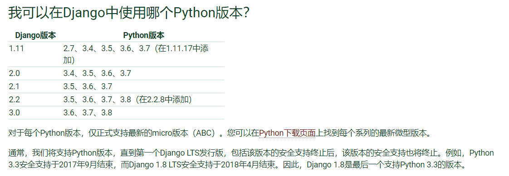
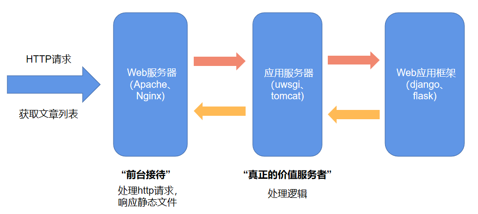
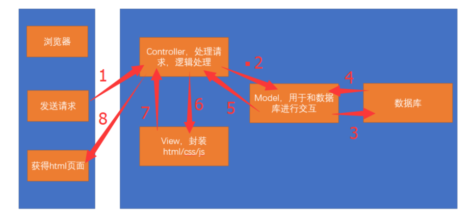
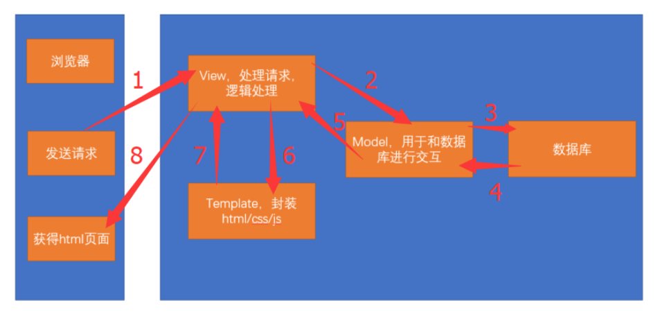

# Django介绍

Django，发音为[`dʒæŋɡəʊ]，Django诞生于2003年秋天，2005年发布正式版本，由Simon和Andrian开发。当时两位作者的老板和记者要他们几天甚至几个小时之内增加新的功能。两人不得已开发了Django这套框架以实现快速开发目的，因此Django生来就是为了**节省开发者时间**的。Django发展至今，被许许多多国内外的开发者使用，已经成为web开发者的首选框架。因此，如果你是用python来做网站，没有理由不学好Django。
选读：

1. [Python+Django如何支撑了7 亿月活用户的Instagram？](http://python.jobbole.com/87814/)
2. [Django商业网站](http://simple-is-better.com/sites/bussiness)

### Django版本和Python版本

[我可以在Django中使用哪个Python版本？](https://docs.djangoproject.com/en/3.0/faq/install/#what-python-version-can-i-use-with-django)

### web服务器和应用服务器以及web应用框架

- **web服务器**：负责处理http请求，响应静态文件，常见的有`Apache`，`Nginx`以及微软的`IIS`.
- **应用服务器**：负责处理逻辑的服务器。比如`php`、`python`的代码，是不能直接通过`nginx`这种**web服务器**来处理的，只能通过**应用服务器**来处理，常见的应用服务器有`uwsgi`、`tomcat`等。
- **web应用框架**：一般使用某种语言，封装了常用的`web`功能的框架就是**web应用框架**，`flask`、`Django`以及Java中的`SSH(Structs2+Spring3+Hibernate3)`框架都是web应用框架。

### Django和MVC

Django是一个遵循`MVC`设计模式的框架，`MVC`是`Model`、`View`、`Controller`的三个单词的简写。分别代表`模型`、`视图`、`控制器`。以下图片说明这三者之间的关系：

而`Django`其实也是一个`MTV`的设计模式。`MTV`是`Model`、`Template`、`View`三个单词的简写。分别代表`模型`、`模版`、`视图`。以下图片说明这三者之间的关系：

### 更多：

1. `Django`的官网：https://www.djangoproject.com/
2. `Django Book`2.0版本的中文文档：http://djangobook.py3k.cn/2.0/chapter01/
3. `Django`2.0版本的中文文档：http://python.usyiyi.cn/translate/django2/index.html