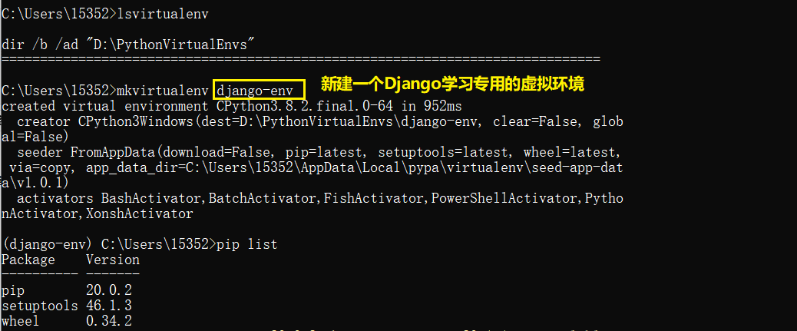
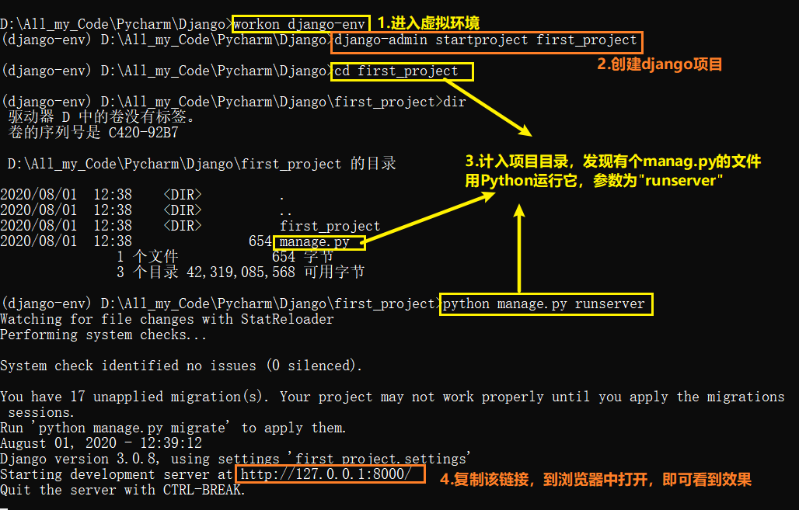
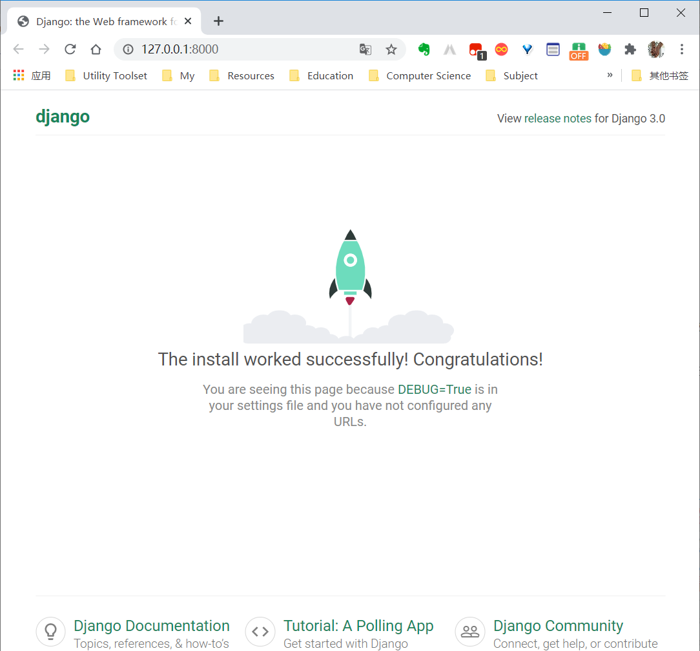
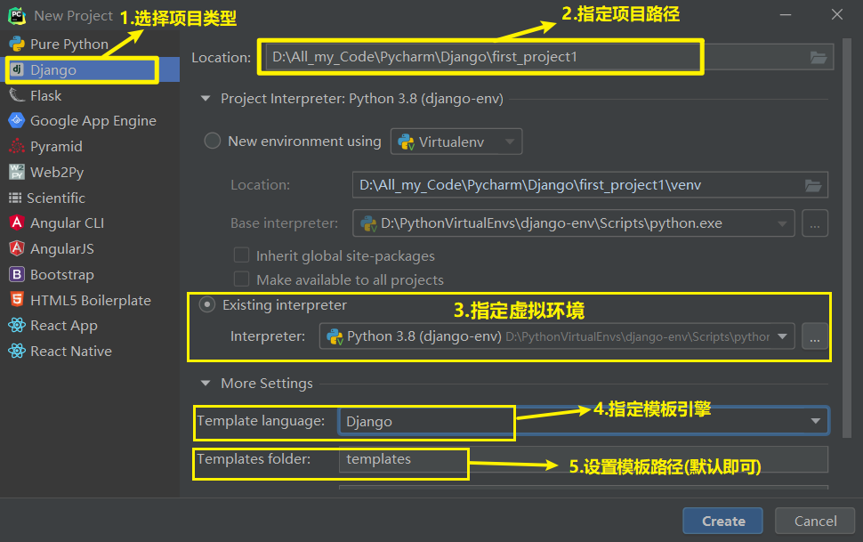
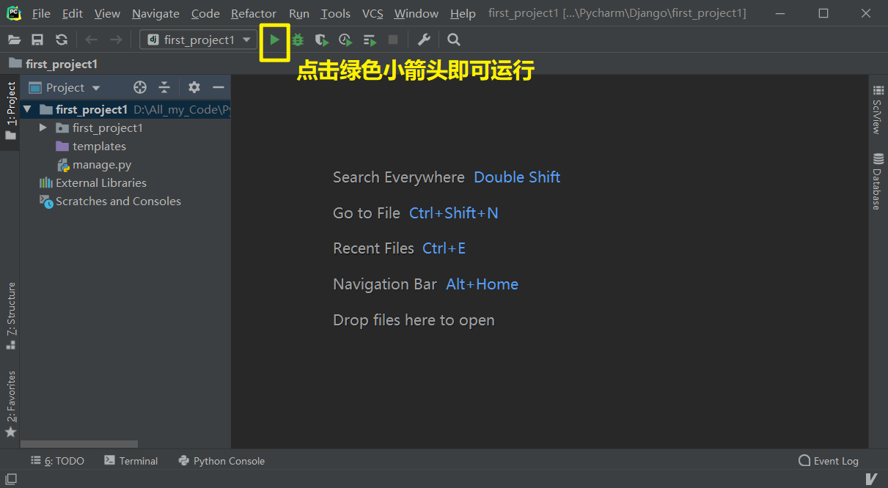

[toc]

# 第一个Django项目

## 01.创建虚拟环境

关于如何创建虚拟环境，已经在`Python/00-Python-环境搭建/虚拟环境`目录中做出了讲解，在此不再赘述。



## 02.创建并运行`Django`项目

### 2.1 用命令行的方式

#### 2.1.1 创建项目

打开终端，进入虚拟环境，进入到将要存放项目的目录(命令行的当前目录在哪，项目就创建在哪里)，使用命令：

```shell
django-admin startproject [项目名称]
```

即可创建。比如：`django-admin startproject first_project`。

#### 2.1.2 运行项目

进入到项目文件夹中，然后执行以下命令即可运行：

```shell
python manage.py runserver
```



运行效果如下：



### 2.2 用`pycharm`的方式

（本教程所用的Pycharm版本均为`PyCharm 2019.3.1 专业版`）

#### 2.2.1 创建项目

用`pycharm`新建一个`Django`项目，新建项目的截图如下：

虽然使用`pycharm`可以可视化创建完项目，但后期**创建app时还是需要重新进入到命令行**单独创建的。

#### 2.2.2 运行项目

通过`pycharm`运行。直接点击右上角的绿色箭头按钮即可运行。



### 2.3 补充：运行参数设置

上面的介绍中，我们都是用最简单最直接的方式运行的项目，所有参数都是默认的（如端口号是8000），其实这些参数是可以指定的，下面就此进行介绍。

#### 2.3.1 改变端口号

1. 在终端：运行的时候加上一个端口号就可以了。命令为：`python manage.py runserver 9000`。
2. 在pycharm中：项目配置->port。改成你想要的端口号，重新运行。

#### 2.3.2 让同局域网中的其他电脑访问本机的项目

1. 让项目运行的时候，host为0.0.0.0。

   * 在终端，使用命令：`python manage.py runserver 0.0.0.0:8000`。(此时必须指定端口号)
   * 在pycharm，项目配置->host。改成`0.0.0.0`。

2. 在`settings.py`文件中，配置`ALLOWED_HOSTS`，将本机的ip地址添加进去。示例代码如下：

   ```python
   ALLOWED_HOSTS = ['192.168.0.103']
   ```

   **ALLOWED_HOSTS这个变量是用来设置以后别人只能通过这个变量中的ip地址或者域名来进行访问**。

   注意：如果无法访问，请关闭自己电脑的防火墙再尝试。

## 03.项目结构介绍

1. `manage.py`：以后和项目交互基本上都是基于这个文件。一般都是在终端输入`python manage.py [子命令]`。可以输入`python manage.py help`看下能做什么事情。除非你知道你自己在做什么，一般情况下不应该编辑这个文件。
2. `settings.py`：保存项目所有的配置信息，以后所有和项目相关的配置都是放在这个里面。
3. `urls.py`：用来做url与视图函数映射的。以后来了一个请求，就会从这个文件中找到匹配的视图函数。
4. `wsgi.py`：专门用来做部署的。不需要修改。


## 04.Django的项目规范

### 4.1 app

#### 4.1.1 app的概念

`app`是`django`项目的组成部分。一个`app`代表项目中的一个模块，所有`URL`请求的响应都是由`app`来处理。比如豆瓣，里面有图书，电影，音乐，同城等许许多多的模块，如果站在`django`的角度来看，图书，电影这些模块就是`app`，图书，电影这些`app`共同组成豆瓣这个项目。因此这里要有一个概念，`django`项目由许多`app`组成，一个`app`可以被用到其他项目，`django`也能拥有不同的`app`。

在django项目的目录结构中，一个app就是一个**Python包**（“包”不是单纯的一个文件夹，“包”内是有`__init__.py`文件的）。

django的项目推荐规范：将项目按功能或模块进行分层，划分成一个app，所有和某个模块相关的代码都写到该app内。

#### 4.1.2 app的创建

django提供了一个非常方便的创建app的命令：

```shell
python manage.py startapp [app名称]
```

### 4.2 DEBUG模式

1. 在django项目的`settings.py`中有一个`DEBUG`变量，当其为`True`时，表示开启了DEBUG模式。默认情况下DEBUG模式是开启的。
2. 如果开启了DEBUG模式，那么以后我们修改了Django项目的代码，然后按下ctrl+s，那么Django就会自动的给我们重启项目，不需要手动重启。
3. 如果开启了DEBUG模式，那么以后Django项目中的代码出现bug了，那么在浏览器中和控制台会打印出错信息。
4. 在生产环境中，禁止开启DEBUG模式，不然有很大的安全隐患。若开启，别人将有机会通过报的错误看到你的源码！
5. 如果将DEBUG设置为False，那么必须要设置ALLOWED_HOSTS。如`ALLOWED_HOSTS=['127.0.0.1']`。