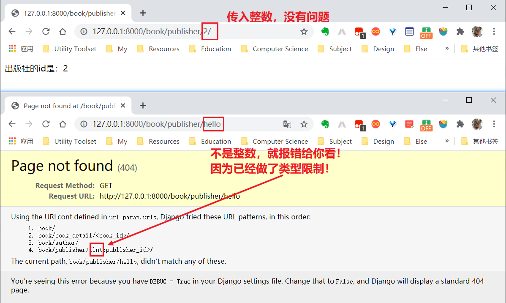

[toc]

#Django-URL

## 01.基本概念

### 1.1 URL

`URL`是`Uniform Resource Locator`的简写，统一资源定位符。

一个`URL`由以下几部分组成：

```
scheme://host:port/path/?query-string=xxx#anchor
```

- **scheme**：代表的是访问的协议，一般为`http`或者`https`以及`ftp`等。
- **host**：主机名，域名，比如`www.baidu.com`。
- **port**：端口号。当你访问一个网站的时候，浏览器默认使用80端口。
- **path**：查找路径。比如：`www.jianshu.com/trending/now`，后面的`trending/now`就是`path`
- **query-string**：<span name="查询字符串">查询字符串</span>，比如：`www.baidu.com/s?wd=python`，后面的`wd=python`就是查询字符串。
- **anchor**：锚点，后台一般不用管，前端用来做页面定位的。

注意：`URL`中的所有字符都是`ASCII`字符集，如果出现非`ASCII`字符，比如中文，浏览器会进行编码再进行传输。

### 1.2 视图函数

一个视图函数就是一个任务处理函数，用户想要服务器完成一个任务，需要先请求某个URL，服务器获取该URL后，找到该URL映射的视图函数，响应的处理任务就交给了视图函数。所以要想处理用户的请求，要完成两件事：

1. 编写视图函数
2. 将视图函数与URL做映射

编写视图函数要注意以下几点：

* 视图函数一般都写在`app`的`views.py`中。

* 视图的第一个参数**永远**都是`request`（一个HttpRequest）对象。这个对象存储了请求过来的所有信息，包括携带的参数以及一些头部信息等。在视图函数中，一般是完成逻辑相关的操作。比如这个请求是添加一篇博客，那么可以通过request来接收到这些数据，然后存储到数据库中，最后再把执行的结果返回给浏览器。
* 视图函数的返回结果**必须**是`HttpResponseBase`对象或者子类的对象。示例代码如下：

```python
from django.http import HttpResponse
def book_list(request):
    return HttpResponse("书籍列表！")
```

### 1.3 URL映射

视图写完后，要与URL进行映射，也即用户在浏览器中输入什么`url`的时候可以请求到这个视图函数。在用户输入了某个`url`，请求到我们的网站的时候，`django`会从**项目的(不是app的！)**`urls.py`文件中寻找对应的视图。在`urls.py`文件中有一个`urlpatterns`变量，以后`django`就会从这个变量中读取所有的匹配规则。匹配规则需要使用`django.urls.path`函数进行包裹，这个函数会根据传入的参数返回`URLPattern`或者是`URLResolver`的对象。示例代码如下：

```python
from django.contrib import admin
from django.urls import path
from book import views

urlpatterns = [
    path('admin/', admin.site.urls),
    path('book/',views.book_list)
]
```

关于URL映射，需要注意一下几点：
1. 为什么会去urls.py文件中寻找映射呢？
是因为在`settings.py`文件中配置了`ROOT_URLCONF`为`urls.py`。所有django会去`urls.py`中寻找。
2. 在`urls.py`中我们所有的映射，都应该放在`urlpatterns`这个变量中。
3. 所有的映射不是随便写的，而是使用`path`函数或者是`re_path`函数进行包装的。

## 02.URL传参

### 2.1 url传参数

有时候，`url`中包含了一些参数需要动态调整。比如简书某篇文章的详情页的url，是`https://www.jianshu.com/p/a5aab9c4978e`后面的`a5aab9c4978e`就是这篇文章的`id`，那么简书的文章详情页面的url就可以写成`https://www.jianshu.com/p/<id>`，其中id就是文章的id。那么如何在`django`中实现这种需求呢？这时候就要用到**url传参**了，下面介绍了实现这一功能的两种方式。

#### 2.1.1 “视图函数变量”方式

采用在url中使用 **变量** 的方式：在path的第一个参数中，使用 `/<参数名>` 的方式可以传递参数。然后在视图函数中也要写一个参数，视图函数中的参数 **必须和url中的参数名称保持一致** ，不然就找不到这个参数。另外，url中可以传递多个参数。

下面的示例代码中，`url_param`是项目名，`book`是其下的一个app

```python
# =========url_param/book/views.py==============
from django.http import HttpResponse
def book(request):
    return HttpResponse("图书首页")

def book_detail(request, book_id):  # 注意这里变量名用的是book_id
    text = "您获取的图书id是：%s" % book_id
    return HttpResponse(text)

# ===========url_param/url_param/urls.py=============
from django.urls import path
from book import views

urlpatterns = [
    path('book/', views.book),
    path('book/detail/<book_id>/', views.book_detail)  # 这里的book_id 必须和视图函数里的变量名一致！！！
]

#===========浏览器测试========
http://127.0.0.1:8000/book/detail/2
# >>> 您获取的图书id是：2
```

几点注意：

1. 视图函数的变量和URL中的变量名必须保护一致，否则Django找不到！
2. 注意`urlpatterns`变量里两个`path()`函数的第一个参数，他们的末尾都有一个`/`，**保险起见，这个斜杆不要随意丢弃！**否则有可能找不到视图函数！因为在浏览器输出`http://127.0.0.1:8000/2`时，有的浏览器会自动在最后加一个`/`，将url变成`http://127.0.0.1:8000/book_detail/2/`，最终想服务器发起请求的是末尾带斜杠的url，所以如果自己做映射时没有加这一个斜杆，Django将找不到视图函数！

#### 2.1.2 “查询字符串”方式（使用较多）

关于“查询字符串”的概念，在1.1节中已经做出介绍，<a href="#查询字符串">点此跳转</a>。

采用 **查询字符串** 的方式有以下特点：在url中，不需要单独的匹配查询字符串的部分；视图函数中也无需设置额外的参数，只需要在视图函数中使用`request.GET.get('参数名称')`的方式来获取。

【示例代码】

下面的示例代码中，`url_param`是项目名，`book`是其下的一个app

```python
# ============url_param/book/views.py================
from django.http import HttpResponse
def author_detail(request):  # 视图函数中无需设置额外参数
    author_id = request.GET.get('id')  # 使用GET获取参数
    text = "作者的id是：%s" % author_id
    return HttpResponse(text)

# ===============url_param/url_param/urls.py==============
from django.urls import path
from book import views
urlpatterns = [
    path('book/author/', views.author_detail),
]
```

因为查询字符串使用的是 `GET` 请求，所以我们通过 `request.GET` 来获取参数。并且因为`GET`是一个类似于字典的数据类型，所有获取值跟字典的方式都是一样的。

【效果展示】


### 2.2 url参数的PATH转换器（类型限制）

#### 2.2.1 先来个例子

2.1节讲了URL传参的两种方式，传递问题已经解决，现在我有进一步的需求，可不可以对传递的参数做类型限制呢？先上代码！

【代码实现】

下面的示例代码中，`url_param`是项目名，`book`是其下的一个app


```python
# ============url_param/book/views.py================
from django.http import HttpResponse
def publish_detail(request, publisher_id):
    text = "出版社的id是：%s" % publisher_id
    return HttpResponse(text)

# ===============url_param/url_param/urls.py==============
from django.urls import path
from book import views
urlpatterns = [
    path('book/publisher/<int:publisher_id>', views.publiser_detail), # 前面做了参数类型限制，如果输入其他类型，将显示找不到页面
]
```

【效果展示】



#### 2.2.2 内置的PATH转换器

Django内置了5种参数转换器：

* str：
  * 默认转换器
  * 除了斜杠`/`以外所有的字符都是可以的
* int：只有是一个或者多个的阿拉伯数字。
* path：所有的字符都是满足的。
* uuid：只有满足`uuid.uuid4()`这个函数返回的字符串的格式。
  * uuid全球唯一，可以作为数据表单的主键
  * uuid是内置库之一
* slug：英文中的横杠或者英文字符或者阿拉伯数字或者下划线才满足。


如何查看转换器源码？

* 【方法一】在pycharm中的某个.py文件中输入：`from django.urls import converters` 然后 `Ctrl+B` 进去看一下就好。
* 【方法二】直接去`django/usrls/converters.py` 文件中查看。

#### 2.2.3 自定义PATH转换器

为了对参数类型做出更个性化的限制，我们需要自定义参数转换器，当然，2.3.2节的re_path()也可以完成类似功能，到时根据需求选择其一便可以。

**需求**
实现一个获取文章列表的demo，用户可以根据`/articles/文章分类/`的方式来获取文章。其中文章分类采用的是`分类1+分类2+分类3...`的方式拼接的，并且如果只有一个分类，那就不需要加号。示例如下：
```
# 1. 第一种：获取python分类下的文章
/articles/python/
# 2. 第二种：获取python和django分类下的文章
/articles/python+django/
# 3. 第三种：获取python和django和flask分类下的文章
/articles/python+django+flask/
以此类推...
```

在“文章分类”参数传到视图函数之前要把这些分类分开来存储到列表中。
比如参数是`python+django`，那么传到视图函数的时候就要变成`['python','django']`。

以后在使用reverse反转的时候，限制传递“文章分类”的参数应该是一个列表，并且要将这个列表变成`python+django`的形式。

**自定义URL转换器**
之前已经学到过一些django内置的url转换器，包括有int、uuid等。有时候这些内置的url转换器并不能满足我们的需求，因此django给我们提供了一个接口可以让我们自己定义自己的url转换器。

自定义url转换器按照以下五个步骤来走就可以了： 
1. 定义一个类，直接继承自object就可以了。 
2. 在类中定义一个属性**regex**（这是属性名是不能变的！），这个属性是用来限制url转换器规则的正则表达式。 
3. 实现to_python(self,value)方法，这个方法是将url中的值转换一下，然后**传给视图函数**的。 
4. 实现to_url(self,value)方法，这个方法是在做**url反转**的时候，将传进来的参数转换后拼接成一个正确的url
5.  将定义好的转换器，使用`django.urls.converters.register_converter`方法注册到django中。

示例代码如下：
```python
from django.urls import register_converter

class CategoryConverter(object):
    regex = r'\w+|(\w+\+\w+)+'

    def to_python(self,value):
        # python+django+flask
        # ['python','django','flask']
        result = value.split("+")
        return result

    def to_url(self,value):
        # value：['python','django','flask']
        # python+django+flask
        if isinstance(value,list):
            result = "+".join(value)
            return result
        else:
            raise RuntimeError("转换url的时候，分类参数必须为列表！")

register_converter(CategoryConverter,'cate')
```

**结构优化**

1. 在app下单独建一个`converters.py`的文件，将转换器的定义、注册均放在里面
2. 将`converter.py`导入到app下的`__init__.py`中，否则其中的代码永远不会被执行。

### 2.3 path()函数和re_path()函数详解

#### 2.3.1 path()函数

`path`函数的定义为：`path(route,view,name=None,kwargs=None)`。以下对这几个参数进行讲解。

1. `route`参数：`url`的匹配规则。这个参数中可以指定`url`中需要传递的参数，比如在访问文章详情页的时候，可以传递一个`id`。传递参数是通过`<>`尖括号来进行指定的。并且在传递参数的时候，可以指定这个参数的数据类型，比如文章的`id`都是`int`类型，那么可以这样写`<int:id>`，以后匹配的时候，就只会匹配到`id`为`int`类型的`url`，而不会匹配其他的`url`，并且在视图函数中获取这个参数的时候，就已经被转换成一个`int`类型了。其中还有几种常用的类型：

   - str：非空的字符串类型。默认的转换器。但是不能包含斜杠。
   - int：匹配任意的零或者正数的整形。到视图函数中就是一个int类型。
   - slug：由英文中的横杠`-`，或者下划线`_`连接英文字符或者数字而成的字符串。
   - uuid：匹配`uuid`字符串。
   - path：匹配非空的英文字符串，可以包含斜杠。

2. `view`参数：可以为一个视图函数或者是`类视图.as_view()`或者是`django.urls.include()`函数的返回值。

3. `name`参数：这个参数是给这个`url`取个名字的，这在项目比较大，`url`比较多的时候用处很大。

4. `kwargs`参数：有时候想给视图函数传递一些额外的参数，就可以通过`kwargs`参数进行传递。这个参数接收一个字典。传到视图函数中的时候，会作为一个关键字参数传过去。比如以下的`url`规则：

   ```python
    from django.urls import path
    from . import views
   
    urlpatterns = [
        path('blog/<int:year>/', views.year_archive, {'foo': 'bar'}),
    ]
   ```

   那么以后在访问`blog/1991/`这个url的时候，会将`foo=bar`作为关键字参数传给`year_archive`函数。

#### 2.3.2 re_path()函数

re_path和path的作用都是一样的。只不过`re_path`是在写url的时候可以用正则表达式，功能更加强大。其实，正则表达式相当于2.2.3节的**自定义的参数转换器**。

写正则表达式都推荐使用原生（raw）字符串（不进行转义）。也就是以`r`开头的字符串。

*  如果不适用原生字符串，那么输入一个 `\`，需要输入4个 `\` ，因为要经过两层转义：编程语言转义&正则转义。 `r"\d{4}"` = `"\\\\d{4}"`

在正则表达式中定义变量，需要使用圆括号括起来。这个参数是有名字的，那么需要使用`?P<参数的名字>`。然后在后面添加正则表达式的规则。示例代码如下：

```python
# ================= app的urls.py====================
from django.urls import re_path
from . import views

urlpatterns = [
    # r""：代表的是原生字符串（raw）
    re_path(r'^$',views.article),
    
    # /article/list/<year>/
    re_path(r"^list/(?P<year>\d{4})/$",views.article_list),
    re_path(r"^list/(?P<month>\d{2})/$",views.article_list_month)
]

# ================app的views.py======================

from django.http import HttpResponse

def article(request):
    return HttpResponse("文章首页")

def article_list(request, year):  # 注意这里的参数名要和上面正则表达式捕获的参数名一致
    text = "您请求的是%s年的文章列表" % year
    return HttpResponse(text)

def article_list(request, month): # 注意这里的参数名要和上面正则表达式捕获的参数名一致
    text = "您请求的是%s月的文章列表" % month
    return HttpResponse(text)
```

如果不是特别要求。直接使用`path`就够了，省的把代码搞的很麻烦（因为正则表达式其实是非常晦涩的，特别是一些比较复杂的正则表达式，今天写的明天可能就不记得了）。除非是url中确实是需要使用正则表达式来解决才使用`re_path`。


#### 2.3.3 指定默认参数

使用`path`或者是`re_path`的后，在`route`中都可以包含参数，而有时候想指定默认的参数，这时候可以通过以下方式来完成。示例代码如下：

```python
from django.urls import path

from . import views

urlpatterns = [
    path('blog/', views.page),  # 因为下面的视图函数制定了默认参数，所以这里的url可以不传参数
    path('blog/page<int:num>/', views.page),
]

# View (in blog/views.py)
def page(request, num=1):
    # Output the appropriate page of blog entries, according to num.
    ...
```

当在访问`blog/`的时候，因为没有传递`num`参数，所以会匹配到第一个url，这时候就执行`view.page`这个视图函数，而在`page`函数中，又有`num=1`这个默认参数。因此这时候就可以不用传递参数。而如果访问`blog/1`的时候，因为在传递参数的时候传递了`num`，因此会匹配到第二个`url`，这时候也会执行`views.page`，然后把传递进来的参数传给`page`函数中的`num`。


## 03.URL模块化

如果项目变得越来越大。那么url会变得越来越多。如果都放在主 `urls.py` 文件中，那么将不太好管理。因此我们可以将每个app自己的urls放到自己的app中进行管理。一般我们会在app中新建一个 **urls.py** 文件用来存储所有和这个app相关的子url。
需要注意的地方：

* 应该使用`include`函数包含子`urls.py`，并且这个`urls.py`的路径是相对于 **项目** 的路径。示例代码如下：

```python
# ============主urls.py==============
from django.urls import path, include  # 导入include函数

urlpatterns = [
    path('admin/', admin.site.urls),
    path('book/',include('book.urls')),  # 使用include()函数将子urls包含进来
]

# =============子urls.py================
from django.urls import path
from . import views

urlpatterns = [  # 同样的要定义urlpatterns这样一个变量
    path('', views.book),
    path('detail/<book_id>/', views.book_detail),
    path('author/', views.author),
    path('publisher/<int:publisher_id>/', views.publiser_detail),
]
```

* 在 `app` 的 `urls.py` 中，所有的url匹配也要放在一个叫做 `urlpatterns` 的变量中，否则找不到。

* `url` 是会根据主 `urls.py` 和app中的 `urls.py` 进行拼接的，因此注意 **不要多加斜杠** 。习惯上把斜杆保留在**父级**。


## 04.URL命名

### 4.1 为什么需要url命名？

首先说明的是，url命名主要用于**url的重定向**。因为url是经常变化的。如果在代码中写死可能会经常改代码。给url取个名字，以后使用url的时候就使用他的名字进行反转就可以了，就不需要写死url了。

【示例代码】

（下面的示例代码中，`URL命名`是项目名，`front`和`cms`是下面的两个app，表示前台和后台）

```python
# ===============【主URL文件】: URL命名/URL命名/urls.py===================

from django.urls import path, include

urlpatterns = [
    path('', include('front.urls')),  # 无前缀时，跳转到front（前台）这一app
    path('cms/', include('cms.urls')),  # 有cms前缀时，跳转到cms（后台）这一app
]


# ===============【子URL文件】: URL命名/front/urls.py===================
from django.urls import path
from . import views
urlpatterns = [
    path('', views.index),  # 映射到index()视图函数
    path('login/', views.login),  # 映射到login()视图函数
]

# ===============【app视图文件】: URL命名/front/views.py==================
from django.http import HttpResponse
from django.shortcuts import redirect  # 导入重定向函数

def index(request):
    username = request.GET.get('username')
    if username:
        return HttpResponse("前台首页")
    else:
        return redirect('login/')  # 如果请求首页时没有用户信息，则转向登陆页面。注意这里我们把目标url写死了，这是有风险的！

def login(request):
    return HttpResponse("前台登陆页面")

```

上面第28行代码是相当不成熟的，一个很现实的问题，假如你的产品经理哪天抽风，说“我们要把所有的登录url由login换成signin！”，这时候你要改的地方可就不止一处了，首先要改掉16行的`login/`，然后还要改掉28行的`login/`，要是还有其他地方重定向了登录视图函数，你就需要一个一个改！不得不说，这是一件很蛋疼的事，麻烦不说，你要是漏改了某一处，那用户访问的时候可是会报错的！那么问题来了，有没有什么办法让我只改动第16行一个地方就可以呢？这就需要用到给url命名了~


### 4.2 如何给一个url指定名称？

>  在 `path` 函数中，传递一个 `name` 参数就可以指定。

假如产品经理抽风，让把所有的login改成signin，有了name属性的加持，不管怎么改，我只需改一处就行了。

示例代码如下：

```python
# ===================【app的urls文件】URL命名/front/urls.py===============
from django.urls import path
from . import views

urlpatterns = [
    path('', views.index, name='index'),  # 取个名
    path('login/', views.login, name='login'),  # 取个名
]

# ===============【app视图文件】: URL命名/front/views.py==================
from django.http import HttpResponse
from django.shortcuts import redirect, reverse  # 引入翻转函数

def index(request):
    username = request.GET.get('username')
    if username:
        return HttpResponse("front首页")
    else:
        return redirect(reverse('login'))  # 根据名字反转后重定向，这样就不会出错啦
def login(request):
    return HttpResponse("front登陆页面")
```

因为我是根据url的名字进行反转重定向的，所以不管怎么改，我只需要更改第7行的url就可以了，其他的地方都不用动！

#### 补充：reverse()函数

[django官方文档——reverse()](https://docs.djangoproject.com/en/3.0/ref/urlresolvers/#django.urls.reverse)

**还原传参**

1. 如果在反转url的时候，需要添加参数，那么可以传递`kwargs`参数到`reverse`函数中。示例代码如下：

   ```python
   detail_url = reverse('detail',kwargs={"article_id":1,'page':2})
   ```

2. 如果想要添加查询字符串的参数，则必须手动的进行拼接。示例代码如下：

   ```python
   login_url = reverse('login') + "?next=/"
   ```

**还原命名空间**

1. 还原应用命名空间：见4.3节
2. 还原实例命名空间：见4.4节


### 4.3 应用命名空间

在多个app之间，有可能产生同名的url。这时候为了避免反转url的时候产生混淆，可以使用 **应用命名空间** ，来做区分。定义应用命名空间非常简单，只要 **在 `app` 的 `urls.py` 中定义一个叫做`app_name`的变量** ，来指定这个应用的命名空间即可。示例代码如下：

```python
# 应用命名空间
app_name = 'front'

urlpatterns = [
    path('',views.index,name='index'),
    path('login/',views.login,name='login')
]
```

以后在做反转的时候就可以使用 **`应用命名空间:url_name`** 的方式进行反转。示例代码如下：

```python
login_url = reverse('front:login')
# 输出： /front/signin/
```

### 4.4 应用(app)命名空间 VS 实例命名空间

在使用include()函数时，Django允许使用 **多个url映射同一个app** ，每一个url叫做该app的一个实例。也就是说，一个app可以创建多个实例。所以这就会产生一个问题。以后在做反转的时候，我怎么知道是哪个实例映射过来的呢？为了解决这个问题，我们可以使用实例命名空间。

* 应用：app
* 实例：一个app有几个url，就有几个实例

实例命名空间也是非常简单，只要 **在`include`函数中传递一个`namespace`变量** 即可。示例代码如下：

```python
# ====================主urls.py=======================
urlpatterns = [
    path('',include('front.urls')),
    # 多个url映射到同一个app
    path('cms1/',include('cms.urls',namespace='cms1')),  # 指定实例
    path('cms2/',include('cms.urls',namespace='cms2')),
]
```

以后在做反转的时候，就可以根据实例命名空间来指定具体的url。示例代码如下：

```python
def index(request):
    username = request.GET.get("username")
    if username:
        return HttpResponse('CMS首页')
    else:
        # 获取当前的命名空间
        current_namespace = request.resolver_match.namespace
        return redirect(reverse("%s:login" % current_namespace)) # 之前是reverse(app_name:url_name) 现在相当于进一步细化
```

【应用命名空间】的概念要**大于** 【实例命名空间】，如果子urls.py中没有app_name，而指定name_space，会报错。

#### 补充：include()函数

[django官网-include()函数用法](https://docs.djangoproject.com/en/3.0/ref/urls/#django.urls.include)

1. include(module,namespace=None)：
    * module：子url的模块字符串。
    * namespace：实例命名空间。这个地方需要注意一点。如果指定实例命名空间，那么前提**必须要先指定应用命名空间**。也就是在子`urls.py`中添加`app_name`变量。

2. include((pattern_list, app_namespace), namespace=None)：`include`函数的第一个参数既可以为一个字符串，也可以为一个元组，如果是元组，那么元组的第一个参数是子`urls.py`模块的字符串，元组的第二个参数是应用命名空间。也就是说，应用命名空间既可以在子`urls.py`中通过`app_name`指定，也可以在`include`函数中指定。

3. include(pattern_list)：`pattern_list`是一个列表。这个列表中装的是`path`或者`re_path`函数。实例代码如下：

```python
# ==============主urls.py==============
from movie import views

urlpatterns = [
    # ====include用法二，在主url中指定app_name====
    path('book/', include(('book.urls', 'book'))),  
    
    # ====include 用法三，在主url中直接指定子url映射，该方法用的不多！====
    path('movie/',include([
        path('',views.movie),
        path('list/',views.movie_list),
    ])),
    
]
```

上面的用法二和用法三其实用的不多，用的最多的是一开始介绍的传统方式，即在子urls.py中指定app_name。


