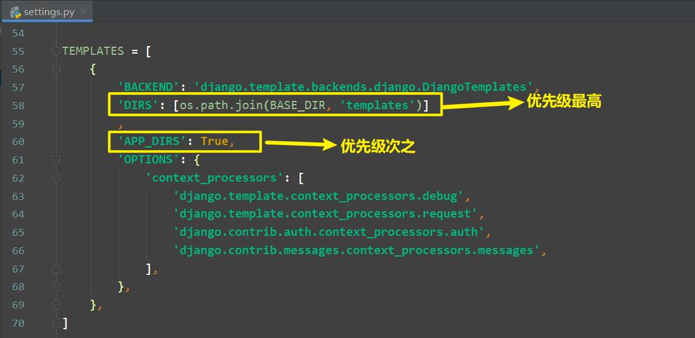
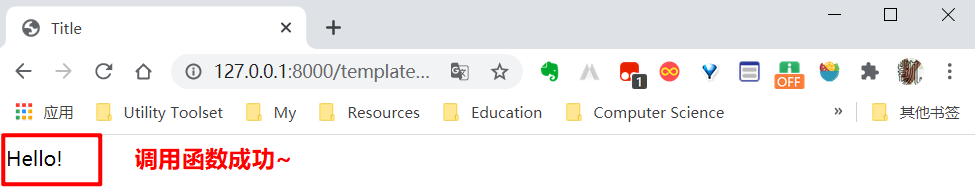
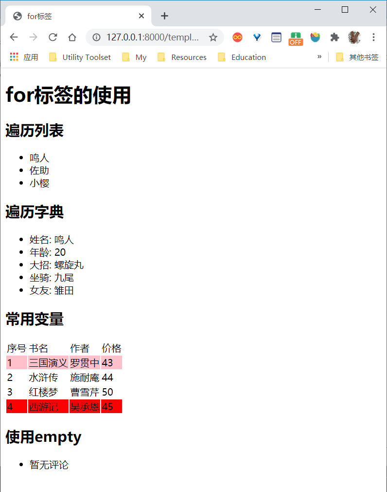

[toc]

# Django模版

## 01.模板简介

在之前的章节中，视图函数只是直接返回文本，而在实际生产环境中其实很少这样用，因为实际的页面大多是带有样式的HTML代码，这可以让浏览器渲染出非常漂亮的页面。目前市面上有非常多的模板系统，其中最知名最好用的就是DTL和Jinja2。DTL是Django Template Language三个单词的缩写，也就是Django自带的模板语言。当然也可以配置Django支持Jinja2等其他模板引擎，但是作为Django内置的模板语言，和Django可以达到无缝衔接而不会产生一些不兼容的情况。因此建议大家学习好DTL。

### 1.1 DTL与普通的HTML文件的区别
DTL模板是一种带有特殊语法的HTML文件，是更为“高级”的HTML，这个HTML文件可以被Django编译，可以传递参数进去，实现数据动态化。在编译完成后，生成一个普通的HTML文件，然后发送给客户端。

### 1.2 渲染模板
渲染模板有多种方式。这里讲下两种常用的方式。

1. `render_to_string`：找到模板，然后将模板编译后渲染成Python的字符串格式。最后再通过HttpResponse类包装成一个HttpResponse对象返回回去。示例代码如下：
```python
from django.template.loader import render_to_string
from django.http import HttpResponse
def book_detail(request,book_id):
    html = render_to_string("detail.html")
    return HttpResponse(html)
```
2. 以上方式虽然已经很方便了。但是django还提供了一个更加简便的方式，直接将模板渲染成字符串和包装成HttpResponse对象一步到位完成。示例代码如下：
```python
 from django.shortcuts import render
 def book_list(request):
     return render(request,'list.html')
```

### 1.3 <span name="模板查找路径">模版查找路径</span>

在项目的 **settings.py** 文件中。有一个 **`TEMPLATES`** 配置，这个配置包含了模板引擎的配置，模板查找路径的配置，模板上下文的配置等。模板路径可以在两个地方配置。、



* **`DIRS`**：这是一个列表，在这个列表中可以存放所有的模板路径，以后在视图中使用render或者render_to_string渲染模板的时候，会**首先**在这个列表的路径中查找模板。
* **`APP_DIRS`**：默认为True，这个设置为True后，会在`INSTALLED_APPS`变量中的安装了的APP下的`templates`（这个名字是不能变的！）文件加中查找模板。
* 查找顺序：比如代码render('list.html')。先会在DIRS这个列表中依次查找路径下有没有这个模板，如果有，就返回。如果DIRS列表中所有的路径都没有找到，那么会先检查当前这个视图所处的app是否已经安装，如果已经安装了，那么就先在当前这个app下的templates文件夹中查找模板，如果没有找到，那么会在其他已经安装了的app中查找。如果所有路径下都没有找到，那么会抛出一个TemplateDoesNotExist的异常。综上，模板查找的优先级为：
  * ==DIRS -> APP_DIRS==
  * ==项目templates  ->  当前app的templates   ->  其他app的templates==
* 在app中找到模板文件的两个条件
  * app已安装，即在settings.py中的**`INSTALLED_APPS`**这一列表变量中有app的名字
  * app下有**`templates`**文件夹，这个名字不能换成其他的，否则Django找不到


## 02.模版变量

### 2.1 访问简单变量

在模版中使用变量，需要完成两件事：

1. 在视图函数中渲染模板时，将待显示数据放入一个字典变量(习惯上起名为context)中，赋给给render()函数的context形参。

2. 在django模板中使用`{{ 变量 }}`来访问变量的值。

直接看代码：

```python
# ==================views.py=======================
from django.shortcuts import render

def index(request):
    context = {  # context变量是联系“数据库”和“前端显示”的桥梁，它必须是一个字典，将数据放在其中，在使用render()渲染模板时，将其一并传入即可。render()便可自动将数据显示在HTML中。
        'username': '杨阳羊'
    }
    return render(request, 'index.html', context=context)  # 将我们的context变量传入
```
在视图函数中，我们已经将模板文件和数据交给了render()进行渲染，模板是如何显示传入的数据的呢？其实很简单，使用 `{{ 变量名 }}` 就可以啦~代码如下：

```django
{# ===================index.html===================== #}
<!DOCTYPE html>
<html lang="en">
<head>
    <meta charset="UTF-8">
    <title>Title</title>
</head>
<body>
    {{ username }}  
    <!-- 此处HTML已经不是纯正的html，而是django模板语言，使用{{变量}}便可访问通过context传入的数据 -->
</body>
</html>
```

不知道你有没有注意到第一行的注释，注释内容放在了`{# #}`中，没错，这就是django模板的注释语法。

### 2.2 访问对象

如果想要访问 **对象** 的属性，那么可以通过`对象.属性名`来进行访问。

```python
# ==================views.py=======================
from django.shortcuts import render

class Person(object):  # 定义一个类
    def __init__(self,username):
        self.username = username

def index(request):
    p = Person("杨阳羊")  # 实例化一个对象
    context = {
        'person': p  # 将对象传入
    }
    return render(request, "index.html", context=context)
```
如果我想要在浏览器中显示传入对象的`username`属性，那么通过`person.username`便可实现，如下：
```django
{# ===================index.html===================== #}
<!DOCTYPE html>
<html lang="en">
<head>
    <meta charset="UTF-8">
    <title>Title</title>
</head>
<body>
    {{ person.username }}  
    <!-- 注意使用的person.username，而非p.username，是按context字典的键进行访问的 -->
</body>
</html>
```

### 2.3 访问字典

如果想要访问一个 **字典** 的key对应的value，那么只能通过`字典.key`的方式进行访问，不能通过`中括号[]`的形式进行访问。

```python
# ==================views.py=======================
from django.shortcuts import render


def index(request):
    context = {
        'person': {  # 这次传入的是一个字典哦~
            'username':'杨阳羊'
        }
    }
    return render(request, "index.html", context=context)
```
如果我想要在浏览器中显示传入对象的`username`属性，那么要在模板中通过`{{ person.username }}`实现；若使用`{{ person[username] }}`，django会报错。

因为在访问字典变量的固有属性或方法时也是使用`点.`来访问，因此不能在字典中定义字典本身就有的属性名或方法名当作`key`，否则就无法访问到字典的原始属性或方法了。如下：

```python
context = {
    'person': {
        'username':'杨阳羊',
        'keys':'abc'
    }
}
```
以上因为将`keys`作为`person`这个字典的`key`了。因此以后在模版中访问`person.keys`的时候，返回的不是这个字典的固有方法——返回所有的key，而是`abc`。

### 2.4 访问列表或元组

如果想要访问 **列表或元组** ，那么也是通过`点.`的方式进行访问，不能通过`中括号[]`的形式进行访问。这一点和python中是不一样的。示例代码如下：

```django
{{ persons.0 }}  {# 访问第0个变量 #}
{{ persons.1 }}  {# 访问第1个变量 #}
```


### 2.5 <span name="DTL访问函数">访问函数</span>

what？还能访问函数？没错，DTL中是可以调用来自context的函数的，但是吧，有一个挺致命的缺陷——不能用`()`方式调用，也就是说不能传参……所以这样的函数意义也不是很大，也正因为如此，DTL推出了“过滤器”这一工具，我们将在<a href="#模板过滤器">04.模板过滤器</a>中学习到。

虽然意义不大，但我们还是来看一下DTL中是如何调用函数的吧，为后期“模板过滤器”的学习打点基础~

【代码实现】

```python
# ====================views.py===================
from django.shortcuts import render


def greet():
    return "Hello!"


def index(request):
    context = {
        'greet_func': greet,
    }
    return render(request, 'index.html', context=context)
```

```django
{# ===============index.html================== #}
<body>
    {{ greet_func }}
</body>
```

【效果展示】



## 03.模板标签

### 3.0 何为标签？

django的模板标签可以理解为编程语言中的关键字。以Python为例，Python中的`if...else...`可以实现分支逻辑，`for`可以实现循环控制，其实在模板（加强版的HTML）中，我们也会有类似的需求，故引入了**模板标签**来实现类似的功能。

下面我们将介绍几种常见的标签：

* if（重点掌握）
* for（重点掌握）
* with
* url（重点掌握）
* spaceless
* autoescape
* verbatim

更多关于django模板标签的知识，请看官网：[django官方文档-DTL标签](https://docs.djangoproject.com/zh-hans/3.0/ref/templates/builtins/#ref-templates-builtins-tags) 。

若想查看标签源码也很简单，有两种方法：

1. 在Python文件中导入`from django.template import defaulttags`，`Ctrl+单击`进入查看。
2. 直接进入`django/template/defaulttags.py`查看。


### 3.1 if标签（重要）

#### 3.1.1 先来个例子

下面的视图函数中，我们将包含年龄变量的字典变量和模板文件一同渲染：

```python
# ====================views.py=======================
from django.shortcuts import render

def label_if(request):
    context = {
        'age': 20,
    }
    return render(request, "index.html", context=context)
```

如果我想根据age的范围反馈给用户不同的内容，那该怎么办呢？此时就到了**if标签**大显身手的时候了，直接看代码吧！

```django
{# =====================index.html===================== #}
<!DOCTYPE html>
<html lang="en">
<head>
    <title>Title</title>
</head>
<body>
    
        <p>您的年龄小于18岁</p>
    
        <p>您的年龄等于18岁</p>
    
        <p>您的年龄大于18岁</p>
     
</body>
</html>
```

如上所示，上面的if用``括了起来，这就是django模板标签的语法了。由于使用了if标签，在返回给用户时时，上面的三个`<p>`标签只会根据传入的年龄显示一个。这种操作是传统的HTML无法实现的，当然，这只是DTL强大之处的一个小小缩影……

#### 3.1.2 if标签语法

1. 所有的标签都是在``之间。
2. if标签有闭合标签。就是``。
3. if标签的判断运算符，就跟python中的判断运算符是一样的。`==、!=、<、<=、>、>=、in、not in、is、is not`这些都可以使用。
4. 还可以使用`elif`以及`else`等标签。


### 3.2 for...in..标签（重要）

`for...in...`标签类似于`Python`中的`for...in...`。可以遍历列表、元组、字符串、字典等一切可以遍历的对象。

#### 3.2.1 遍历列表

示例代码如下：

```python
# ===========view.py==============
context = {
    'persons': [  # 遍历列表示例
        '鸣人',
        '佐助',
        '小樱'
    ],
}
```

```django
{# ==============模板文件==============  #}
<ul>
    
    <li>{{ person }}</li>
    
</ul>
```

如果想要反向遍历，那么在遍历的时候就加上一个`reversed`。示例代码如下：

```django
<ul>
    
    <li>{{ person }}</li>
    
</ul>
```

#### 3.2.2 遍历字典

遍历字典的时候，需要使用`items`、`keys`和`values`等方法。在`DTL`中，执行一个方法**不能**使用圆括号的形式。遍历字典示例代码如下：

```python
# ===================views.py===============
context = {
    'infos': {  # 遍历字典示例
        '姓名': '鸣人',
        '年龄': 20,
        '大招': '螺旋丸',
        '坐骑': '九尾',
        '女友': '雏田',
    },
}
```

```django
{# ==============模板文件==============  #}
<ul>
    
        <li>{{ key }}: {{ value }}</li>
    
</ul>
```


#### 3.2.3 常用变量

在`for`循环中，`DTL`提供了一些变量可供使用。这些变量如下：

* `forloop.counter`：当前循环的下标。以1作为起始值。
* `forloop.counter0`：当前循环的下标。以0作为起始值。
* `forloop.revcounter`：当前循环的反向下标值。比如列表有5个元素，那么第一次遍历这个属性是等于5，第二次是4，以此类推。并且是以1作为最后一个元素的下标。
* `forloop.revcounter0`：类似于forloop.revcounter。不同的是最后一个元素的下标是从0开始。
* `forloop.first`：是否是第一个元素。
* `forloop.last`：是否是最后一个元素。
* `forloop.parentloop`：如果有多个循环嵌套，那么这个属性代表的是上一级的for循环。
* 模板中的for...in...==没有==continue和break语句，这一点和Python中有很大的不同，一定要记清楚！ 

```python
# ================views.py===================
context = {
		'books': [  # 常用变量示例
        {
            'name': '三国演义',
            'author': '罗贯中',
            'price': '43',
        },
        {
            'name': '水浒传',
            'author': '施耐庵',
            'price': '44',
        },
        {
            'name': '红楼梦',
            'author': '曹雪芹',
            'price': '50',
        },
        {
            'name': '西游记',
            'author': '吴承恩',
            'price': '45',
        },
    ],
}
```


```django
{# ==============模板文件==============  #}
<table>
        <thead>
            <tr>
                <td>序号</td>
                <td>书名</td>
                <td>作者</td>
                <td>价格</td>
            </tr>
        </thead>
        <tbody>
            
                
                    <tr style="background: pink">
                
                    <tr style="background: red">
                
                    <tr>
                
                        <td>{{ forloop.counter }}</td>
                        <td>{{ book.name }}</td>
                        <td>{{ book.author }}</td>
                        <td>{{ book.price }}</td>
                </tr>
            
        </tbody>
    </table>
```


#### 3.2.4 使用`empty`标签
这个标签使用跟`for...in...`是一样的，只不过是在遍历的对象如果没有元素的情况下，会执行`empty`中的内容。示例代码如下：

```python
# ==================view.py=================
context = {
    'comments': [
        # '好',
        # '真好',
        # '确实好',
    ]
}
```

```django
{# ==============模板文件==============  #}
<ul>
    
        <li>{{ comment }}</li>
    
        <li>暂无评论</li>
    
</ul>
```

####3.2.5 完整代码

**【代码实现】**

```python
# ====================view.py====================
from django.shortcuts import render


def traverse(request):
    context = {
        'persons': [  # 遍历列表示例
            '鸣人',
            '佐助',
            '小樱'
        ],

        'infos': {  # 遍历字典示例
            '姓名': '鸣人',
            '年龄': 20,
            '大招': '螺旋丸',
            '坐骑': '九尾',
            '女友': '雏田',
        },

        'books': [  # 常用变量示例
            {
                'name': '三国演义',
                'author': '罗贯中',
                'price': '43',
            },
            {
                'name': '水浒传',
                'author': '施耐庵',
                'price': '44',
            },
            {
                'name': '红楼梦',
                'author': '曹雪芹',
                'price': '50',
            },
            {
                'name': '西游记',
                'author': '吴承恩',
                'price': '45',
            },
        ],

        'comments': [
            # '好',
            # '真好',
            # '确实好',
        ]
    }
    return render(request, 'index.html', context=context)
```

对应的模板文件如下：

```django
{# ==================index.html=================== #}
<!DOCTYPE html>
<html lang="en">
<head>
    <meta charset="UTF-8">
    <title>for标签</title>
</head>
<body>
    <h1>for标签的使用</h1>
    {#  ===============遍历列表==============  #}
    <h2>遍历列表</h2>
    <ul>
        
             <li>{{ person }}</li>
        
    </ul>
    {#  ===============遍历字典==============  #}
    <h2>遍历字典</h2>
    <ul>
        
            <li>{{ key }}: {{ value }}</li>
        
    </ul>
    {#  ===============常用变量==============  #}
    <h2>常用变量</h2>
    <table>
        <thead>
            <tr>
                <td>序号</td>
                <td>书名</td>
                <td>作者</td>
                <td>价格</td>
            </tr>
        </thead>
        <tbody>
            
                
                    <tr style="background: pink">
                
                    <tr style="background: red">
                
                    <tr>
                
                        <td>{{ forloop.counter }}</td>
                        <td>{{ book.name }}</td>
                        <td>{{ book.author }}</td>
                        <td>{{ book.price }}</td>
                </tr>
            
        </tbody>
    </table>
    {#  ===============常用变量==============  #}
    <h2>使用empty</h2>
    <ul>
        
            <li>{{ comment }}</li>
        
            <li>暂无评论</li>
        
    </ul>
</body>
</html>
```

**【效果展示】**



### 3.3 with标签

1. 在模板中，想要定义变量，可以通过`with`语句来实现。
2. `with`语句有两种使用方式，第一种是`with var=xxx`的形式，该种方法极其要注意的一点是：**等号两端不能有任何空格！**（这一点倒是和Shell编程的语法有些相似~）；第二种是`with xxx as var`的形式。
3. 定义的变量只能在with语句块中使用，在with语句块外面使用取不到这个变量。
示例代码如下：
```django
{# 用法一 #}

    <p>{{ zs }}</p>
    <p>{{ zs }}</p>


{# 下面这个因为超过了with语句块，因此不能使用 #}
<p>{{ zs }}</p>

{# 用法二 #}

    <p>{{ zs }}</p>

```

### 3.4 url标签（重要）

`url`标签：在模版中，我们经常要写一些`url`，比如某个`a`标签中需要定义`href`属性。当然如果通过硬编码的方式直接将这个`url`写死在里面也是可以的。但是这样对于以后项目维护可能不是一件好事。因此建议使用这种反转的方式来实现，类似于`django`中的`reverse`一样。示例代码如下：

```django
<a href="">图书列表页面</a>
```

如果`url`反转的时候需要传递参数，那么可以在后面传递。但是参数分位置参数和关键字参数。位置参数和关键字参数不能同时使用。示例代码如下：

```django
# path部分
path('detail/<book_id>/',views.book_detail,name='detail')

# url反转，使用位置参数
<a href="">图书详情页面</a>

# url反转，使用关键字参数
<a href="">图书详情页面</a>
```

如果想要在使用`url`标签反转的时候要传递查询字符串的参数，那么必须要手动在在后面添加。示例代码如下：

```django
<a href="?page=1">图书详情页面</a>
```

如果需要传递多个参数，那么通过空格的方式进行分隔。示例代码如下：

```django
<a href="">图书详情页面</a>
```

### 3.5 spaceless标签

`spaceless`标签：移除html**标签之间**的空白字符。包括空格、tab键、换行等。示例代码如下：

```django
 
     <p>
         <a href="foo/">Foo</a>
     </p>
 
```

那么在渲染完成后，会变成以下的代码：

```html
 <p><a href="foo/">Foo</a></p>
```

`spaceless`只会移除html**标签之间**的空白字符。而不会移除标签与文本之间的空白字符。看以下代码：

```django
 
     <strong>
         Hello
     </strong>
 
```

这个将不会移除`strong`中的空白字符。

### 3.6 <span name="autoescape标签">autoescape标签</span>

1. DTL中默认已经开启了自动转义。会将那些特殊字符进行转义。比如会将`<`转义成`&lt;`等。
2. 如果你不知道自己在干什么，那么最好是使用DTL的自动转义。这样网站才不容易出现XSS漏洞。
3. 如果变量确实是可信任的。那么可以使用 `autoescape` 标签来关掉自动转义。示例代码如下：
```django

	{{ info }}

```

在DTL的过滤器中，有一个与autoescape标签功能类似的过滤器：

<a href="#safe过滤器">safe过滤器</a>

### 3.7 verbatim标签

`verbatim`标签：默认在`DTL`模板中是会去解析那些特殊字符的。比如``以及`{{`等。如果你在某个代码片段中不想使用`DTL`的解析引擎。那么你可以把这个代码片段放在`verbatim`标签中。示例代码下：

```django

	{{if dying}}Still alive.{{/if}}

```

这个verbatim标签有什么实际应用场景呢？

开发一个大型网站，不会只用到DTL这一种模板引擎，出于不同的需求，我们会用到其他的模板引擎，如[art-template](https://github.com/aui/art-template)，这是一个纯JavaScript编写的模板引擎，效率要比DTL高很多。而两者的语法又有类似之处，所以混合使用时极易容易出问题，如果将新引擎语句放置在verbatim标签内就完全OK了，这就是verbatim标签存在的意义。

## 04.<span name='模板过滤器'>模板过滤器</span>

### 4.1 为什么需要过滤器？

之前在学习DTL变量时我们已经知道，DTL种是可以调用函数的（<a href="#DTL访问函数">点此回顾</a>）。但是不支持函数的调用形式`()`，因此不能给函数传递参数，这将有很大的局限性。而过滤器 **其实就是一个函数** ，可以对需要处理的参数进行处理，并且还可以额外接收一个参数（也就是说，最多只能有 **2个参数** ）。

更多关于DTL过滤器的内容，请看官网：[django官方文档-DTL过滤器](https://docs.djangoproject.com/zh-hans/3.0/ref/templates/builtins/#built-in-filter-reference)。

若想查看过滤器源码也很简单，有两种方法：

1. 在Python文件中导入`from django.template import defaultfilters`，`Ctrl+单击`进入查看。
2. 直接进入`django/template/defaultfilters.py`查看。

### 4.2 Django常见内置过滤器
#### 4.2.1 add过滤器
将传进来的参数添加到原来的值上面。这个过滤器会尝试将`值`和`参数`转换成整形然后进行相加。如果转换成整形过程中失败了，那么会将`值`和`参数`进行拼接。如果是字符串，那么会拼接成字符串，如果是列表，那么会拼接成一个列表。示例代码如下：

```django
{{ value|add:"2" }}
```

如果`value`是等于4，那么结果将是6。如果`value`是等于一个普通的字符串，比如`abc`，那么结果将是`abc2`。`add`过滤器的源代码如下：

```python
@register.filter(is_safe=False)
def add(value, arg):
    """Add the arg to the value."""
    try:
        return int(value) + int(arg)
    except (ValueError, TypeError):
        try:
            return value + arg
        except Exception:
            return ''
```

#### 4.2.2 cut过滤器
移除值中所有指定的字符串。类似于`python`中的`replace(args,"")`。示例代码如下：

```django
{{ value|cut:" " }}
```

以上示例将会移除`value`中所有的空格字符。`cut`过滤器的源代码如下：

```python
@register.filter
@stringfilter
def cut(value, arg):
    """Remove all values of arg from the given string."""
    safe = isinstance(value, SafeData)
    value = value.replace(arg, '')
    if safe and arg != ';':
        return mark_safe(value)
    return value
```

#### 4.2.3 date过滤器
将一个日期按照指定的格式，格式化成字符串。示例代码如下：

```python
# ==================views.py=================
context = {
	"today": datetime.datetime.now()
}

# ==================模版文件==================
{{ today|date:"Y-m-d H:i:s" }} #我的标准时间格式
# 输出：2020-06-06 14:19:06
```

那么将会输出`2020-06-06 14:19:06` 。其中`Y`代表的是四位数字的年份，`m`代表的是两位数字的月份，`d`代表的是两位数字的日。  
还有更多时间格式化的方式。见下表。

| 格式字符 | 描述                                 | 示例  |
| -------- | ------------------------------------ | ----- |
| Y        | 四位数字的年份                       | 2018  |
| m        | 两位数字的月份                       | 01-12 |
| n        | 月份，1-9前面没有0前缀               | 1-12  |
| d        | 两位数字的天                         | 01-31 |
| j        | 天，但是1-9前面没有0前缀             | 1-31  |
| g        | 小时，12小时格式的，1-9前面没有0前缀 | 1-12  |
| h        | 小时，12小时格式的，1-9前面有0前缀   | 01-12 |
| G        | 小时，24小时格式的，1-9前面没有0前缀 | 1-23  |
| H        | 小时，24小时格式的，1-9前面有0前缀   | 01-23 |
| i        | 分钟，1-9前面有0前缀                 | 00-59 |
| s        | 秒，1-9前面有0前缀                   | 00-59 |


#### 4.2.4 default

如果值被评估为`False`。比如`[]`，`""`，`None`，`{}`等这些在`if`判断中为`False`的值，都会使用`default` 过滤器提供的默认值。示例代码如下：

```django
{{ value|default:"nothing" }}
```

如果`value`是等于一个空的字符串。比如`""`，那么以上代码将会输出`nothing`。

#### 4.2.5 default\_if\_none

如果值是`None`，那么将会使用`default_if_none`提供的默认值。这个和`default`有区别，`default`是所有被评估为`False`的都会使用默认值。而`default_if_none`则只有这个值是等于`None`的时候才会使用默认值。示例代码如下：

```django
{{ value|default_if_none:"nothing" }}
```

如果`value`是等于`""`也即空字符串，那么以上会输出空字符串。如果`value`是一个`None`值，以上代码才会输出`nothing`。

#### 4.2.6 first

返回列表/元组/字符串中的第一个元素。示例代码如下：

```django
{{ value|first }}
```

如果`value`是等于`['a','b','c']`，那么输出将会是`a`。

#### 4.2.7 last

返回列表/元组/字符串中的最后一个元素。示例代码如下：

```django
{{ value|last }}
```

如果`value`是等于`['a','b','c']`，那么输出将会是`c`。

#### 4.2.8 floatformat

使用 **四舍五入** 的方式格式化一个浮点类型。如果这个过滤器没有传递任何参数。那么只会在小数点后保留 **一个** 小数，如果小数后面全是0，那么只会保留整数。当然也可以传递一个参数，标识具体要保留几个小数。

1. 如果没有传递参数：

| value    | 模版代码                  | 输出 |
| -------- | ------------------------- | ---- |
| 34.23234 | `{{ value|floatformat }}` | 34.2 |
| 34.000   | `{{ value|floatformat }}` | 34   |
| 34.260   | `{{ value|floatformat }}` | 34.3 |

2. 如果传递参数：

| value    | 模版代码                  | 输出   |
| -------- | ------------------------- | ------ |
| 34.23234 | `{{value|floatformat:3}}` | 34.232 |
| 34.0000  | `{{value|floatformat:3}}` | 34.000 |
| 34.26000 | `{{value|floatformat:3}}` | 34.260 |

#### 4.2.9 join

类似与`Python`中的`join()`，将列表/元组/字符串用指定的字符进行拼接。示例代码如下：

```django
{{ value|join:"/" }}
```

如果`value`是等于`['a','b','c']`，那么以上代码将输出`a/b/c`。

#### 4.2.10 length

获取一个列表/元组/字符串/字典的长度，类似Python中的`len()`。示例代码如下：

```django
{{ value|length }}
```

如果`value`是等于`['a','b','c']`，那么以上代码将输出`3`。如果`value`为`None`，那么以上将返回`0`。

#### 4.2.11 lower

将值中所有的字符全部转换成小写。示例代码如下：

```django
{{ value|lower }}
```

如果`value`是等于`Hello World`。那么以上代码将输出`hello world`。

#### 4.2.12 upper

类似于`lower`，只不过是将指定的字符串全部转换成大写。

#### 4.2.13 random:随机选择

在被给的列表/字符串/元组中随机的选择一个值。示例代码如下：

```django
{{ value|random }}
```

如果`value`是等于`['a','b','c']`，那么以上代码会在列表中随机选择一个。可以用来做点名或抽奖功能。

#### 4.2.14 <span name="safe过滤器">safe</span>：关闭自动转义

标记一个字符串是安全的。也即会 **关掉这个字符串的自动转义** 。

相当于  <a href="#autoescape标签"></a> 的缩写形式。

示例代码如下:

```django
{{value|safe}}
```

如果`value`是一个不包含任何特殊字符的字符串，比如`<a>`这种，那么以上代码就会把字符串正常的输入。如果`value`是一串`html`代码，那么以上代码将会把这个`html`代码渲染到浏览器中。

#### 4.2.15 slice：切片

类似于`Python`中的切片操作。示例代码如下：

```django
{{ some_list|slice:"1::2" }}  {# 以2为步长获取从1开始往后的所有元素 #}
```

以上代码将会给`some_list`从`1`开始做切片操作。

#### 4.2.16 striptags

删除字符串中所有的`html`标签。只留下纯文本进行展示。常用，比如博客摘要的显示。

示例代码如下：

```django
{{ value|striptags }}
```

如果`value`是`<strong>hello world</strong>`，那么以上代码将会输出`hello world`。

#### 4.2.17 truncatechars

如果给定的字符串长度超过了过滤器指定的长度。那么就会进行切割，并且会拼接三个点来作为省略号。示例代码如下：

```django
{{ value|truncatechars:5 }}
```

如果`value`是等于`北京欢迎您~`，那么输出的结果是`北京...`。可能你会想，为什么不会`北京欢迎您...`呢。因为三个点也占了三个字符，所以`北京`+三个点的字符长度就是5。

#### 4.2.18 truncatechars\_html

类似于`truncatechars`，只不过是不会切割`html`标签。示例代码如下：

```django
{{ value|truncatechars:5 }}
```

如果`value`是等于`<p>北京欢迎您~</p>`，那么输出将是`<p>北京...</p>`。


### 4.3 自定义过滤器笔记

#### 步骤

1. 首先在某个app中，创建一个python **包** ，叫做`templatetags`，注意，这个包的名字 **必须** 为`templatetags`，不然就找不到。

2. 在这个`templatetags`包下面，创建一个python文件用来存储过滤器。

3. 在新建的python文件中，定义过滤器（也就是函数），这个函数的第一个参数永远是被过滤的那个值，并且如果在使用过滤器的时候传递参数，那么还可以定义另外一个参数。但是过滤器最多只能有2个参数。

4. 在写完过滤器（函数）后，要使用`django.template.Library().filter(self, name=None, filter_func=None):`进行注册。或者使用装饰器。

```python
# ===========my_filter.py============
# ====方法一====
from django import template
register = template.Library()
# 过滤器最多有两个参数，且第一个永远是被过滤的那个值
def greet(value, word):
	return value + word
register.filter("greet", greet)

# ===方法二：使用装饰器===
from django import template
register = template.Library()
@register.filter(name="greet") #可以指定过滤器名称参数，如果不指定，将使用函数名作为过滤器的名字
def greet(value, word):
	return value + word
```


5. 还要把这个过滤器所在的这个app**安装**到`settings.INSTALLED_APPS`中，不然Django也找不到这个过滤器。

6. 在模板中使用 `load` 标签加载过滤器所在的python文件名。如：`` 。

7. 可以使用过滤器了。

#### 实战：自定义时间过滤器
有时候经常会在朋友圈、微博中可以看到一条信息发表的时间，并不是具体的时间，而是距离现在多久。比如`刚刚`，`1分钟前`等。这个功能DTL是没有内置这样的过滤器的，因此我们可以自定义一个这样的过滤器。

具体要求如下：

time距离现在的时间间隔：
1. 如果时间间隔小于1分钟以内，那么就显示“刚刚”
2. 如果是大于1分钟小于1小时，那么就显示“xx分钟前”
3. 如果是大于1小时小于24小时，那么就显示“xx小时前”
4. 如果是大于24小时小于30天以内，那么就显示“xx天前”
5. 否则就是显示具体的时间 2017/10/20 16:15


示例代码如下：

```python
# =========time_filter.py===========
from datetime import datetime
from django import template

register = template.Library()
@register.filter(name="time_since")  # 注册过滤器
def time_since(value):
    if isinstance(value, datetime):
        now = datetime.now()
        timestamp = (now - value).total_seconds()  # 作差之后返回的是timedelay对象
        if timestamp < 60:
            return "刚刚"
        elif timestamp >= 60 and timestamp < 60*60:
            minutes = int(timestamp / 60)
            return "%s分钟前" % minutes
        elif timestamp >= 60*60 and timestamp < 60*60*24:
            hours = int(timestamp / (60*60))
            return "%s小时前" % hours
        elif timestamp >= 60*60*24 and timestamp < 60*60*24*30:
            days = int(timestamp / (60*60*24))
            return "%s天前" % days
        else:
            return value.strftime("%Y/%m/%d %H:%M")
    else:
        return value
```

在模版中使用的示例代码如下：

```django

...

...
```

为了更加方便的将函数注册到模版库中当作过滤器。也可以使用装饰器来将一个函数包装成过滤器。示例代码如下：

```python
from django import template
register = template.Library()

@register.filter(name='mycut')
def mycut(value,mystr):
    return value.replace(mystr,"")
```


## 05.模板结构优化

### 5.1 引入模板：include标签

1. 有些模版代码是重复的。因此可以单独抽取出来，以后哪里需要用到，就直接使用`include`进来就可以了。
2. 如果想要在`include`子模版的时候，传递一些参数，那么可以使用`with xxx=xxx`的形式。示例代码如下：
```python

```

需要说明的是，include标签包含子模板时的查找路径依然是之前介绍过的，如果忘了，可<a href="#模板查找路径"> 点此回顾</a>。注意：如果子模板文件是`templates/dir1/dir2/header.html`，则用include时应写``，而不是直接写``。

### 5.2 模版继承：extends标签

在前端页面开发中。有些代码是需要重复使用的。这种情况可以使用`include`标签来实现。也可以使用另外一个比较强大的方式来实现，那就是模版继承。模版继承类似于`Python`中的类，在父类中可以先定义好一些变量和方法，然后在子类中实现。

模版继承也可以在父模版中先定义好一些子模版需要用到的代码，然后子模版直接继承就可以了。并且因为子模版肯定有自己的不同代码，因此可以在父模版中定义一个**block接口**，然后子模版再去实现。以下是父模版的代码：

```django
{# ====================base.html=============#}
<!DOCTYPE html>
<html lang="en">
    <head>
        <title></title>
    </head>
    <body>
        <div id="content">
            我是父模板中content的的默认内容  {# 开一个口子 #}
        </div>
    </body>
</html>
```

这个模版，我们取名叫做`base.html`，定义好一个简单的`html`骨架，然后定义好两个`block`接口，让子模版来根据具体需求来实现。子模板然后通过`extends`标签来实现，示例代码如下：

```django
{# ===============child1.html=================#}


博客列表


	这里是子模板中的内容

```

* **需要注意的是：extends标签必须是子模板的第一个标签**
* **子模板中的代码必须放在block中，否则将不会被渲染。**
* 如果在某个`block`中需要使用父模版的内容，那么可以使用`{{block.super}}`来继承。比如上例，``，如果想要使用父模版的`title`，那么可以在子模版的`title block`中使用`{{ block.super }}`来实现。
* 父模板可以直接使用子模板中的变量。说是继承，其实就是将两个HTML文件合成了一个，此时便不存在父子的概念了，“父模板”也就当然能用子模板中的变量了。
* 在定义`block`的时候，除了在`block`开始的地方定义这个`block`的名字，还可以在`block`结束的时候定义名字。比如``。这在大型模版中显得尤其有用，能让你快速的看到`block`包含在哪里。


## 06.加载静态文件

在一个网页中，不仅仅只有一个`html`骨架，还需要`css`样式文件，`js`执行文件以及一些图片等。因此在`DTL`中加载静态文件是一个必须要解决的问题。在`DTL`中，使用`static`标签来加载静态文件。由于`static` 标签并不是Django的内置标签，所以要使用`static`标签，首先需要``。加载静态文件的步骤如下：

1. 首先确保`django.contrib.staticfiles`已经添加到`settings.INSTALLED_APPS`中。

2. 确保在`settings.py`中设置了`STATIC_URL`。这个变量是在请求静态文件时域名之后的根路径。

3. 在**已经安装了的**`app`下创建一个文件夹叫做`static`，然后再在这个`static`文件夹下创建一个当前`app`的名字的文件夹，再把静态文件放到这个文件夹下。例如你的`app`叫做`book`，有一个静态文件叫做`zhiliao.jpg`，那么路径为`book/static/book/zhiliao.jpg`。（为什么在`app`下创建一个`static`文件夹，还需要在这个`static`下创建一个同`app`名字的文件夹呢？原因是如果直接把静态文件放在`static`文件夹下，那么在模版加载静态文件的时候就是使用`zhiliao.jpg`，如果在多个`app`之间有同名的静态文件，这时候可能就会产生混淆。而在`static`文件夹下加了一个同名`app`文件夹，在模版中加载的时候就是使用`app/zhiliao.jpg`，这样就可以避免产生混淆。）

4. 如果有一些静态文件是不和任何 `app` 挂钩的。那么可以在`settings.py`中添加`STATICFILES_DIRS` （此变量名 **必须** 是这个，一点也不能改！！！），以后`DTL`就会在这个列表的路径中查找静态文件。比如可以设置为:

```python
STATICFILES_DIRS = [
	os.path.join(BASE_DIR,"static")
]
```

5. 在模版中使用`load`标签加载`static`标签。比如要加载在项目的`static`文件夹下的`style.css`的文件。那么示例代码如下：

```django

<link rel="stylesheet" href="">
```

6. 如果不想每次在模版中加载静态文件都使用`load`加载`static`标签，那么可以在`settings.py`中的`TEMPLATES/OPTIONS`添加`'builtins':['django.templatetags.static']`，这样以后在模版中就可以直接使用`static`标签，而不用手动的`load`了。

7. 如果没有在`settings.INSTALLED_APPS`中添加`django.contrib.staticfiles`。那么我们就需要手动的将请求静态文件的`url`与静态文件的路径进行映射了。示例代码如下：

```python
from django.conf import settings
from django.conf.urls.static import static

urlpatterns = [
# 其他的url映射
] + static(settings.STATIC_URL, document_root=settings.STATIC_ROOT)
```