[toc]
# Django数据库
## 01.MySQL数据库

在网站开发中，数据库是网站的重要组成部分。只有提供数据库，数据才能够动态的展示，而不是在网页中显示一个静态的页面。数据库有很多，比如有`SQL Server`、`Oracle`、`PostgreSQL`以及`MySQL`等等。`MySQL`由于价格实惠、简单易用、不受平台限制、灵活度高等特性，目前已经取得了绝大多数的市场份额。因此我们在`Django`中，也是使用`MySQL`来作为数据存储。

### 1.1 MySQL数据库安装

1. 在`MySQL`的官网下载`MySQL`数据库安装文件：`https://dev.mysql.com/downloads/windows/installer/5.7.html`。
2. 然后双击安装，如果出现以下错误，则到`http://www.microsoft.com/en-us/download/details.aspx?id=17113`下载`.net framework`。
   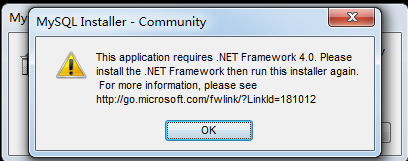
3. 在安装过程中，如果提示没有`Microsoft C++ 2013`，那么就到以下网址下载安装即可：`http://download.microsoft.com/download/9/0/5/905DBD86-D1B8-4D4B-8A50-CB0E922017B9/vcredist_x64.exe`。
   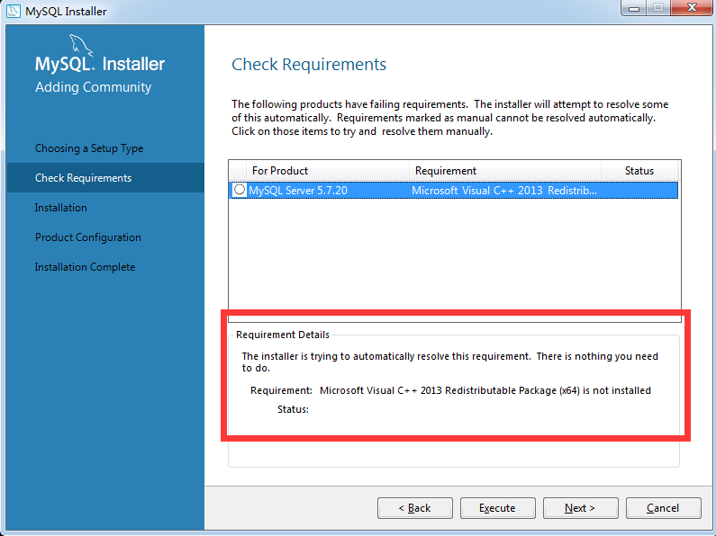
4. 接下来就是做好用户名和密码的配置即可。

### 1.2 navicat数据库操作软件

安装完`MySQL`数据库以后，就可以使用`MySQL`提供的终端客户端软件来操作数据库。如下：
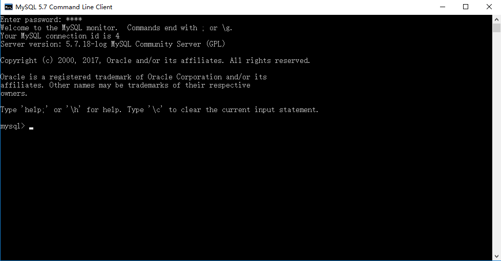
这个软件所有的操作都是基于`sql`语言，对于想要熟练`sql`语言的同学来讲是非常合适的。但是对于在企业中可能不是一款好用的工具。在企业中我们推荐使用`mysql workbench`以及`navicat`这种图形化操作的软件。而`mysql workbench`是`mysql`官方提供的一个免费的软件，正因为是免费，所以在一些功能上不及`navicat`。`navicat for mysql`是一款收费的软件。官网地址如下：`https://www.navicat.com.cn/products`。使用的截图如下：


### 1.3 MySQL驱动程序安装

我们使用`Django`来操作`MySQL`，实际上底层还是通过`Python`来操作的。因此我们想要用`Django`来操作`MySQL`，首先还是需要安装一个驱动程序。在`Python3`中，驱动程序有多种选择。比如有`pymysql`以及`mysqlclient`等。这里我们就使用`mysqlclient`来操作。`mysqlclient`安装非常简单。只需要通过`pip install mysqlclient`即可安装。

常见`MySQL`驱动介绍：

1. `MySQL-python`：也就是`MySQLdb`。是对`C`语言操作`MySQL`数据库的一个简单封装。遵循了`Python DB API v2`。但是只支持`Python2`，目前还不支持`Python3`。
2. `mysqlclient`：是`MySQL-python`的另外一个分支。支持`Python3`并且修复了一些`bug`。
3. `pymysql`：纯`Python`实现的一个驱动。因为是纯`Python`编写的，因此执行效率不如`MySQL-python`。并且也因为是纯`Python`编写的，因此可以和`Python`代码无缝衔接。
4. `MySQL Connector/Python`：`MySQL`官方推出的使用纯`Python`连接`MySQL`的驱动。因为是纯`Python`开发的。效率不高。


## 02.SQL原生语句操作数据库

### 2.1 Django配置连接数据库

在操作数据库之前，首先先要连接数据库。这里我们以配置`MySQL`为例来讲解。`Django`连接数据库，不需要单独的创建一个连接对象。只需要在`settings.py`文件中做好数据库相关的配置就可以了。示例代码如下：

```python
DATABASES = {
    'default': {
        # 数据库引擎（是mysql还是oracle等）
        'ENGINE': 'django.db.backends.mysql',
        # 数据库的名字
        'NAME': 'dfz',
        # 连接mysql数据库的用户名
        'USER': 'root',
        # 连接mysql数据库的密码
        'PASSWORD': 'root',
        # mysql数据库的主机地址
        'HOST': '127.0.0.1',
        # mysql数据库的端口号
        'PORT': '3306',
    }
}
```

### 2.2 在Django中操作数据库

在`Django`中操作数据库有**两种**方式。第一种方式就是使用原生`sql`语句操作，第二种就是使用`ORM`模型来操作。这节课首先来讲下第一种。

在`Django`中使用原生`sql`语句操作其实就是使用`python db api`的接口来操作。如果你的`mysql`驱动使用的是`pymysql`，那么你就是使用`pymysql`来操作的，只不过`Django`将数据库连接的这一部分封装好了，我们只要在`settings.py`中配置好了数据库连接信息后直接使用`Django`封装好的接口就可以操作了。示例代码如下：

```python
# 使用django封装好的connection对象，会自动读取settings.py中数据库的配置信息
from django.db import connection

# 获取游标对象
cursor = connection.cursor()
# 拿到游标对象后执行sql语句
cursor.execute("select * from book")
# 获取所有的数据
rows = cursor.fetchall()
# 遍历查询到的数据
for row in rows:
    print(row)
```

以上的`execute`以及`fetchall`方法都是`Python DB API`规范中定义好的。任何使用`Python`来操作`MySQL`的驱动程序都应该遵循这个规范。所以不管是使用`pymysql`或者是`mysqlclient`或者是`mysqldb`，他们的接口都是一样的。更多规范请参考：[PEP 249 -- Python Database API ](https://www.python.org/dev/peps/pep-0249/)。

### 2.3 Python DB API下规范下cursor对象常用接口

1. `description`：如果`cursor`执行了查询的`sql`代码。那么读取`cursor.description`属性的时候，将返回一个列表，这个列表中装的是元组，元组中装的分别是`(name,type_code,display_size,internal_size,precision,scale,null_ok)`，其中`name`代表的是查找出来的数据的字段名称，其他参数暂时用处不大。

2. `rowcount`：代表的是在执行了`sql`语句后受影响的行数。

3. `close`：关闭游标。关闭游标以后就再也不能使用了，否则会抛出异常。

4. `execute(sql[,parameters])`：执行某个`sql`语句。如果在执行`sql`语句的时候还需要传递参数，那么可以传给`parameters`参数。示例代码如下：

```python
cursor.execute("select * from article where id=%s",(1,))
```

5. `fetchone`：在执行了查询操作以后，获取第一条数据。

6. `fetchmany(size)`：在执行查询操作以后，获取多条数据。具体是多少条要看传的`size`参数。如果不传`size`参数，那么默认是获取第一条数据。

7. `fetchall`：获取所有满足`sql`语句的数据。

### 2.4 小实战：图书管理系统

==TODO==


## 03.ORM模型介绍

### 3.1 什么是ORM模型？

随着项目越来越大，采用写原生SQL的方式在代码中会出现大量的SQL语句，那么问题就出现了：

1. SQL语句重复利用率不高，越复杂的SQL语句条件越多，代码越长。会出现很多相近的SQL语句。
2. 很多SQL语句是在业务逻辑中拼出来的，如果有数据库需要更改，就要去修改这些逻辑，这会很容易漏掉对某些SQL语句的修改。
3. 写SQL时容易忽略web安全问题，给未来造成隐患。SQL注入。

`ORM`，全称`Object Relational Mapping`，中文叫做对象关系映射，通过`ORM`我们可以通过类的方式去操作数据库，而不用再写原生的SQL语句。通过把表映射成类，把行作实例，把字段作为属性，`ORM`在执行对象操作的时候最终还是会把对应的操作转换为数据库原生语句。使用`ORM`有许多优点：

1. 易用性：使用`ORM`做数据库的开发可以有效的减少重复SQL语句的概率，写出来的模型也更加直观、清晰。
2. 性能损耗小：`ORM`转换成底层数据库操作指令确实会有一些开销。但从实际的情况来看，这种性能损耗很少（不足5%），只要不是对性能有严苛的要求，综合考虑开发效率、代码的阅读性，带来的好处要远远大于性能损耗，而且项目越大作用越明显。
3. 设计灵活：可以轻松的写出复杂的查询。
4. 可移植性：`Django`封装了底层的数据库实现，支持多个关系数据库引擎，包括流行的`MySQL`、`PostgreSQL`和`SQLite`。可以非常轻松的切换数据库。

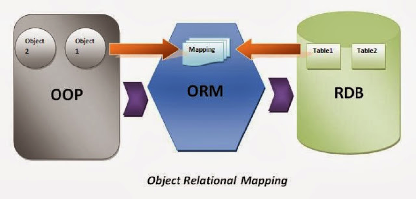

### 3.2 创建ORM模型

`ORM`模型一般都是放在`app`的`models.py`文件中。每个`app`都可以拥有自己的模型。并且如果这个模型想要映射到数据库中，那么这个`app`必须要放在`settings.py`的`INSTALLED_APP`中进行安装。以下是写一个简单的书籍`ORM`模型。示例代码如下：

```python
from django.db import models

class Book(models.Model):
    # 1. id：int类型；自增长；主键
    id = models.AutoField(primary_key=True)
    # 2. name: varchar(100)；不空
    name = models.CharField(max_length=100, null=False)
    # 3. author: varchar(100)；不空
    author = models.CharField(max_length=100, null=False)
    # 4. prince: float；不空
    price = models.FloatField(null=False, default=0)
```

以上便定义了一个模型。这个模型继承自`django.db.models.Model`，如果这个模型想要映射到数据库中，就必须继承自这个类。这个模型以后映射到数据库中，表名是模型名称的小写形式，为`book`。在这个表中，有四个字段，一个为`name`，这个字段是保存的是书的名称，是`varchar`类型，最长不能超过20个字符，并且不能为空。第二个字段是作者名字类型，同样也是`varchar`类型，长度不能超过20个。第三个是出版时间，数据类型是`datetime`类型，默认是保存这本书籍的时间。第五个是这本书的价格，是浮点类型。
还有一个字段我们没有写，就是主键`id`，在`django`中，如果一个模型没有定义主键，那么**django将会自动生成一个自动增长的`int`类型的主键**，并且这个主键的名字就叫做`id`。

### 3.3 映射模型到数据库中

将`ORM`模型映射到数据库中，总结起来就是以下几步：

1. 在`settings.py`中，配置好`DATABASES`，做好数据库相关的配置。
2. 在`app`中的`models.py`中定义好模型，这个模型必须继承自`django.db.models`。
3. 将这个`app`添加到`settings.py`的`INSTALLED_APP`中。
4. 在命令行终端，进入到项目所在的路径，然后执行命令`python manage.py makemigrations`来生成迁移脚本文件。
5. 同样在命令行中，执行命令`python manage.py migrate`来将迁移脚本文件映射到数据库中。

## 04.ORM对数据库的基本操作

### 4.1 添加数据

只要使用ORM模型创建一个对象。然后再调用这个ORM模型的`save`方法就可以保存了。
示例代码如下：

```python
# ====================views.py========================
from django.http import HttpResponse
from .models import Book

def index(request):
    book = Book(name='西游记', author='吴承恩', price=100)
    book.save()  # 需要执行save()方法
    return HttpResponse("数据库操作完成！")
```

### 4.2 查找数据

所有的查找工作都是使用模型上的`objects`属性来完成的。当然也可以自定义查询对象。这部分功能会在后面讲到。
1. 根据**主键**进行查找：使用主键进行查找。可以使用`objects.get()`方法。然后传递`pk=xx`的方式进行查找。示例代码如下：
```python
book = Book.objects.get(pk=2)  # pk 是 primary_key的缩写，即“主键”
```
2. 根据其他字段进行查找：可以使用`objects.filter()`方法进行查找。示例代码如下：
```python
books = Book.objects.filter(name='三国演义')
```
* 使用`filter`方法返回来的是一个`QuerySet`对象。这个对象类似于列表。我们可以使用这个对象的`first()`方法来获取第一个值。

### 4.3 删除数据

首先查找到对应的数据模型。然后再执行这个模型的`delete`方法即可删除。示例代码如下：
```python
book = Book.objects.get(pk=1)
book.delete()  # 这个就无需再执行save()方法了
```

### 4.4 修改数据

首先查找到对应的数据模型。然后修改这个模型上的属性的值。再执行`save`方法即可修改完成。示例代码如下：
```python
book = Book.objects.get(pk=2)
book.price = 200
book.save()
```


## 05.ORM模型常用字段

### 5.1 常用字段

在`Django`中，定义了一些`Field`来与数据库表中的字段类型来进行映射。以下将介绍那些常用的字段类型。

####  AutoField

映射到数据库中是`int`类型，可以有**自动增长**的特性。一般不需要使用这个类型，如果不指定主键，那么模型会**自动**的生成一个叫做`id`的自动增长的主键。如果你想指定一个其他名字的并且具有自动增长的主键，使用`AutoField`也是可以的。

#### BigAutoField

64位的整形，在数据库层面是`bigint`类型，类似于`AutoField`，只不过是产生的数据的范围是从`1-9223372036854775807`。

```python
# ====================models.py========================
from django.db import models

class Article(models.Model):
    # 如果想要自己定义的Field作为主键，那么必须要设置primary_key
    id = models.BigAutoField(primary_key=True)
```

#### BooleanField

在模型层面接收的是`True/False`。在数据库层面是`tinyint`类型。如果没有指定默认值，默认值是`None`。

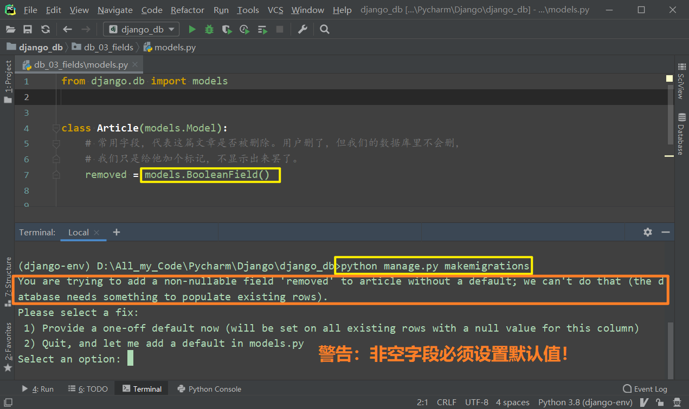

* 上面我定义了一个`removed`字段，当我准备生成数据库迁移表时，给出了如图所示的警告：“你必须为非空字段指定默认值。” 这是啥意思呢？其实很容易想明白，如果你向一个表中添加一个新字段，它补能为空，又没有默认值的话，那之前存在的那些数据的该字段应该填什么呢？MySQL很凌乱，Django也很凌乱……所以Django给出了下面的两种解决方式：
  * 设定一下默认值
  * 退出重来（我们选择这个就好，重新修改代码，让一切操作都可以在代码中体现出来）
* 上面的`removed`字段是数据库的**常规技巧**：当用户想要删除已经添加过的内容时，保险起见，我们都会给做出备份，怎样让用户看不到而且我们还保留它呢，很简单，定义一个字段标识一下就好啦！

#### NullBooleanField

`models.NullBooleanField()` 在语义上等价于` models.BooleanField(null=True)`，但是Django并不推荐后者，所以专门设定了一个`NullBooleanField`字段。

#### CharField

在数据库层面是`varchar`类型。在`Python`层面就是普通的字符串。这个类型在使用的时候**必须要指定最大的长度**，也即必须要传递`max_length`这个关键字参数进去。


CharField如果超过了**254**个字符，那就不建议使用了。而推荐使用**TextField**：longtext

#### DateField

**(1)小辨析**

| 类型     | 含义                    | Python类型映射    | MySQL类型映射 |
| -------- | ----------------------- | ----------------- | ------------- |
| Date     | 日期：年月日            | datetime.date     | date          |
| Time     | 时间：时分秒            | datetime.time     | time          |
| DateTime | 日期+时间：年月日时分秒 | datetime.datetime | datetime      |

**(2)DateField用法**

日期类型。在`Python`中是`datetime.date`类型，可以记录年月日。在映射到数据库中也是`date`类型。使用这个`Field`可以传递以下几个参数：

1. `auto_now`：在每次这个数据保存的时候，都使用当前的时间。比如作为一个记录修改日期的字段，可以将这个属性设置为`True`。
2. `auto_now_add`：在每次数据第一次被添加进去的时候，都使用当前的时间。比如作为一个记录第一次入库的字段，可以将这个属性设置为`True`。

```python
from django.db import models

class Article(models.Model):
    # auto_now_add：在【第一次】添加数据的时候会自动获取当前时间
    create_time = models.DateField(auto_now_add=True)
    # auto_now: 【每次】对象调用save()方法时都会将当前时间更新
    modify_time = models.DateField(auto_now=True)
```

**(3)补充：`naive time` VS `aware time`（重要）**

该部分内容较多，已放在后面的补充内容中，<a href="#两种时间">点此跳转</a>。

#### DateTimeField

日期时间类型，类似于`DateField`。不仅仅可以存储日期，还可以存储时间。映射到数据库中是`datetime`类型。这个`Field`也可以使用`auto_now`和`auto_now_add`两个属性。

#### TimeField

时间类型。在数据库中是`time`类型。在`Python`中是`datetime.time`类型。

#### EmailField

类似于`CharField`。在数据库底层也是一个`varchar`类型。最大长度是254个字符。该字段并**不**对传入字符做格式限制，你是可以传入非邮箱格式的字符串的。那该字段岂不就是个空架子？岂不如直接用CharField？No！存在即合理！EmailField在数据库层面确实没啥意义，但是以后在ModelForm表单相关操作时会起作用。至于是啥作用，请参考后面章节。

#### FileField

用来存储文件的。这个请参考后面的文件上传章节部分。

#### ImageField

用来存储图片文件的。这个请参考后面的图片上传章节部分。

#### FloatField

浮点类型。映射到数据库中是`float`类型。

#### IntegerField

整形。值的区间是`-2147483648——2147483647`。

#### BigIntegerField

大整形。值的区间是`-9223372036854775808——9223372036854775807`。

#### PositiveIntegerField

正整形。值的区间是`0——2147483647`。

#### SmallIntegerField

小整形。值的区间是`-32768——32767`。

#### PositiveSmallIntegerField

正小整形。值的区间是`0——32767`。

#### TextField

大量的文本类型。映射到数据库中是**`longtext`类型**。该类型可以存储任意长度的字符串，一般用来存储文章。

#### UUIDField

只能存储`uuid`格式的字符串。`uuid`是一个32位的全球唯一的字符串，一般用来作为主键。类似与EmailField，数据库层面不做类型限制，但在生成表单时会很方便。

#### URLField

类似于`CharField`，只不过只能用来存储`url`格式（以`http://`或`https://`开头）的字符串。并且默认的`max_length`是200。类似与EmailField，数据库层面不做类型限制，但在生成表单时会很方便。


### 5.2 Field的常用参数

#### null

如果设置为`True`，`Django`将会在映射表的时候指定是否为空。默认是为`False`。在使用字符串相关的`Field`（CharField/TextField/EmailField/URLField）的时候，官方推荐尽量不要使用这个参数，也就是保持默认值`False`。因为`Django`在处理字符串相关的Field的时候，即使这个`Field`的`null=False`，如果你没有给这个`Field`传递任何值，那么`Django`也会使用一个空的字符串`""`来作为默认值存储进去。因此如果再使用`null=True`，`Django`会产生两种空值的情形（NULL或者空字符串）。如果想要在表单验证的时候允许这个字符串为空，那么建议使用`blank=True`。如果你的`Field`是`BooleanField`，那么对应的可空的字段则为`NullBooleanField`。

#### blank

标识这个字段在表单验证的时候是否可以为空。默认是`False`。
这个和`null`是有区别的，`null`是一个纯**数据库级别**的。而`blank`是**表单验证级别**的。

#### db_column

这个字段在数据库中的名字。如果没有设置这个参数，那么将会使用模型中属性的名字。

#### default

默认值。可以为一个**值**，或者是一个**函数**，但是不支持`lambda`表达式。并且不支持列表/字典/集合等可变的数据结构。

```python
# ====================models.py==========================

from django.db import models
from django.utils.timezone import now


class Article(models.Model):
    # 【指定固定值】标记文章是否被删除的字段
    removed = models.BooleanField(default=False)

    # 【指定函数】
    # auto_now_add：在【第一次】添加数据的时候会自动获取当前时间。
    create_time = models.DateTimeField(auto_now_add=True)
    # 上面的auto_now_add=True其实等价于下面这条语句：
    
    # 注意：此处我们指定的默认值是now函数！而不是now函数的返回值！
    create_time = models.DateTimeField(default=now)

    # 错误！下面这样指定就玩完了，每篇文章的创建时间就都是网站部署时那一个固定的时间了
    create_time = models.DateTimeField(default=now())
```

#### primary_key

是否为主键。默认是`False`。

#### unique

在表中这个字段的值是否唯一。一般是设置手机号码/邮箱等，我们虽不会让他们做主键，但仍需让他们唯一，此时便可用此参数。

更多`Field`参数请参考官方文档：[django官方文档-模型字段参考](https://docs.djangoproject.com/zh-hans/3.1/ref/models/fields/)

### 5.3 模型中`Meta`配置

对于一些模型级别的配置。我们可以在模型中定义一个类，叫做`Meta`。然后在这个类中添加一些类属性来控制模型的作用。比如我们想要在数据库映射的时候使用自己指定的表名，而不是使用模型的名称。那么我们可以在`Meta`类中添加一个`db_table`的属性。示例代码如下：

```python
class Book(models.Model):
    name = models.CharField(max_length=20,null=False)
    desc = models.CharField(max_length=100,name='description',db_column="description1")

    class Meta:
        db_table = 'book_model'
```

以下将对`Meta`类中的一些常用配置进行解释。

#### db_table

这个模型映射到数据库中的表名。如果没有指定这个参数，那么在映射的时候将会使用模型名来作为默认的表名。

#### ordering

设置在提取数据的排序方式。后面章节会讲到如何查找数据。比如我想在查找数据的时候根据添加的时间排序，那么示例代码如下：

```python
class Book(models.Model):
    name = models.CharField(max_length=20,null=False)
    desc = models.CharField(max_length=100,name='description',db_column="description1")
    pub_date = models.DateTimeField(auto_now_add=True)

    class Meta:
        ordering = ['pub_date']  # 按pub_date字段升序排序
        ordering = ['-pub_date']  # 前面加个负号，按pub_date字段降序排序
        ordering = ['pub_date', 'name']  # 将第一排序字段设为'pub_date',第二排序字段设为'name' 
```

更多的配置后面会慢慢介绍到。 完整说明请看官方文档：[django官方文档-模型Meta](https://docs.djangoproject.com/zh-hans/3.1/ref/models/options/)


### 5.4 <span name="两种时间">补充：`naive time` VS `aware time`（重要）</span>

#### 5.4.1  什么是naive时间？什么是aware时间？
1. naive时间：不知道自己的时间表示的是哪个时区的。也就是不知道自己几斤几两。比较幼稚。
2. aware时间：知道自己的时间表示的是哪个时区的。也就是比较清醒。

#### 5.4.2 pytz库
专门用来处理时区的库。这个库会经常更新一些时区的数据，不需要我们担心。并且这个库在安装Django的时候会**默认**的安装。如果没有安装，那么可以通过`pip install pytz`的方式进行安装。

#### 5.4.3 astimezone方法
将一个时区的时间转换为另外一个时区的时间。**在Linux平台下**，这个方法只能被`aware`类型的时间调用。不能被`naive`类型的时间调用。
示例代码如下：

```python
import pytz
from datetime import datetime
now = datetime.now() # 这是一个navie类型的时间
utc_timezone = pytz.timezone("UTC") # 定义UTC的时区对象
utc_now = now.astimezone(utc_timezone) # 将当前的时间转换为UTC时区的时间

>>> ValueError: astimezone() cannot be applied to a naive datetime # 会抛出一个异常，原因就是因为navie类型的时间不能调用astimezone方法

now = now.replace(tzinfo=pytz.timezone('Asia/Shanghai'))
utc_now = now.astimezone(utc_timezone)
# 这时候就可以正确的转换。
```

#### 5.4.4 replace方法
可以将一个时间的某些属性进行更改。也可以为`naive time`添加 `tzinfo`(时区信息)属性，使其变为`aware time`。

#### 5.4.5 django.utils.timezone.now方法
会根据`settings.py`中是否设置了`USE_TZ=True`获取当前的时间。如果设置了，那么就获取一个`aware`类型的`UTC`时间。如果没有设置，那么就会获取一个`naive`类型的时间。

#### 5.4.6 django.utils.timezone.localtime方法
会根据`setting.py`中的`TIME_ZONE`来将一个`aware`类型的时间转换为`TIME_ZONE`指定时区的时间。

#### 5.4.7 django对时间的处理

在settings.py中有两个对两个时区参数：`TIME_ZONE`和`USE_TZ`，如果考虑到你的网站将来有可能国际化（梦想还是要有的嘛，万一实现了呢~）正确的配置应该如下：

```python
USE_TZ = True
TIME_ZONE = 'Asia/Shanghai'
```

* `USE_TZ = True`影响的是`django.utils.timezone.now`，查看一下源码即可知道，设置为True会获取`aware time`，否则只能得到`naive time`，处于国际化考虑，我们当然是需要时区信息的。
* `TIME_ZONE = Asia/Shanghai`影响的是DTL对时间的渲染，当`USE_TZ = True`时，使用`django.utils.timezone.now`获取的时间虽然是`aware time`，但该时间的时区是`UTC`，也就是说，你**存储**的是0时区的时间，在将该时间交给DTL时，DTL会自动将该时间根据`TIME_ZONE`进行转换！不得不说，django是真的强大！当然喽，这样操作同样也存在着一个问题，就是如果你的数据库从头到尾是django一手生成的话，一切都安好，但如果是别处移植过来的数据库，人家存的本身就是东八区的时间，你再一转换，那就会多8个小时！

#### 5.4.8 navie和aware介绍以及在django中的用法
[django官方文档-时区问题](https://docs.djangoproject.com/zh-hans/3.1/topics/i18n/timezones/)


## 06.外键和表关系

### 6.1 外键

#### 6.1.0 何为外键？

外键是联系数据中的两张表的**桥梁**。

#### 6.1.1 django中使用外键

在`MySQL`中，表有两种引擎，一种是`InnoDB`，另外一种是`myisam`。如果使用的是`InnoDB`引擎，是支持外键约束的。外键的存在使得`ORM`框架在处理表关系的时候异常的强大。因此这里我们首先来介绍下外键在`Django`中的使用。

类定义为`class ForeignKey(to,on_delete,**options)`。第一个参数是引用的是哪个模型，第二个参数是在使用外键引用的模型数据被删除了，这个字段该如何处理，比如有`CASCADE`、`SET_NULL`等。这里以一个实际案例来说明。比如有一个`User`和一个`Article`两个模型。一个`User`可以发表多篇文章，一个`Article`只能有一个`Author`，并且通过外键进行引用。那么相关的示例代码如下：

```python
class User(models.Model):
    username = models.CharField(max_length=20)
    password = models.CharField(max_length=100)


class Article(models.Model):
    title = models.CharField(max_length=100)
    content = models.TextField()

    author = models.ForeignKey("User",on_delete=models.CASCADE)
```

以上使用`ForeignKey`来定义模型之间的关系。即在`article`的实例中可以通过`author`属性来操作对应的`User`模型。这样使用起来非常的方便。示例代码如下：

```python
article = Article(title='abc',content='123')
author = User(username='张三',password='111111')
author.save()  # 此处如果不保存会报错哦！Flask中可自行保存，该句可以不写，但Django中不行！！！！
article.author = author
article.save()

# 修改article.author上的值
article.author.username = '李四'  # 是不是再次被ORM的清爽震撼了一下下呢？
article.save()
```

为什么使用了`ForeignKey`后，就能通过`author`访问到对应的`user`对象呢。因为在数据库层面，`Django`为`Article`表添加了一个`属性名_id`的字段（比如author的字段名称是author_id），这个字段是一个外键，记录着对应的作者的主键。以后通过`article.author`访问的时候，实际上是先通过`author_id`找到对应的数据，然后再提取`User`表中的这条数据，形成一个模型。

如果想要引用另外一个`app`的模型，那么应该在传递`to`参数的时候，使用`app.model_name`进行指定。以上例为例，如果`User`和`Article`不是在同一个`app`中，那么在引用的时候的示例代码如下：

```python
# User模型在user这个app中
class User(models.Model):
    username = models.CharField(max_length=20)
    password = models.CharField(max_length=100)

# Article模型在article这个app中
class Article(models.Model):
    title = models.CharField(max_length=100)
    content = models.TextField()

    author = models.ForeignKey("user.User",on_delete=models.CASCADE)
```

如果模型的外键引用的是本身自己这个模型，那么`to`参数可以为`'self'`，或者是这个模型的名字。在论坛开发中，一般评论都可以进行二级评论，即可以针对另外一个评论进行评论，那么在定义模型的时候就需要使用外键来引用自身。示例代码如下：

```python
class Comment(models.Model):
    content = models.TextField()
    origin_comment = models.ForeignKey('self',on_delete=models.CASCADE,null=True)
    # 或者
    # origin_comment = models.ForeignKey('Comment',on_delete=models.CASCADE,null=True)
```

#### 6.1.2 外键删除操作

如果一个模型使用了外键。那么在**对方**那个模型被删掉后，该进行什么样的操作（一定要弄清是谁影响谁！是**外键影响本模型**！以上面Article和User为例，User作为Article的外键，当User被删除后，会影响Article，但Article被删除后，对User没有影响）。可以通过`on_delete`来指定。可以指定的类型如下：

1. `CASCADE`：级联操作。如果外键对应的那条数据被删除了，那么这条数据也会被删除。
2. `PROTECT`：受保护。即只要这条数据引用了外键的那条数据，那么就不能删除外键的那条数据。如果强行执行删除操作，会抛出`ProtectedError`异常。
3. `SET_NULL`：设置为空。如果外键的那条数据被删除了，那么在本条数据上就将这个字段设置为空。如果设置这个选项，**前提**是要在`models.ForeignKey()`方法中通过`null=True`指定这个字段**可以**为空。
4. `SET_DEFAULT`：设置默认值。如果外键的那条数据被删除了，那么本条数据上就将这个字段设置为默认值。如果设置这个选项，前提是要在`models.ForeignKey()`方法中通过`default=xxx`指定这个字段一个默认值。
5. `SET()`：如果外键的那条数据被删除了。那么将会获取`SET`函数中的值来作为这个外键的值。`SET`函数可以接收一个可以调用的对象（比如函数或者方法），如果是可以调用的对象，那么会将这个对象调用后的结果作为值返回回去。`SET()`也可以当SET_DEFAULT使用，只需要将之前在`models.ForeignKey()`方法中的`default=xxx`删掉，并将`xxx`放到`SET()`中即可。

6. `DO_NOTHING`：不采取任何行为。**一切全看数据库级别的约束**。到这里或许你突然想起数据库级别的约束，然后发出这样的疑问：既然数据库层级有约束了，我上面介绍的那5种ORM级别的约束是如何发挥作用的呢？难不成它能越过数据库？开玩笑，怎么可能！其实Django ORM删除约束是“反向”操作的，以`on_delete=CASCADE`为例，数据库级别是`RESTRICT`，那我删除外键是指定是没法删的，但Django的做法是，先删除所有以该数据为外键的子数据，最后再来删除这个外键，牛逼了吧！

**以上这些选项只是Django级别的，数据级别的默认约束是RESTRICT(类似与上面的PROTECT)！**

------

### 6.2 表关系

表之间的关系都是通过外键来进行关联的。而表之间的关系，无非就是三种关系：一对一、一对多（多对一）、多对多等。以下将讨论一下三种关系的应用场景及其实现方式。

#### 6.2.1 一对多

**(1)应用场景**

比如文章和作者之间的关系。一个文章只能由一个作者编写，但是一个作者可以写多篇文章。文章和作者之间的关系就是典型的多对一的关系。

**(2)实现方式**

一对多或者多对一，都是通过`ForeignKey`来实现的。还是以文章和作者的案例进行讲解。

```python
class User(models.Model):
    username = models.CharField(max_length=20)
    password = models.CharField(max_length=100)

class Article(models.Model):
    title = models.CharField(max_length=100)
    content = models.TextField()
    author = models.ForeignKey("User",on_delete=models.CASCADE)
    
    def __str__(self):  # 后面打印该模型对象时可以如下面的方式显示。
        return "<Article:(id:%s, title:%s)>" % (self.id, self.title)
```

那么以后在给`Article`对象指定`author`，就可以使用以下代码来完成：

```python

article = Article(title='abc',content='123')
author = User(username='zhiliao',password='111111')
# 要先保存到数据库中
author.save()
article.author = author
article.save()
```

**(3)反向引用**

以后如果想要获取某个用户下所有的文章，可以通过`article_set`来实现。示例代码如下：

```python
user = User.objects.first()
# 获取第一个用户写的所有文章
articles = user.article_set.all()
for article in articles:
	print(article)
```

看到这里你可能感觉有些懵逼，`article_set`我啥时候定义了？你确实没有定义，这其实是Django自己搞的，**只要模型A被模型B当做外键引用了，那么Django就会自动为A添加一个属性`b_set`**，这是一个`RelatedManager`对象，与查询用的`objects`非常相像，你可以调用`all()`、`first()`、`filter()`等方法。

当然，如果你不喜欢`b_set`这种命名方式，也是可以自定义的，方法很简单，只要在B引用A做外键时，在`models.ForeignKey()`中设置一下`related_name`这一参数即可，示例代码如下：

```python
class User(models.Model):
    username = models.CharField(max_length=20)
    password = models.CharField(max_length=100)

class Article(models.Model):
    title = models.CharField(max_length=100)
    content = models.TextField()
    author = models.ForeignKey("User", related_name='articles')  # 用related_name为User()指定article_set的新名字为articles。
```

此时便可通过`articles`实现反向引用，代码如下：

```python
user = User.objects.first()
# 获取第一个用户写的所有文章
articles = user.articles.all()
for article in articles:
	print(article)
```

**(4)反向引用型添加**

如果想要将文章添加到某个用户的文章集中。可以使用一下的方式：

```python
user = User.objects.first()

article = Article(title='bbb',content='vvv')

user.article_set.add(article,bulk=False)
```
* 使用`bulk=False`，那么Django会自动的保存article，而不需要在添加到user之前先保存article。
* 或者是另外一种解决方式是，在添加到`user.article_set`中之前，先将`article`保存到数据库中。但是如果`article.user`不能为空，那么就产生一种类似与“死锁”的死循环了，article没有`user`不能保存，而将article添加到`cateogry.artile_set`中，又需要article之前是已经存储到数据库中的。
* 如果是上面的那种需求，建议使用`bulk=False`的解决方案。

#### 6.2.2 一对一

**(1)应用场景**

比如一个用户表和一个用户信息表。在实际网站中，可能需要保存用户的许多信息，但是有些信息是不经常用的。如果把所有信息都存放到一张表中可能会影响查询效率，因此可以把用户的一些不常用的信息存放到另外一张表中我们叫做`UserExtension`。但是用户表`User`和用户信息表`UserExtension`就是典型的一对一了。

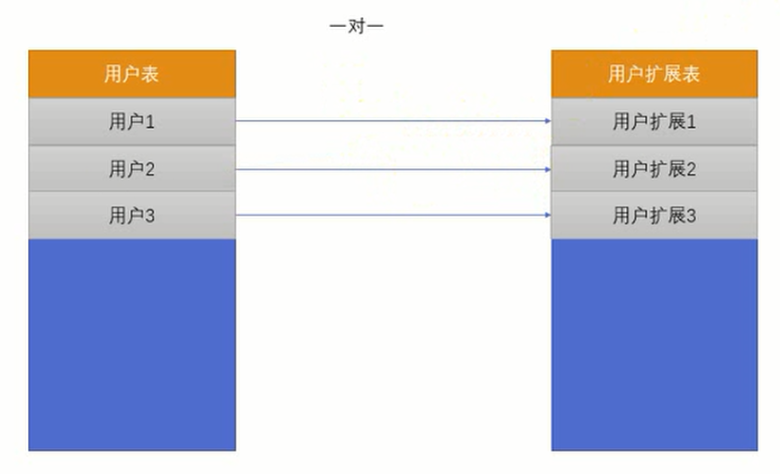

**(2)实现方式**

在Django中一对一是通过`models.OnetToOneField()`来实现的。这个`OneToOneField`其实本质上就是一个外键，只不过这个外键有一个`唯一约束（unique key）`，来实现一对一。示例代码如下：

```python
class User(models.Model):
    username = models.CharField(max_length=20)
    password = models.CharField(max_length=100)

class UserExtension(models.Model):  
    birthday = models.DateTimeField(null=True)  
    school = models.CharField(blank=True,max_length=50)  
    user = models.OneToOneField("User", on_delete=models.CASCADE)  # 因为是一对一，所以这里必然采用级联删除。
```

   在`UserExtension`模型上增加了一个一对一的关系映射。其实底层是在`UserExtension`这个表上增加了一个`user_id`，来和`user`表进行关联，并且这个外键数据在表中必须是唯一的，来保证一对一。

**(3)反向引用**

根据`UserExtension()`获取`User()`相当容易，因为`UserExtension()`本身就有`user`属性，那么如何在`User()`中获取与它对应的`UserExtension()`呢？很简单，类似于上面的`b_set`。**只要模型A被模型B当做一对一外键引用了，那么Django就会自动为A添加一个属性`b`**，所以通过`user.userextension`即可获取。示例代码如下：

```python
# 通过userextension来访问UserExtension对象
user = User.objects.first()
print(user.userextension)  # 若想打印效果满意，还需重写__str__()方法。
```

同样的，类比于`models.ForeignKey()`，`models.OneToOneField()`也有`related_name`参数支持为反向引用字段起别名。如果不想使用Django默认的引用属性名字，则可通过该参数起别名。


#### 6.2.3 多对多

**(1)应用场景**

比如文章和标签的关系。一篇文章可以有多个标签，一个标签可以被多个文章所引用。因此标签和文章的关系是典型的多对多的关系。

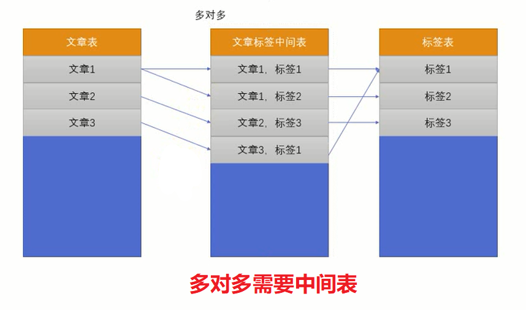

**(2)实现方式**

`Django`为这种多对多的实现提供了专门的`Field`。叫做`ManyToManyField`。还是拿文章和标签为例进行讲解。示例代码如下：

```python
class Article(models.Model):
    title = models.CharField(max_length=100)
    content = models.TextField()
    tags = models.ManyToManyField("Tag",related_name="articles")  # 默认反引用名称为"article_set"

class Tag(models.Model):
    name = models.CharField(max_length=50)
```

 在数据库层面，实际上`Django`是为这种多对多的关系建立了一个中间表。这个中间表分别定义了两个外键，引用到`article`和`tag`两张表的主键。但在Django层面，你是感觉不到中间表的存在的，双方均可以反引用。需要注意的是，多对多的`add()`方法没有`bulk`参数，如果要添加的数据之前不存在，必须要先手动调用`.save()`方法。


#### 6.2.4 related_name和related_query_name

**related_name**

还是以`User`和`Article`为例来进行说明。如果一个`article`想要访问对应的作者，那么可以通过`author`来进行访问。但是如果有一个`user`对象，想要通过这个`user`对象获取所有的文章，该如何做呢？这时候可以通过`user.article_set`来访问，这个名字的规律是`模型名字小写_set`。示例代码如下：

```python
user = User.objects.get(name='张三')
user.article_set.all()
```

如果不想使用`模型名字小写_set`的方式，想要使用其他的名字，那么可以在定义模型的时候指定`related_name`。示例代码如下：

```python
class Article(models.Model):
    title = models.CharField(max_length=100)
    content = models.TextField()
    # 传递related_name参数，以后在方向引用的时候使用articles进行访问
    author = models.ForeignKey("User",on_delete=models.SET_NULL,null=True,related_name='articles')
```

以后在方向引用的时候。使用`articles`可以访问到这个作者的文章模型。示例代码如下：

```python
user = User.objects.get(name='张三')
user.articles.all()
```

如果不想使用反向引用，那么可以指定`related_name='+'`。示例代码如下：

```python
class Article(models.Model):
    title = models.CharField(max_length=100)
    content = models.TextField()
    # 传递related_name参数，以后在方向引用的时候使用articles进行访问
    author = models.ForeignKey("User",on_delete=models.SET_NULL,null=True,related_name='+')
```

以后将不能通过`user.article_set`来访问文章模型了。

**related_query_name**

在查找数据的时候，可以使用`filter`进行过滤。使用`filter`过滤的时候，不仅仅可以指定本模型上的某个属性要满足什么条件，还可以指定相关联的模型满足什么属性。比如现在想要获取写过标题为`abc`的所有用户，那么可以这样写：

```python
users = User.objects.filter(article__title='abc')
```

如果你设置了`related_name`为`articles`，因为反转的过滤器的名字将使用`related_name`的名字，那么上例代码将改成如下：

```python
users = User.objects.filter(articles__title='abc')
```

可以通过`related_query_name`将查询的反转名字修改成其他的名字。比如`article`。示例代码如下：

```python
class Article(models.Model):
    title = models.CharField(max_length=100)
    content = models.TextField()
    # 传递related_name参数，以后在方向引用的时候使用articles进行访问
    author = models.ForeignKey("User",on_delete=models.SET_NULL,null=True,related_name='articles',related_query_name='article')
```

那么在做反向过滤查找的时候就可以使用以下代码：

```python
users = User.objects.filter(article__title='abc')
```


## 07.查询操作


### 7.0 准备工作

#### 7.0.1 Pycharm连接MySQL

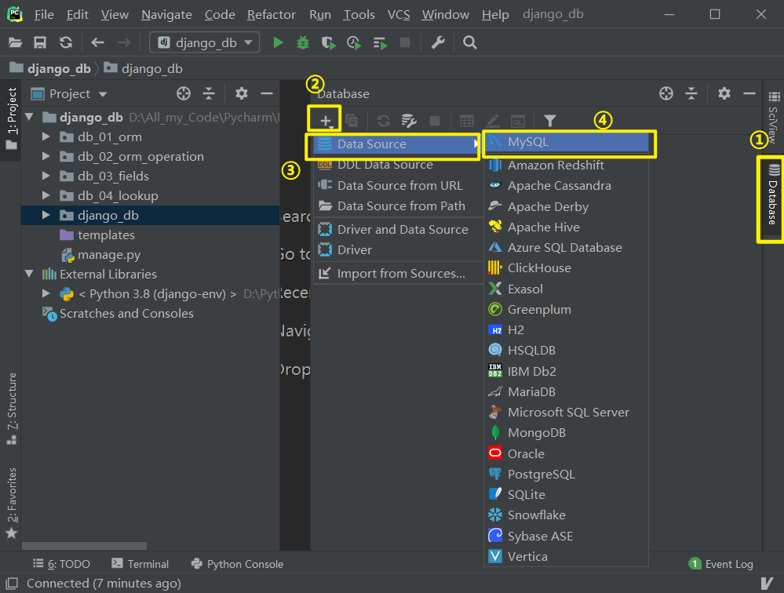

进入MySQL连接界面

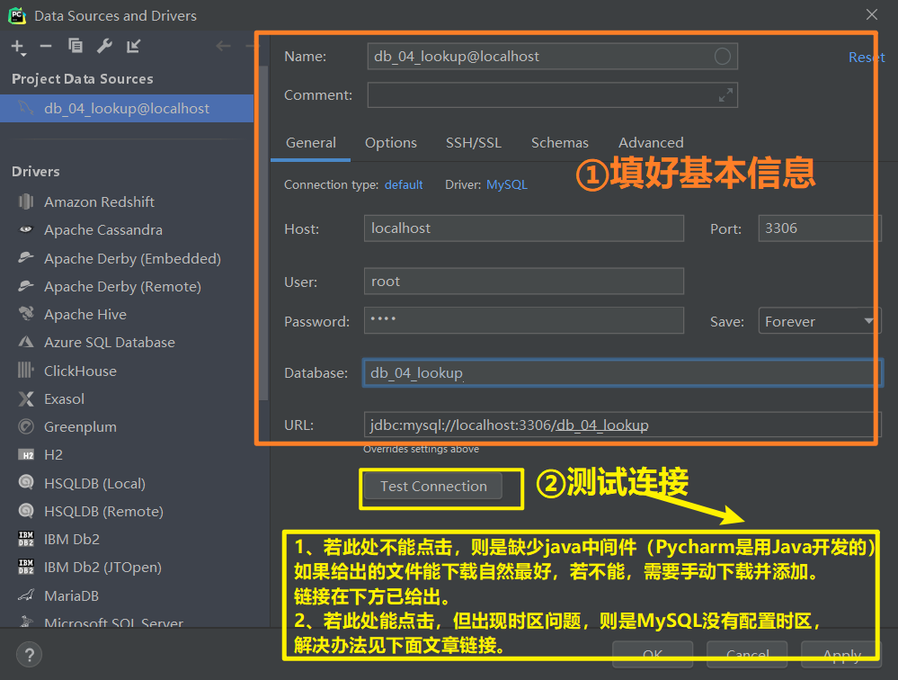

* 问题一：若给出的中间件文件无法下载，需要去[这里](https://dev.mysql.com/downloads/connector/j/)下载。
* 问题二：如出现时区问题，请看[这里](https://blog.csdn.net/liuqiker/article/details/102455077)解决。

#### 7.0.2 数据库排序规则

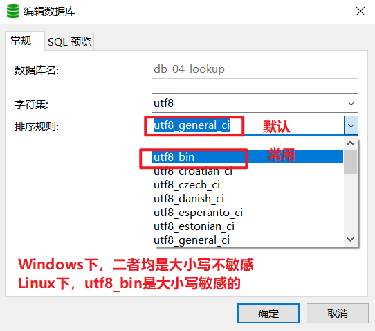

### 7.1 查询条件

查找是数据库操作中一个非常重要的技术。查询一般就是使用`filter`、`exclude`以及`get`三个方法来实现。我们可以在调用这些方法的时候传递不同的参数来实现查询需求。在`ORM`层面，这些查询条件都是使用`field`+`__`+`condition`的方式来使用的。以下将那些常用的查询条件来一一解释。

#### exact

**(1)基本用法**

使用精确的`=`进行查找。如果提供的是一个`None`，那么在`SQL`层面就是被解释为`NULL`。示例代码如下：

```python
article = Article.objects.get(id__exact=14)
article = Article.objects.get(id__exact=None)
```

以上的两个查找在翻译为`SQL`语句为如下：

```mysql
select ... from article where id=14;
select ... from article where id IS NULL;
```

**(2)详细示例**

```python
# =====================models.py========================
from django.db import models

class Article(models.Model):
    title = models.CharField(max_length=100)
    content = models.TextField()

    class Meta:
        db_table = 'article'

    def __str__(self):
        return "<Article: (id:%s, title:%s)>" % (self.id, self.title)
    
# ====================views.py========================
from django.http import HttpResponse
from .models import Article

def index(request):
    article = Article.objects.filter(id__exact=1)
    print("=" * 20 + "Article.objects.filter(id__exact=1)" + "=" * 20)
    print(article)
    print("="*30 + "原生SQL语句" + "="*30)
    print(article.query)   # 使用模型对象的query属性可以查看原生SQL语句
    return HttpResponse("front operation success!")
```

效果如下：

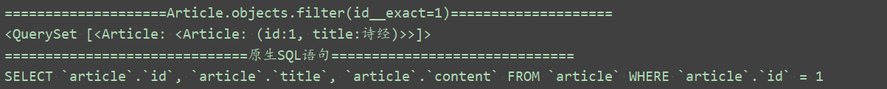

* 看原生语句可以发现，exact写不写其实无所谓，因为会被翻译为`=`。
* 上面使用的是`filter()`方法，所以返回的是**QuerySet对象**，该对象有`query`属性；如果使用`get()`方法就是ORM模型对象，模型对象就**木有**`query`属性了。所以，要想查看被翻译为的SQL原生语句是啥么样子，须使用`filter()`查询方法，然后打印`query`属性。

#### iexact

使用`like`进行查找。示例代码如下：

```pyton
article = Article.objects.filter(title__iexact='hello world')
```

那么以上的查询就等价于以下的`SQL`语句：

```mysql
select ... from article where title like 'hello world';
```

注意上面这个`sql`语句，因为在`MySQL`中，没有一个叫做`ilike`的。所以`exact`和`iexact`的区别实际上就是`LIKE`和`=`的区别，在大部分`collation=utf8_general_ci`情况下都是一样的（`collation`是用来对字符串比较的），因为上面虽然用了`like`，但后面没有用通配符`%`，所以算不上模糊查询。

综合前面`exact`和`iexact`，可以知道，在大多数情况下，`exact`=`iexact`=`=`，所以不如直接用等号。所以以后直接写`field=xxx`就OK啦~

#### contains

大小写敏感，判断某个字段是否包含了某个数据。示例代码如下：

```python
articles = Article.objects.filter(title__contains='hello')
```

在翻译成`SQL`语句为如下（通过打印`filter()`返回的`QuerySet`对象的`query`属性可以查看）：

```mysql
select ... where title like binary '%hello%';
```

可以发现，`like`后面是有个`binary`的，即**区分大小写**。

要注意的是，在使用`contains`的时候，翻译成的`sql`语句左右两边是有百分号的，意味着使用的是模糊查询。而`exact`翻译成`sql`语句左右两边是没有百分号的，意味着使用的是精确的查询。

#### icontains

大小写不敏感的匹配查询（`i`意为`ignore`，即忽略大小写区分）。示例代码如下：

```python
articles = Article.objects.filter(title__icontains='hello')
```

在翻译成MySQL语句为如下：

```mysql
select ... where title like '%hello%';
```

#### in

**(1)基本语法**

提取那些给定的`field`的值是否在给定的容器中。容器可以为`list`、`tuple`或者任何一个可以迭代的对象，包括`QuerySet`对象。示例代码如下：

```python
articles = Article.objects.filter(id__in=[1,2,3])
```

以上代码在翻译成`SQL`语句为如下：

```mysql
select ... where id in (1,3,4)
```

**(2)反向查询**

也可以通过其他表的字段来判断，示例代码如下：

```python
# ================================models.py==========================
from django.db import models

class Category(models.Model):
    name = models.CharField(max_length=100)

    class Meta:
        db_table = 'category'

    def __str__(self):
        return "<Category: (id:%s, name:%s)>" % (self.id, self.name)


class Article(models.Model):
    title = models.CharField(max_length=100)
    content = models.TextField()
    category = models.ForeignKey("Category", on_delete=models.CASCADE, default=1)

    class Meta:
        db_table = 'article'

    def __str__(self):
        return "<Article: (id:%s, title:%s)>" % (self.id, self.title)
    
    
# =========================views.py========================

from django.http import HttpResponse
from .models import Article, Category


def index(request):
    # 1.查找文章id为1,2,3的文章
    # articles = Article.objects.filter(id__in=[1, 2, 3])
    # for article in articles:
    #     print(article)

    # 2.查找id为1,2,3的文章的"分类"（找谁就写谁）
    # categories = Category.objects.filter(article__in=[1, 2, 3])
    categories = Category.objects.filter(article__title__in=['道德经', '诗经'])  # 跨表字段同样也通过双下划线
    for category in categories:
        print(category)

    return HttpResponse("front operation success!")
```


如果要判断相关联的表的字段，那么也是通过`__`来连接。并且在做关联查询的时候，不需要写`models_set`，直接使用`模型的名字的小写化`就可以了。比如通过分类去查找相应的文章，那么通过`article__in`就可以了，而不是写成`article_set__in`的形式。当然如果你不想使用默认的形式，可以在外键定义的时候传递`related_query_name`来指定反向查询的名字。示例代码如下：
```python
class Category(models.Model):
    name = models.CharField(max_length=100)

class Meta:
db_table = 'category'


class Article(models.Model):
    title = models.CharField(max_length=200)
    content = models.TextField()
cateogry=models.ForeignKey("Category",on_delete=models.CASCADE,default=1,related_query_name='articles')

class Meta:
	db_table = 'article'
```
因为在`cateogry`的`ForeignKey`中指定了`related_query_name`为`articles`，因此你不能再使用`article`来进行反向查询了。这时候就需要通过`articles__in`来进行反向查询。


* 反向查询是将模型名字小写化。比如`article__in`。可以通过`related_query_name`来指定自己的方式，而不使用默认的方式。
* 反向引用是将模型名字小写化，然后再加上`_set`，比如`article_set`，可以通过`related_name`来指定自己的方式，而不是用默认的方式。

并且，如果在做反向查询的时候，如果查询的字段就是模型的主键，那么需要省略掉这个字段，直接写成`article__in`就可以了，而不是用`article__id__in`。


当然也可以传递一个`QuerySet`对象进去。示例代码如下：

```python
inner_qs = Article.objects.filter(title__contains='hello')
categories = Category.objects.filter(article__in=inner_qs)
```

以上代码的意思是获取那些文章标题包含`hello`的所有分类。
将翻译成以下`SQL`语句，示例代码如下：

```mysql
select ...from category where article.id in (select id from article where title like '%hello%');
```

#### gt

某个`field`的值要大于给定的值。示例代码如下：

```python
articles = Article.objects.filter(id__gt=4)
```

以上代码的意思是将所有`id`大于4的文章全部都找出来。
将翻译成以下`SQL`语句：

```sql
select ... where id > 4;
```

#### gte

类似于`gt`，是大于等于。

#### lt

类似于`gt`是小于。

#### lte

类似于`lt`，是小于等于。

#### startswith

判断某个字段的值是否是以某个值开始的。大小写敏感。示例代码如下：

```python
articles = Article.objects.filter(title__startswith='hello')
```

以上代码的意思是提取所有标题以`hello`字符串开头的文章。
将翻译成以下`SQL`语句：

```sql
select ... where title like 'hello%'
```

#### istartswith

类似于`startswith`，但是大小写是不敏感的。

#### endswith

判断某个字段的值是否以某个值结束。大小写敏感。示例代码如下：

```python
articles = Article.objects.filter(title__endswith='world')
```

以上代码的意思是提取所有标题以`world`结尾的文章。
将翻译成以下`SQL`语句：

```sql
select ... where title like '%world';
```

#### iendswith

类似于`endswith`，只不过大小写不敏感。

#### range

判断某个`field`的值是否在给定的区间中。示例代码如下：

```python
from django.utils.timezone import make_aware
from datetime import datetime
start_date = make_aware(datetime(year=2018,month=1,day=1))
end_date = make_aware(datetime(year=2018,month=3,day=29,hour=16))
articles = Article.objects.filter(pub_date__range=(start_date,end_date))
```

以上代码的意思是提取所有发布时间在`2018/1/1`到`2018/12/12`之间的文章。
将翻译成以下的`SQL`语句：

```sql
select ... from article where pub_time between '2018-01-01' and '2018-12-12'。
```

需要注意的是，以上提取数据，不会包含最后一个值。也就是不会包含`2018/12/12`的文章。
而且另外一个重点，因为我们在`settings.py`中指定了`USE_TZ=True`，并且设置了`TIME_ZONE='Asia/Shanghai'`，因此我们在提取数据的时候要使用`django.utils.timezone.make_aware`先将`datetime.datetime`从`navie`时间转换为`aware`时间。`make_aware`会将指定的时间转换为`TIME_ZONE`中指定的时区的时间。

#### date

针对某些`date`或者`datetime`类型的字段。可以指定`date`的范围。并且这个时间过滤，还可以使用链式调用。示例代码如下：

```python
articles = Article.objects.filter(pub_date__date=date(2018,3,29))
```

以上代码的意思是查找时间为`2018/3/29`这一天发表的所有文章。
将翻译成以下的`sql`语句：

```sql
select ... WHERE DATE(CONVERT_TZ(`front_article`.`pub_date`, 'UTC', 'Asia/Shanghai')) = 2018-03-29
```

注意，因为默认情况下`MySQL`的表中是没有存储时区相关的信息的。因此我们需要下载一些时区表的文件，然后添加到`Mysql`的配置路径中。如果你用的是`windows`操作系统。那么在`http://dev.mysql.com/downloads/timezones.html`下载`timezone_2018d_posix.zip - POSIX standard`。然后将下载下来的所有文件拷贝到`C:\ProgramData\MySQL\MySQL Server 5.7\Data\mysql`中，如果提示文件名重复，那么选择覆盖即可。
如果用的是`linux`或者`mac`系统，那么在命令行中执行以下命令：`mysql_tzinfo_to_sql /usr/share/zoneinfo | mysql -D mysql -u root -p`，然后输入密码，从系统中加载时区文件更新到`mysql`中。

#### year

根据年份进行查找。示例代码如下：

```python
articles = Article.objects.filter(pub_date__year=2018)
articles = Article.objects.filter(pub_date__year__gte=2017)
```

以上的代码在翻译成`SQL`语句为如下：

```sql
select ... where pub_date between '2018-01-01' and '2018-12-31';
select ... where pub_date >= '2017-01-01';
```

#### month

同`year`，根据月份进行查找。

#### day

同`year`，根据日期进行查找。

#### week_day

`Django 1.11`新增的查找方式。同`year`，根据星期几进行查找。1表示星期天，7表示星期六，`2-6`代表的是星期一到星期五。

#### time

根据时间进行查找。示例代码如下：

```python
articles = Article.objects.filter(pub_date__time=datetime.time(12,12,12));
```

以上的代码是获取每一天中12点12分12秒发表的所有文章。
更多的关于时间的过滤，请参考`Django`官方文档：`https://docs.djangoproject.com/en/2.0/ref/models/querysets/#range`。

#### isnull

根据值是否为空进行查找。示例代码如下：

```python
articles = Article.objects.filter(pub_date__isnull=False)
```

以上的代码的意思是获取所有发布日期不为空的文章。
将来翻译成`SQL`语句如下：

```sql
select ... where pub_date is not null;
```

#### regex和iregex

大小写敏感和大小写不敏感的正则表达式。示例代码如下：

```python
articles = Article.objects.filter(title__regex=r'^hello')
```

以上代码的意思是提取所有标题以`hello`字符串开头的文章。
将翻译成以下的`SQL`语句：

```sql
select ... where title regexp binary '^hello';
```

`iregex`是大小写不敏感的。

#### 根据关联的表进行查询

假如现在有两个`ORM`模型，一个是`Article`，一个是`Category`。代码如下：

```python
class Category(models.Model):
    """文章分类表"""
    name = models.CharField(max_length=100)

class Article(models.Model):
    """文章表"""
    title = models.CharField(max_length=100,null=True)
    category = models.ForeignKey("Category",on_delete=models.CASCADE)
```

比如想要获取文章标题中包含"hello"的所有的分类。那么可以通过以下代码来实现：

```python
categories = Category.object.filter(article__title__contains("hello"))
```

------

### 7.2 聚合函数

如果你用原生`SQL`，则可以使用聚合函数来提取数据。比如提取某个商品销售的数量，那么可以使用`Count`，如果想要知道商品销售的平均价格，那么可以使用`Avg`。
聚合函数是通过`aggregate`方法来实现的。在讲解这些聚合函数的用法的时候，都是基于以下的模型对象来实现的。

```python
  from django.db import models

 class Author(models.Model):
     """作者模型"""
     name = models.CharField(max_length=100)
     age = models.IntegerField()
     email = models.EmailField()

     class Meta:
         db_table = 'author'


 class Publisher(models.Model):
     """出版社模型"""
     name = models.CharField(max_length=300)

     class Meta:
         db_table = 'publisher'


 class Book(models.Model):
     """图书模型"""
     name = models.CharField(max_length=300)
     pages = models.IntegerField()
     price = models.FloatField()
     rating = models.FloatField()
     author = models.ForeignKey(Author,on_delete=models.CASCADE)
     publisher = models.ForeignKey(Publisher, on_delete=models.CASCADE)

     class Meta:
         db_table = 'book'


 class BookOrder(models.Model):
     """图书订单模型"""
     book = models.ForeignKey("Book",on_delete=models.CASCADE)
     price = models.FloatField()

     class Meta:
         db_table = 'book_order'
```

1. `Avg`：求平均值。比如想要获取所有图书的价格平均值。那么可以使用以下代码实现。

```python
from django.db.models import Avg
result = Book.objects.aggregate(Avg('price'))
print(result)
```

   以上的打印结果是：

```shell
{"price__avg":23.0}
```

   其中`price__avg`的结构是根据`field__avg`规则构成的。如果想要修改默认的名字，那么可以将`Avg`赋值给一个关键字参数。示例代码如下：

```python
from django.db.models import Avg
result = Book.objects.aggregate(my_avg=Avg('price'))
print(result)
```

   那么以上的结果打印为：

```shell
{"my_avg":23}
```

2. `Count`：获取指定的对象的个数。示例代码如下：

```python
from django.db.models import Count
result = Book.objects.aggregate(book_num=Count('id'))
```

   以上的`result`将返回`Book`表中总共有多少本图书。
   `Count`类中，还有另外一个参数叫做`distinct`，默认是等于`False`，如果是等于`True`，那么将去掉那些重复的值。比如要获取作者表中所有的不重复的邮箱总共有多少个，那么可以通过以下代码来实现：

```python
from djang.db.models import Count
result = Author.objects.aggregate(count=Count('email',distinct=True))
```

3. `Max`和`Min`：获取指定对象的最大值和最小值。比如想要获取`Author`表中，最大的年龄和最小的年龄分别是多少。那么可以通过以下代码来实现：

```python
from django.db.models import Max,Min
result = Author.objects.aggregate(Max('age'),Min('age'))
```

   如果最大的年龄是88,最小的年龄是18。那么以上的result将为：

```shell
{"age__max":88,"age__min":18}
```

4. `Sum`：求指定对象的总和。比如要求图书的销售总额。那么可以使用以下代码实现：

```python
from djang.db.models import Sum
result = Book.objects.annotate(total=Sum("bookstore__price")).values("name","total")
```

   以上的代码`annotate`的意思是给`Book`表在查询的时候添加一个字段叫做`total`，这个字段的数据来源是从`BookStore`模型的`price`的总和而来。`values`方法是只提取`name`和`total`两个字段的值。

更多的聚合函数请参考官方文档：https://docs.djangoproject.com/en/2.0/ref/models/querysets/#aggregation-functions

#### aggregate和annotate的区别

1. `aggregate`：返回使用聚合函数后的字段和值。
2. `annotate`：在原来模型字段的基础之上添加一个使用了聚合函数的字段，并且在使用聚合函数的时候，会使用当前这个模型的主键进行分组（group by）。
   比如以上`Sum`的例子，如果使用的是`annotate`，那么将在每条图书的数据上都添加一个字段叫做`total`，计算这本书的销售总额。
   而如果使用的是`aggregate`，那么将求所有图书的销售总额。

### 7.3 F表达式和Q表达式

#### 7.3.1 F表达式

`F表达式`是用来优化`ORM`操作数据库的。比如我们要将公司所有员工的薪水都增加1000元，如果按照正常的流程，应该是先从数据库中提取所有的员工工资到Python内存中，然后使用Python代码在员工工资的基础之上增加1000元，最后再保存到数据库中。这里面涉及的流程就是，首先从数据库中提取数据到Python内存中，然后在Python内存中做完运算，之后再保存到数据库中。示例代码如下：

```python
employees = Employee.objects.all()
for employee in employees:
    employee.salary += 1000
    employee.save()
```

而我们的`F表达式`就可以优化这个流程，他可以不需要先把数据从数据库中提取出来，计算完成后再保存回去，他可以直接执行`SQL语句`，就将员工的工资增加1000元。示例代码如下：

```python
from djang.db.models import F
Employee.object.update(salary=F("salary")+1000)
```

`F表达式`并不会马上从数据库中获取数据，而是在生成`SQL`语句的时候，动态的获取传给`F表达式`的值。

比如如果想要获取作者中，`name`和`email`相同的作者数据。如果不使用`F表达式`，那么需要使用以下代码来完成：

```python
authors = Author.objects.all()
for author in authors:
if author.name == author.email:
print(author)
```

如果使用`F表达式`，那么一行代码就可以搞定。示例代码如下：

```python
from django.db.models import F
authors = Author.objects.filter(name=F("email"))
```

#### 7.3.2 Q表达式

如果想要实现所有价格高于100元，并且评分达到9.0以上评分的图书。那么可以通过以下代码来实现：

```python
books = Book.objects.filter(price__gte=100,rating__gte=9)
```

以上这个案例是一个并集查询，可以简单的通过传递多个条件进去来实现。
但是如果想要实现一些复杂的查询语句，比如要查询所有价格低于10元，或者是评分低于9分的图书。那就没有办法通过传递多个条件进去实现了。这时候就需要使用`Q表达式`来实现了。示例代码如下：

```python
from django.db.models import Q
books = Book.objects.filter(Q(price__lte=10) | Q(rating__lte=9))
```

以上是进行或运算，当然还可以进行其他的运算，比如有`&`和`~（非）`等。一些用`Q`表达式的例子如下：

```python
from django.db.models import Q
# 获取id等于3的图书
books = Book.objects.filter(Q(id=3))
# 获取id等于3，或者名字中包含文字"记"的图书
books = Book.objects.filter(Q(id=3)|Q(name__contains("记")))
# 获取价格大于100，并且书名中包含"记"的图书
books = Book.objects.filter(Q(price__gte=100)&Q(name__contains("记")))
# 获取书名包含“记”，但是id不等于3的图书
books = Book.objects.filter(Q(name__contains='记') & ~Q(id=3))
```