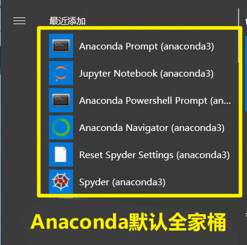
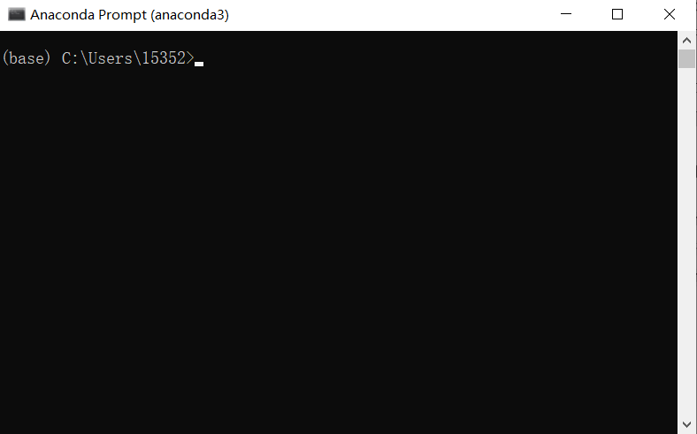
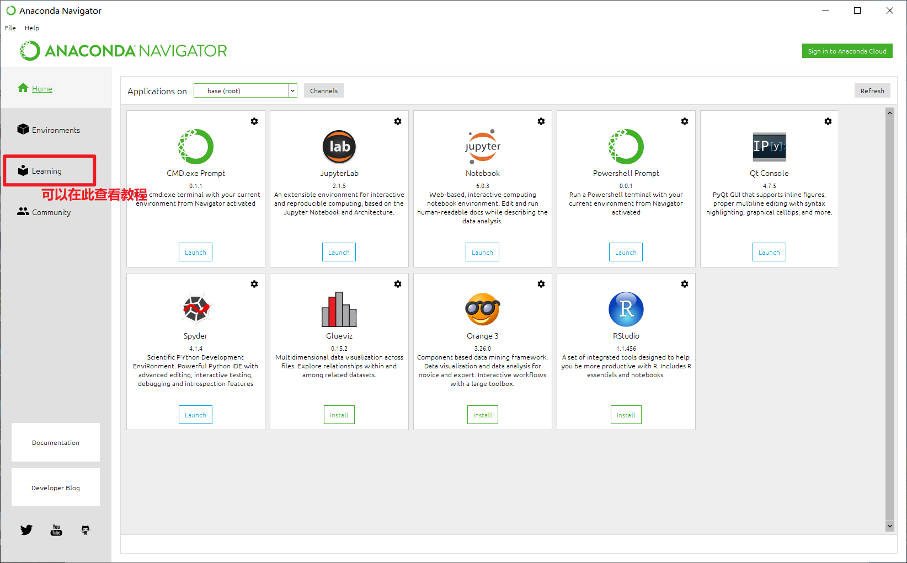
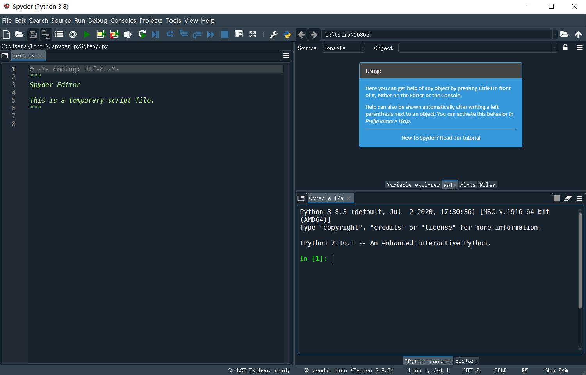
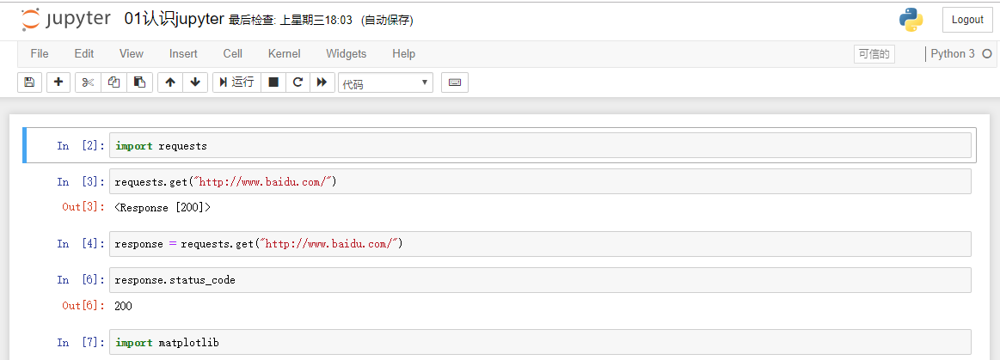
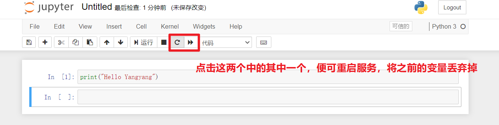

[toc]

# 数据分析前奏

## 01.数据分析介绍

### 1.1 什么是数据分析？

数据分析是指用适当的统计分析方法对收集来的大量数据进行分析，提取有用信息和形成结论而对数据加以详细研究和概括总结的过程。数据分析的目的有多种，概括起来有三种：**现状分析**、**原因分析**、**预测分析**。现状分析简单来说就是告诉你过去发生了什么。原因分析简单来说就是告诉你某一现状为什么发生。预测分析简单来说就是预测未来会发生什么。

### 1.2 数据分析的步骤（重要）

数据分析主要有**六**个过程：

1. 需求明确：明确做数据分析的目标。为后面的分析过程做好铺垫。
2. 数据收集：通过爬虫、商务合作的方式，获取想要的数据。
3. 数据处理：对获取来的数据进行处理和清洗，把不需要的剔除掉，把需要的加工成我们想要的，方便后面的分析。
4. 数据分析：根据自己的目的，以及现有的数据确定好分析的方法。
5. 数据展现：将数据按照确定好的分析方法进行展示出来。
6. 撰写报告：将分析的结果通过图表和文字的方式形成报告文档。

### 1.3 数据分析的误区

1. 分析目的不明确，为分析而分析：一定要找准自己分析数据的目标而去分析，比如是要了解现状，还是找出原因，还是预测未来发展等，千万不要为了分析而分析，这样就偏离主题了。
2. 缺乏业务知识，分析结果偏离实际：分析数据的时候，一定要和公司的业务结合起来。如果脱离业务，即使数据分析方法再牛逼，图标再优美，也无济于事。
3. 追求高级分析方法：一些人喜欢用一些高级的分析方法，认为只有这样才能体现专业性。其实高级的数据分析方法不一定是最好的，能够简单有效的解决问题的方法才是最好的。

### 1.4 数据分析的方法和工具

数据分析可以通过工具，也可以通过代码来实现。以下分别列出这些常用的：

1. 工具：Excel、Tableau、SPSS、百度图说等。
2. 编程：Python语言、R语言、数据库的SQL语言、Excel的VBA语言等。

### 1.5 工具和代码该怎么选？

两者没有好坏之分，只有合适之分。数据分析总体来讲有两个模块，一个是数据处理，一个是可视化。如果数据已经经过处理了，并且手头上的软件可以直接非常方便的做可视化处理，那么我们用软件实现就可以。如果数据没有经过处理，那么最好通过python或者r对数据进行有一些处理，然后再通过软件可视化。或者软件的可视化无法满足我们的要求，那么可以通过代码来实现。总而言之，工具功能无法100%的满足你的要求，但是效率高。代码做数据处理比较好，最数据可视化比较繁琐，但是DIY属性强！


## 02.环境搭建与介绍——Anaconda

### 2.0 Anaconda是什么？

学习数据分析，我们用到的环境是——Anaconda。

anaconda读作`[ˌænəˈkɒndə]`，单词原意为“水蟒”，就像Python原意为“蟒蛇”，大家都是一家人~

`Anaconda（水蟒）`是一个捆绑了`Python`、`conda`、其他相关依赖包的一个软件。包含了180多个可学计算包及其依赖。`Anaconda3`是集成了`Python3`的环境，`Anaconda2`是集成了`Python2`的环境。`Anaconda`默认集成的包，是属于内置的`Python`的包。并且支持绝大部分操作系统（比如：Windows、Mac、Linux等）。下载地址如下：[Anaconda下载地址](https://www.anaconda.com/products/individual)（如果官网下载太慢，可以在清华大学开源软件站中下载[清华镜像](https://mirrors.tuna.tsinghua.edu.cn/anaconda/archive/)）。根据自己的操作系统，下载相应的版本，因为`Anaconda`内置了许多的包，所以安装过程需要耗费相当长的时间，大家在安装的时候需要耐心等待。在安装完成后，会有以下几个模块：`Anaconda prompt`、`Anaconda Navigator`、`Spyder`、`jupyter notebook`，如下图：



以下对它们分别做一些介绍~

### 2.1 Anaconda prompt

`Anaconda prompt`是专门用来操作`anaconda`的终端，其命令同与Windows的cmd。如果你安装完`Anaconda`后没有在环境变量的`PATH`中添加相关的环境变量，那么以后你想在终端使用`anaconda`相关的命令，则必须要在`Anaconda prompt`中完成。

下面还有一个`Anaconda Poweshell Prompt`，它的基本命令同powershell，即既支持cmd命令，也支持Linux终端命令。



### 2.2 Anaconda Navigator

这个是一个图形界面的导航面板，上面组织了`Anaconda`相关的软件。界面如下：




### 2.3 Spyder

一个专门开发`Python`的软件，熟悉`MATLAB`的同学会比较有亲切感，但在后期的学习过程中，我们将不会使用这个工具写代码，因为还有更好的可替代的工具。虽然不用，但也看一下它长啥样子吧~




### 2.4 Jupyter Notebook（重要）

#### 2.4.1 干啥的？

一个Python编辑环境，可以实时的查看代码的运行效果。



#### 2.4.2 怎么打开？

1. 先打开`Anaconda Prompt`或者`Anaconda PowerShell Prompt`，然后进入到项目所在的目录。
2. 输入命令`jupyter notebook`打开`jupyter notebook`浏览器。

#### 2.4.3 怎么用？

jupyter notebook可以用鼠标完成相应命令；也可以像Vim一样键盘操作，同样的分为编辑模式和命令模式（按`Esc`进入命令模式）。

**命令模式常用命令**

1. Enter：转入编辑模式
2. Shift-Enter：运行本单元，选中下个单元
3. Ctrl-Enter：运行本单元
4. Alt-Enter：运行本单元，在其下插入新单元
5. Y：单元转入代码状态
6. M：单元转入markdown状态
7. R：单元转入raw状态
8. 1：设定 1 级标题
9. 2：设定 2 级标题
10. 3：设定 3 级标题
11. 4：设定 4 级标题
12. 5：设定 5 级标题
13. 6：设定 6 级标题
14. Up：选中上方单元
15. K：选中上方单元
16. Down：选中下方单元
17. J：选中下方单元
18. Shift-K：扩大选中上方单元
19. Shift-J：扩大选中下方单元
20. A：在上方插入新单元
21. B：在下方插入新单元
22. X：剪切选中的单元
23. C：复制选中的单元
24. Shift-V：粘贴到上方单元
25. V：粘贴到下方单元
26. Z：恢复删除的最后一个单元
27. D,D：删除选中的单元
28. Shift-M：合并选中的单元
29. Ctrl-S：文件存盘
30. S：文件存盘
31. L：转换行号
32. O：转换输出
33. Shift-O：转换输出滚动
34. Esc：关闭页面
35. Q：关闭页面
36. H：显示快捷键帮助
37. I,I：中断Notebook内核
38. 0,0：重启Notebook内核
39. Shift：忽略
40. Shift-Space：向上滚动
41. Space：向下滚动

**编辑模式常用快捷键**

1. Tab : 代码补全或缩进
2. Shift-Tab : 提示
3. Ctrl-] : 缩进
4. Ctrl-[ : 解除缩进
5. Ctrl-A : 全选
6. Ctrl-Z : 复原
7. Ctrl-Shift-Z : 再做
8. Ctrl-Y : 再做
9. Ctrl-Home : 跳到单元开头
10. Ctrl-Up : 跳到单元开头
11. Ctrl-End : 跳到单元末尾
12. Ctrl-Down : 跳到单元末尾
13. Ctrl-Left : 跳到左边一个字首
14. Ctrl-Right : 跳到右边一个字首
15. Ctrl-Backspace : 删除前面一个字
16. Ctrl-Delete : 删除后面一个字
17. Esc : 进入命令模式
18. Ctrl-M : 进入命令模式
19. Shift-Enter : 运行本单元，选中下一单元
20. Ctrl-Enter : 运行本单元
21. Alt-Enter : 运行本单元，在下面插入一单元
22. Ctrl-Shift-- : 分割单元
23. Ctrl-Shift-Subtract : 分割单元
24. Ctrl-S : 文件存盘
25. Shift : 忽略
26. Up : 光标上移或转入上一单元
27. Down :光标下移或转入下一单元

#### 2.4.4 注意事项（重要）

`jupyter notebook`每一个`cell`运行完后都会把这个`cell`中的变量保存到内存中，如果在一个`cell`中修改了之前的变量，再此运行这个`cell`的时候可能会导致一些问题产生。比如以下代码：

```python
# 第一个cell中的代码
a = 10
b = 20

# 第二个cell中的代码
c = a/b
b = 0
```

因为第二个`cell`修改了`b`变量，此时在整个环境中`b`都是等于0的，所以以后再运行这个`cell`的时候，`a/b`这个就会出问题了。这时候可以使用`Kernel->Rstart&Run All`来重新运行整个项目。在图形界面中，可以用如下方式：



### 2.5 conda

#### 2.5.1 介绍

`conda`伴随着`Anaconda`安装而**自动**安装的。`conda`可以跟`virtualenv`一样管理不同的环境，也可以跟`pip`一样管理某个环境下的包。以下来看看两个功能的用法。

#### 2.5.2 环境管理

能跟`virtualenv`一样管理不同的`Python`环境，不同的环境之间是互相隔离，互不影响的。为什么需要创建不同的环境呢？原因是有时候项目比较多，但是项目依赖的包不一样，比如`A`项目用的是`Python2`开发的，而`B`项目用的是`Python3`开发的，那么我们在同一台电脑上就需要两套不同的环境来支撑他们运行了。创建环境的基本命令如下（以下命令需在Anaconda Prompt或Anaconda Powershell Prompt内执行）：

```shell
# conda create --name [环境名称] 比如以下：
conda create --name da-env
```

这样将创建一个叫做`da-env`的环境，这个环境的`python`解释器根据`anaconda`来，如果`anaconda`为`3.7`，那么将默认使用`3.7`的环境，如果`anaconda`内置的是`2.7`，那么将默认使用`2.7`的环境。然后你就可以使用`conda install numpy`的方式来安装包了，并且这样安装进来的包，只会安装在当前环境中。有的同学可能有想问，如果想要装一个`Python2.7`的环境，`anaconda`中没有内置`Python2.7`，那么该怎么实现呢？。实际上，我们只需要在安装的时候指定`python`的版本，如果这个版本现在不存在，那么`anaconda`会自动的给我们下载。所以安装`Python2.7`的环境，使用以下代码即可实现：

```powershell
conda create --name xxx python=2.7
```

以下再列出`conda`管理环境的其他命令：

1. 创建的时候指定需要安装的包：

```
conda create --name xxx numpy pandas
```

2. 创建的时候既需要指定包，也需要指定python环境：

```
conda create --name xxx python=3.7 numpy pandas
```

3. 进入到某个环境

```
windows: activate xxx
mac/linux: source activate xxx
```

4. 退出环境：

```
deactivate
```

5. 列出当前所有的环境：

```
conda env list
```

6. 移除某个环境：

```
conda remove --name xxx --all
```

7. 环境下的包导出和导入：

   - 导出：`conda env export > environment.yml`。
   - 导入：`conda env create --name xxx -f environment.yml`。

#### 2.5.3 包管理

`conda`也可以用来管理包。比如我们创建完一个新的环境后，想要在这个环境中安装包（比如numpy），那么可以通过以下代码来实现：

```shell
activate xxx
conda install numpy
```

以下再介绍一些包管理常用的命令：

1. 在不进入某个环境下直接给这个环境安装包：

```shell
conda install [包名] -n [环境名]
```

2. 列出该环境下所有的包：

```shell
conda list
```

3. 卸载某个包：

```shell
conda remove [包名]
```

4. 设置安装包的源：

```
conda config --add channels https://mirrors.tuna.tsinghua.edu.cn/anaconda/pkgs/free/
conda config --add channels https://mirrors.tuna.tsinghua.edu.cn/anaconda/pkgs/main/
conda config --set show_channel_urls yes
```