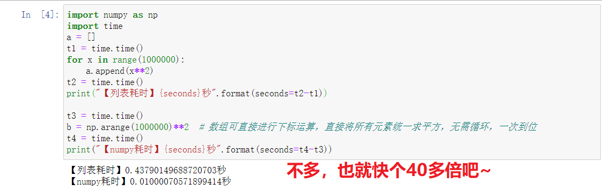
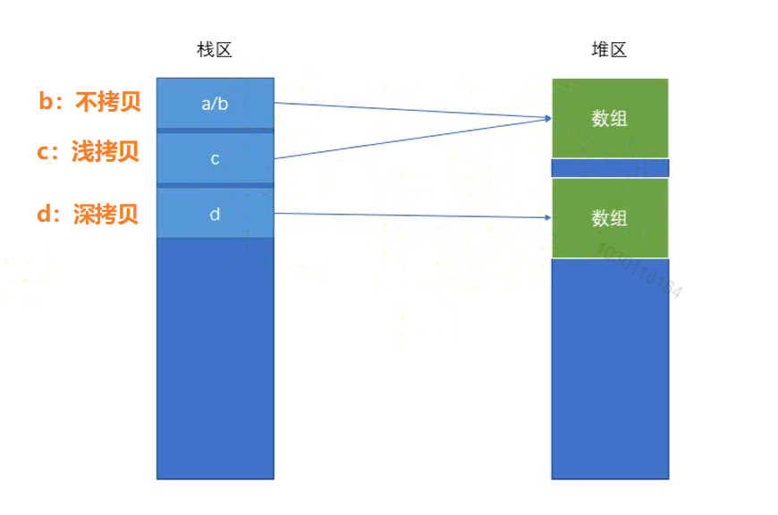
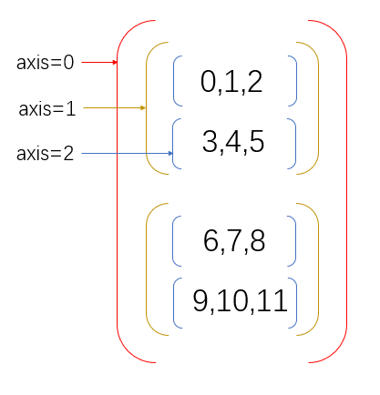

# Numpy库的使用

## 01.Numpy介绍

### 1.1 Numpy特点

`NumPy`是一个功能强大的`Python`库，主要用于对多维数组执行计算。`NumPy`这个词来源于两个单词-- `Numerical`和`Python`。`NumPy`提供了大量的库函数和操作，可以帮助程序员轻松地进行数值计算。在数据分析和机器学习领域被广泛使用。他有以下几个特点：

1. numpy内置了并行运算功能，当系统有多个核心时，做某种计算时，numpy会自动做并行计算。
2. Numpy底层使用C语言编写，内部解除了GIL（全局解释器锁），其对数组的操作速度不受Python解释器的限制，效率远高于纯Python代码。
3. 有一个强大的N维数组对象Array（一种类似于列表的东西）。
4. 实用的线性代数、傅里叶变换和随机数生成函数。

总而言之，他是一个非常高效的用于处理数值型运算的包。

### 1.2 安装

```shell
pip install numpy
```

### 1.3 教程地址

1. [numpy官网教程](https://docs.scipy.org/doc/numpy/user/quickstart.html)
2. [中文文档](https://www.numpy.org.cn/)

### 1.4 性能PK：Numpy数组 VS Python列表

**代码**

```python
import numpy as np
import time
a = []
t1 = time.time()
for x in range(1000000):
    a.append(x**2)
t2 = time.time()
print("【列表耗时】{seconds}秒".format(seconds=t2-t1))

t3 = time.time()
b = np.arange(1000000)**2  # 数组可直接进行下标运算，直接将所有元素统一求平方，无需循环，一次到位
t4 = time.time()
print("【numpy耗时】{seconds}秒".format(seconds=t4-t3))
```

**效果展示**




-------------------

## 02.Numpy数组基本介绍

1. `Numpy`是`Python`科学计算库，用于快速处理任意维度的数组。
2. `NumPy`提供一个**N维数组类型ndarray**，它描述了**相同类型**的“items”的集合。
3. `numpy.ndarray`支持向量化运算。
4. `NumPy`使用c语言写的，底部解除了`GIL`，其对数组的操作速度不在受`python`解释器限制。

### 2.1 numpy中的数组

`Numpy`中的数组的使用跟`Python`中的列表非常类似。他们之间的区别如下：

1. 一个列表中可以存储多种数据类型。比如`a = [1,'a']`是允许的，而数组只能存储同种数据类型。
2. 数组可以是多维的，当多维数组中所有的数据都是数值类型的时候，相当于线性代数中的矩阵，是可以进行相互间的运算的。

### 2.2 创建数组（np.ndarray对象）

`Numpy`经常和数组打交道，因此首先第一步是要学会创建数组。在`Numpy`中的数组的数据类型叫做`ndarray`。以下是两种创建的方式：

1. 根据`Python`中的列表生成：

```python
import numpy as np
a1 = np.array([1,2,3,4])
print(a1)
print(type(a1))
```

2. 使用`np.arange`生成，`np.arange`的用法类似于`Python`中的`range`：

```python
import numpy as np
a2 = np.arange(2,21,2)
print(a2)
```

3. 使用`np.random`生成随机数的数组：

```python
a1 = np.random.random(2,2) # 生成2行2列的随机数的数组
a2 = np.random.randint(0,10,size=(3,3)) # 元素是从0-10之间随机的3行3列的数组
```

4. 使用函数生成特殊的数组：

```python
import numpy as np
a1 = np.zeros((2,2)) #生成一个所有元素都是0的2行2列的数组
a2 = np.ones((3,2)) #生成一个所有元素都是1的3行2列的数组
a3 = np.full((2,2),8) #生成一个所有元素都是8的2行2列的数组
a4 = np.eye(3) #生成一个在斜方形上元素为1，其他元素都为0的3x3的矩阵
```

### 2.3 ndarray常用属性

#### 2.3.1 `ndarray.dtype`

因为数组中只能存储同一种数据类型，因此可以通过`dtype`获取数组中的元素的数据类型。以下是`ndarray.dtype`的常用的数据类型：

| 数据类型   | 描述                                                        | 唯一标识符 |
| ---------- | ----------------------------------------------------------- | ---------- |
| bool       | 用一个字节存储的布尔类型（True或False）                     | 'b'        |
| int8       | 一个字节大小，-128 至 127                                   | 'i1'       |
| int16      | 整数，16 位整数(-32768 ~ 32767)                             | 'i2'       |
| int32      | 整数，32 位整数(-2147483648 ~ 2147483647)                   | 'i4'       |
| int64      | 整数，64 位整数(-9223372036854775808 ~ 9223372036854775807) | 'i8'       |
| uint8      | 无符号整数，0 至 255                                        | 'u1'       |
| uint16     | 无符号整数，0 至 65535                                      | 'u2'       |
| uint32     | 无符号整数，0 至 2 ** 32 - 1                                | 'u4'       |
| uint64     | 无符号整数，0 至 2 ** 64 - 1                                | 'u8'       |
| float16    | 半精度浮点数：16位，正负号1位，指数5位，精度10位            | 'f2'       |
| float32    | 单精度浮点数：32位，正负号1位，指数8位，精度23位            | 'f4'       |
| float64    | 双精度浮点数：64位，正负号1位，指数11位，精度52位           | 'f8'       |
| complex64  | 复数，分别用两个32位浮点数表示实部和虚部                    | 'c8'       |
| complex128 | 复数，分别用两个64位浮点数表示实部和虚部                    | 'c16'      |
| object_    | python对象                                                  | 'O'        |
| string_    | 字符串                                                      | 'S'        |
| unicode_   | unicode类型                                                 | 'U'        |

我们可以看到，`Numpy`中关于数值的类型比`Python`内置的多得多，这是因为`Numpy`为了能高效处理处理海量数据而设计的。举个例子，比如现在想要存储上百亿的数字，并且这些数字都不超过254（一个字节内），我们就可以将`dtype`设置为`int8`，这样就比默认使用`int64`更能节省内存空间了。类型相关的操作如下：

1. 默认的数据类型：

```python
import numpy as np
a1 = np.array([1,2,3])
print(a1.dtype) 
# 如果是windows系统，默认是int32
# 如果是mac或者linux系统，则根据系统来
```

2. 指定`dtype`

```python
import numpy as np
a1 = np.array([1,2,3],dtype=np.int64)
# 或者 a1 = np.array([1,2,3],dtype="i8")
print(a1.dtype)
```

3. 修改`dtype`

```python
import numpy as np
a1 = np.array([1,2,3])
print(a1.dtype) # window系统下默认是int32
# 以下修改dtype
a2 = a1.astype(np.int64) # astype不会修改数组本身，而是会将修改后的结果返回
print(a2.dtype)
```

#### 2.3.2 `ndarray.size`

获取数组中总的元素的个数。比如有个二维数组：

```python
import numpy as np
a1 = np.array([[1,2,3],[4,5,6]])
print(a1.size) #打印的是6，因为总共有6个元素
```

#### 2.3.3 `ndarray.ndim`

数组的维数。比如：

```python
a1 = np.array([1,2,3])
print(a1.ndim) # 维度为1
a2 = np.array([[1,2,3],[4,5,6]])
print(a2.ndim) # 维度为2
a3 = np.array([[[1,2,3],[4,5,6]],[[7,8,9],[10,11,12]]])
print(a3.ndim) # 维度为3
```

#### 2.3.4 `ndarray.shape`

数组的维度的元组。比如以下代码：

```python
a1 = np.array([1,2,3])
print(a1.shape) # 输出(3,)，意思是一维数组，有3个数据

a2 = np.array([[1,2,3],[4,5,6]])
print(a2.shape) # 输出(2,3)，意思是二位数组，2行3列

a3 = np.array([
    [
        [1,2,3],
        [4,5,6]
    ],
    [
        [7,8,9],
        [10,11,12]
    ]
])
print(a3.shape) # 输出(2,2,3)，意思是三维数组，总共有2个元素，每个元素是2行3列的

a44 = np.array([1,2,3],[4,5])
print(a4.shape) # 输出(2,)，意思是a4是一个一维数组，总共有2列
print(a4) # 输出[list([1, 2, 3]) list([4, 5])]，其中最外面层是数组，里面是Python列表
```

【总结】：**返回的元组有几个元素，就代表数组有几维！**

* `(12,)`表示有12个元素的一维数组
* `(12, 1)`表示有12个元素的二维数组！

另外，我们还可以通过`ndarray.reshape`来重新修改数组的维数。示例代码如下：

```python
a1 = np.arange(12) #生成一个有12个数据的一维数组
print(a1) 

a2 = a1.reshape((3,4)) #变成一个2维数组，是3行4列的
print(a2)

a3 = a1.reshape((2,3,2)) #变成一个3维数组，总共有2块，每一块是2行2列的
print(a3)

a4 = a2.reshape((12,)) # 将a2的二维数组重新变成一个12列的1维数组
print(a4)

a5 = a2.flatten() # flatten意为扁平化，不管a2是几维数组，都将他变成一个一维数组
print(a5)
```

注意，`reshape`并不会修改原来数组本身，而是会将修改后的结果返回。如果想要直接修改数组本身，那么可以使用`resize`来替代`reshape`。

#### 2.3.5 `ndarray.itemsize`

数组中每个元素占的大小，单位是字节。比如以下代码：

```python
a1 = np.array([1,2,3],dtype=np.int32)
print(a1.itemsize) # 打印4，因为每个字节是8位，32位/8=4个字节
```

通过`ndarray.size`和`ndarray.itemsize`两个属性，可以计算出一个数组在内存中所占空间的大小（以字节为单位），只需要将两者相乘即可。


## 03.数组基本操作——索引

### 3.1 花式索引

#### 3.1.1 一维数组

**代码举例**

```python
import numpy as np

a1 = np.arange(10)  # 创建数组

print("原始数组：a1 = %s" % a1)

# 1.索引操作
print("【例一】索引操作：a1[4] = %s" % a1[4] )
# 2.切片操作
print("【例二】切片操作：a1[4:6] = %s" % a1[4:6])
# 3.使用步长
print("【例三】使用步长：a1[::2] = %s" % a1[::2])
# 4.使用负数来作为索引
print("【例四】负数索引：a1[-1] = %s" % a1[-1])
```

**效果展示**


#### 3.1.2 二维数组

**代码举例**

```python
a2 = np.random.randint(0, 10, size=(4, 6))
print("原始数组：\n%s" % a2)

# 1.获取某一行
print("【例一】获取第0行：a2[0] = %s" % a2[0])

# 2.获取连续的多行
print("【例二】获取1-2行：a2[1:3] = \n%s" % a2[1:3])

# 3.获取离散的多行
print("【例三】获取第0、2、3行：a2[[0, 2, 3]]=\n%s" % a2[[0, 2, 3]])

# 4.获取某一个元素
print("【例四】获取第2行第3列元素：a2[2,3] = %s" % a2[2, 3])

# 5.获取离散的某2个元素
print("【例五】获取第1行第4列和第4行第5列这两个离散的元素：a2[[1,2],[4,5]] = %s" % a2[[1,2], [4,5]])

# 6.连续截取数组的某一部分
print("【例六】获取第1行第4列到第4行第5列之间的所有元素：a2[1:2,4:5] = \n%s" % a2[1:3, 4:6])

# 7.获取某一列
print("【例七】获取第二列：a2[:,2] = %s" % a2[:,2])

# 8.获取离散的两列
print("【例八】获取第零列和第四列：a2[:,[0,4]] = \n%s" % a2[:, [0,4]])
```

**效果展示**


#### 3.1.3 花式索引总结

* 如果数组是一维的，那其索引和切片和Python列表
* 如果是多维的，规则如下（这里以二维为例）：
    * **逗号左边是行，逗号右边是列**（若只有一个值，则表示行）
    * 连续获取用切片，离散获取用中括号（比较例五和例六）


### 3.2 布尔索引

布尔运算也是矢量的，比如以下代码：

```python
a1 = np.arange(0,24).reshape((4,6))
print(a1<10) #会返回一个新的数组，这个数组中的值全部都是bool类型
> [[ True  True  True  True  True  True]
 [ True  True  True  True False False]
 [False False False False False False]
 [False False False False False False]]
```

这样看上去没有什么用，假如我现在要实现一个需求，要将`a1`数组中所有小于10的数据全部都提取出来。那么可以使用以下方式实现：

```python
a1 = np.arange(0,24).reshape((4,6))
a2 = a1 < 10
print(a1[a2]) #这样就会在a1中把a2中为True的元素对应的位置的值提取出来
```

其中布尔运算可以有`!=`、`==`、`>`、`<`、`>=`、`<=`以及`&(与)`和`|(或)`。示例代码如下：

```python
a1 = np.arange(0,24).reshape((4,6))
a2 = a1[(a1 < 5) | (a1 > 10)]
print(a2)
```

总结：

* 布尔索引是通过同形状的布尔矩阵进行元素提取，为True选中，为False则不选。
* 提取条件可以有多个，此时需要逻辑运算符来连接，注意此时每个条件都要用圆括号括起来，否则会报错。

### 3.3 值的替换

利用索引，也可以做一些值的替换。把满足条件的位置的值替换成其他的值。比如以下代码：

```python
a1 = np.arange(0,24).reshape((4,6))
a1[3] = 0 #将第三行的所有值都替换成0
print(a1)
```

也可以使用条件索引来实现：

```python
a1 = np.arange(0,24).reshape((4,6))
a1[a1 < 5] = 0 #将小于5的所有值全部都替换成0
print(a1)
```

还可以使用函数来实现：

```python
# where函数：
a1 = np.arange(0,24).reshape((4,6))
a2 = np.where(a1 < 10,1,0) #把a1中所有小于10的数全部变成1，其余的变成0
print(a2)
```

### 3.4 练习作业

####  5道题目

1. 将`np.arange(10)`数组中的奇数全部都替换成`-1`。
2. 有一个`4`行`4`列的数组（比如：`np.random.randint(0,10,size=(4,4))`），请将其中对角线的数取出来形成一个一维数组。提示（使用`np.eye`）。
3. 有一个`4`行`4`列的数组，请取出其中`(0,0),(1,2),(3,2)`的点。
4. 有一个`4`行`4`列的数组，请取出其中`2-3`行（包括第3行）的所有数据。
5. 有一个`8`行`9`列的数组，请将其中1-5行（包含第5行）的第8列大于3的数全部都取出来。

#### 参考答案

**1.将`np.arange(10)`数组中的奇数全部都替换成`-1`。**

```python
>>> import numpy as np
>>> a1 = np.arange(10)
>>> a1[a1% != 0] = -1  # 布尔索引
>>> a1
array([ 0, -1,  2, -1,  4, -1,  6, -1,  8, -1])
```

**2.有一个`4`行`4`列的数组（比如：`np.random.randint(0,10,size=(4,4))`），请将其中对角线的数取出来形成一个一维数组。提示（使用`np.eye`）。**

```python
>>> a2 = np.random.randint(0, 10, size=(4,4))
>>> a2
array([[5, 3, 4, 8],
       [2, 2, 6, 6],
       [4, 2, 2, 8],
       [3, 8, 7, 2]])
>>> eye = np.eye(4, dtype=bool)  # 这里可以直接指定Python的bool类型哦！
>>> eye
array([[ True, False, False, False],
       [False,  True, False, False],
       [False, False,  True, False],
       [False, False, False,  True]])
>>> a2[eye]
array([5, 2, 2, 2])
```

**3.有一个`4`行`4`列的数组，请取出其中`(0,0),(1,2),(3,2)`的点。**

```python
>>> a3 = np.random.randint(0,10, size=(4,4))
>>> a3
array([[4, 2, 2, 6],
       [8, 1, 3, 2],
       [9, 1, 2, 7],
       [8, 3, 9, 2]])
>>> a3[[0,1,3],[0,2,2]]  # 取离散点要放在中括号里哦~
array([4, 3, 9])
```

**4.有一个`4`行`4`列的数组，请取出其中`2-3`行（包括第3行）的所有数据。**

```python
>>> a4 = np.random.randint(0, 10, size=(4,4))
>>> a4
array([[4, 0, 5, 2],
       [4, 3, 2, 7],
       [4, 5, 6, 5],
       [5, 8, 1, 1]])
>>> a4[2:4]
array([[4, 5, 6, 5],
       [5, 8, 1, 1]])
```

**5.有一个`8`行`9`列的数组，请将其中1-5行（包含第5行）的第8列大于3的数全部都取出来。**

```python
>>> a5 = np.random.randint(0,10, size=(8,9))
>>> a5
array([[1, 5, 0, 0, 1, 7, 3, 5, 5],
       [1, 0, 8, 1, 9, 8, 5, 3, 6],
       [9, 4, 8, 8, 0, 5, 4, 1, 5],
       [2, 5, 1, 7, 3, 2, 1, 1, 1],
       [0, 0, 4, 8, 6, 3, 7, 5, 1],
       [4, 4, 7, 6, 5, 5, 7, 6, 5],
       [0, 8, 4, 7, 9, 8, 5, 4, 1],
       [5, 5, 8, 1, 9, 1, 9, 3, 2]])
>>> data = a5[1:6,8]
>>> data
array([2, 7, 4, 4, 2])
>>> data[data>3]
array([7, 4, 4])
```


## 04.数组基本操作——广播

### 4.1 数组与数的计算

在`Python`列表中，想要对列表中所有的元素都加一个数，要么采用`map`函数，要么循环整个列表进行操作。但是`NumPy`中的数组可以**直接在数组上进行操作**。示例代码如下：

```python
import numpy as np

>>> a1 = np.random.random((3,4))
>>> a1
array([[0.62928116, 0.37295703, 0.31856012, 0.6968846 ],
       [0.71481242, 0.64369174, 0.78137192, 0.45072004],
       [0.44628399, 0.67282452, 0.70013595, 0.84670274]])

>>> a2 = a1*10  # 所有元素都乘10
>>> a2
array([[6.2928116 , 3.72957027, 3.18560121, 6.96884605],
       [7.14812417, 6.43691744, 7.81371918, 4.50720035],
       [4.46283993, 6.72824516, 7.00135949, 8.46702742]])

>>> a3 = a2.round(2)  # 所有元素都只保留2位小数
>>> a3
array([[6.29, 3.73, 3.19, 6.97],
       [7.15, 6.44, 7.81, 4.51],
       [4.46, 6.73, 7.  , 8.47]])
```

以上例子是相乘，其实相加、相减、相除也都是类似的。

### 4.2 数组与数组的计算

**(1)结构完全相同的数组之间的运算**

```python
import numpy as np

>>> a1 = np.arange(0, 24).reshape((3, 8))
>>> a1
array([[ 0,  1,  2,  3,  4,  5,  6,  7],
       [ 8,  9, 10, 11, 12, 13, 14, 15],
       [16, 17, 18, 19, 20, 21, 22, 23]])

>>> a2 = np.random.randint(1, 10, size=(3,8))
>>> a2
array([[6, 3, 2, 6, 2, 4, 8, 8],
       [7, 4, 4, 8, 3, 8, 8, 8],
       [9, 9, 2, 4, 9, 5, 3, 1]])

>>> a1 + a2  # 求和：对应位置上的元素相加
array([[ 6,  4,  4,  9,  6,  9, 14, 15],
       [15, 13, 14, 19, 15, 21, 22, 23],
       [25, 26, 20, 23, 29, 26, 25, 24]])

>>> a1 * a2  # 相乘：只是对应位置上的元素相乘，而非矩阵乘法！！！
array([[  0,   3,   4,  18,   8,  20,  48,  56],
       [ 56,  36,  40,  88,  36, 104, 112, 120],
       [144, 153,  36,  76, 180, 105,  66,  23]])
```

**(2)与行数相同并且只有1列的数组之间的运算**

```python
>>> a1 = np.random.randint(10, 20, size=(3,8))  # 3行8列
>>> a1
array([[16, 12, 16, 15, 19, 13, 16, 10],
       [10, 11, 11, 13, 13, 17, 18, 19],
       [16, 13, 15, 17, 10, 15, 16, 15]])

>>> a2 = np.random.randint(1,10,size=(3,1))  # 3行1列
>>> a2
array([[7],
       [1],
       [3]])

>>> a1 - a2  # a1的每一列都减去a2
array([[ 9,  5,  9,  8, 12,  6,  9,  3],
       [ 9, 10, 10, 12, 12, 16, 17, 18],
       [13, 10, 12, 14,  7, 12, 13, 12]])
```

**(3)与列数相同并且只有1行的数组之间的运算**

```python
>>> a1 = np.random.randint(10, 20, size=(3,8))  # 3行8列
>>> a1
array([[14, 15, 12, 11, 10, 18, 14, 13],
       [16, 13, 17, 15, 10, 17, 18, 14],
       [19, 19, 13, 17, 12, 13, 12, 12]])

>>> a2 = np.random.randint(1,10,size=(1,8)) # 1行8列
>>> a2
array([[8, 4, 2, 4, 6, 1, 2, 5]])

>>> a1 - a2  # a1的每一行都减去a2
array([[ 6, 11, 10,  7,  4, 17, 12,  8],
       [ 8,  9, 15, 11,  4, 16, 16,  9],
       [11, 15, 11, 13,  6, 12, 10,  7]])
```


### 4.3 广播机制

**如果两个数组的后缘维度（trailing dimension，即从末尾开始算起的维度）的轴长度相符或其中一方的长度为1，则认为他们是广播兼容的。广播会在缺失和（或）长度为1的维度上进行。**看以下案例分析：

1. `shape`为`(3,8,2)`的数组能和`(8,3)`的数组进行运算吗？
   分析：不能，因为按照广播原则，从后面往前面数，`(3,8,2)`和`(8,3)`中的`2`和`3`不相等，所以不能进行运算。
2. `shape`为`(3,8,2)`的数组能和`(8,1)`的数组进行运算吗？
   分析：能，因为按照广播原则，从后面往前面数，`(3,8,2)`和`(8,1)`中的`2`和`1`虽然不相等，但是因为有一方的长度为`1`，所以能参与运算。
3. `shape`为`(3,1,8)`的数组能和`(8,1)`的数组进行运算吗？
   分析：能，因为按照广播原则，从后面往前面数，`(3,1,4)`和`(8,1)`中的`4`和`1`虽然不相等且`1`和`8`不相等，但是因为这两项中有一方的长度为`1`，所以能参与运算。

```python
import numpy as np

>>> a1 = np.random.randint(10, 20, size = (2,3,4))  # a1共2页，每一页都是3行4列
>>> a1
array([[[17, 18, 12, 18],
        [11, 11, 19, 16],
        [17, 15, 12, 13]],

       [[18, 14, 17, 19],
        [19, 10, 12, 17],
        [17, 16, 11, 19]]])
>>> a2 = np.random.randint(1, 10, size=(3,4))  # a2和a1的每一页规模相同
>>> a2
array([[6, 6, 7, 6],
       [5, 1, 6, 6],
       [8, 7, 1, 5]])

>>> a1 - a2  # 作差时，a1的每一页都减去a2
array([[[11, 12,  5, 12],
        [ 6, 10, 13, 10],
        [ 9,  8, 11,  8]],

       [[12,  8, 10, 13],
        [14,  9,  6, 11],
        [ 9,  9, 10, 14]]])
```

### 4.4 练习作业

#### 题目

1. 数组`a = np.random.rand(3,2,3)`能和`b = np.random.rand(3,2,2)`进行运算吗？能和`c = np.random.rand(3,1,1)`进行运算吗？请说明结果的原因。

#### 参考答案

**1.数组`a = np.random.rand(3,2,3)`能和`b = np.random.rand(3,2,2)`进行运算吗？能和`c = np.random.rand(3,1,1)`进行运算吗？请说明结果的原因。**

a和b不能运算

a和c能运算

## 05.数组基本操作——变形

### 5.1 变形

在numpy中可以通过一些函数，非常方便的操作数组的形状。

#### 5.1.1 任意形状——`reshape()`和`resize()`

两个方法都是用来修改数组形状的，但是有一些不同。

1. `reshape`是将数组转换成指定的形状，然后返回转换后的结果，对于原数组的形状是**不会**发生改变的。调用方式：

```python
import numpy as np

>>> a1 = np.random.randint(0, 10, size=(3,4))
>>> a1
array([[0, 2, 6, 4],
       [9, 7, 3, 2],
       [5, 4, 5, 2]])

>>> a1.reshape((2,6))  # 使用reshape()变形（约束条件：变形前后元素个数不能改变）
array([[0, 2, 6, 4, 9, 7],
       [3, 2, 5, 4, 5, 2]])

>>> a1  # 回头再看看a1，并没有发生变化
array([[0, 2, 6, 4],
       [9, 7, 3, 2],
       [5, 4, 5, 2]])
```

2. `resize`是将数组转换成指定的形状，会直接修改数组本身。并不会返回任何值。调用方式：

```python
>>> a2 = np.random.randint(0, 10, size=(3,4))
>>> a2
array([[9, 1, 5, 2],
       [5, 2, 4, 5],
       [1, 8, 5, 8]])

>>> a2.resize((2,6))  # resize()没有返回值，故此时命令行不会输出

>>> a2  # 回过头来再次看a2，它已然发生变化
array([[9, 1, 5, 2, 5, 2],
       [4, 5, 1, 8, 5, 8]])

```

#### 5.1.2 扁平化——`flattern()`和`ravel()`

两个方法都是将多维数组转换为一维数组，但是有以下不同：

1. `flatten`是将数组转换为一维数组后，然后将这个拷贝返回回去，所以后续对这个返回值进行修改不会影响之前的数组。

```python
import numpy as np

>>> a1 = np.array([[1,2,3,4],[5,6,7,8]])
>>> a1
array([[1, 2, 3, 4],
       [5, 6, 7, 8]])

>>> a1_flat = a1.flatten()
>>> a1_flat
array([1, 2, 3, 4, 5, 6, 7, 8])

>>> a1_flat[0] = 100  # 修改其中一个值
>>> a1_flat
array([100,   2,   3,   4,   5,   6,   7,   8])  # a1_flat发生了变化

>>> a1  # 原来的a1并没有变化
array([[1, 2, 3, 4],
       [5, 6, 7, 8]])
```

2. `ravel`是将数组转换为一维数组后，将这个视图（可以理解为引用）返回回去，所以后续对这个返回值进行修改会影响之前的数组。

```python
import numpy as np

>>> a1 = np.array([[1,2,3,4],[5,6,7,8]])
>>> a1
array([[1, 2, 3, 4],
       [5, 6, 7, 8]])

>>> a1_ravel = a1.ravel()
>>> a1_ravel
array([1, 2, 3, 4, 5, 6, 7, 8])

>>> a1_ravel[0] = 100  # 修改其中一个值
>>> a1_ravel
array([100,   2,   3,   4,   5,   6,   7,   8])  # a1_ravel发生了变化

>>> a1  # 原来的a1也发生了变化
array([[100,   2,   3,   4],
       [  5,   6,   7,   8]])
```


### 5.2 组合

如果有多个数组想要组合在一起，也可以通过其中的一些函数来实现。常用的组合函数有3个：

* vstack()
* hstack()
* concatenate()

#### 5.2.1 vstack()

`vstack`：将数组按垂直方向进行叠加。数组的列数必须相同才能叠加。示例代码如下：

**例一**

```python
>>> a = np.array([1,2,3])  # 一维数组
>>> b = np.array([4,5,6])  # 一维数组
>>> np.vstack((a,b))  # 可以将将二者放在元组里
array([[1, 2, 3],
       [4, 5, 6]])
>>> np.vstack([a,b])  # 也可以将二者放在列表里
array([[1, 2, 3],
       [4, 5, 6]])
```
* 这里两个一维数组叠加之后**升维**为二维数组
* 约束：两个一维数组的元素个数必须相同

**例二**

```python
>>> a = np.array([[1], [2], [3]])  # 3行1列的二维数组
>>> b = np.array([[4], [5]]) # 2行1列的二维数组
>>> np.vstack((a,b))  # 5行1列的二维数组
array([[1],
       [2],
       [3],
       [4],
       [5]])
```

* 这里是两个二维数组叠加
* 约束：两个二维数组列的个数必须相同

#### 5.2.2 hstack()

`hstack`：将数组按水平方向进行叠加。数组的行必须相同才能叠加。示例代码如下：

**例一**

```python
>>> a = np.array((1,2,3))
>>> b = np.array((4,5))
>>> np.hstack((a,b))
array([1, 2, 3, 4, 5])
```

* 细心的你也许会发现，这里的`hstack()`并没有升维，这是因为一维数组本身就是**行向量**，而且numpy里面没有列向量这一概念，对行向量进行转置并没有产生什么变化，为什么会这样呢？我也不清楚……
* 对于上面的问题，或许可以这样解释，一维数组既不是行向量，也不是列向量。行向量是1行n列的二维数组，列向量是1列n行的二维数组，这样就都解释通了，Yeah~

**例二**

```python
>>> a = np.array([[1],[2],[3]])
>>> a
array([[1],
       [2],
       [3]])
>>> b = np.array([[4, 5],[6, 7],[8,9]])
>>> b
array([[4, 5],
       [6, 7],
       [8, 9]])

>>> np.hstack((a,b))
array([[1, 4, 5],
       [2, 6, 7],
       [3, 8, 9]])
```

* 约束：a和b的行数必须相同。

#### 5.2.3 concatenate()

`concatenate([],axis)`：将两个数组进行叠加，但是具体是按水平方向还是按垂直方向。则要看`axis`的参数，如果`axis=0`，那么代表的是往垂直方向（行）叠加，如果`axis=1`，那么代表的是往水平方向（列）上叠加，如果`axis=None`，那么会将两个数组组合成一个一维数组。需要注意的是，如果往水平方向上叠加，那么行必须相同，如果是往垂直方向叠加，那么列必须相同。示例代码如下：

```python
>>> a = np.array([[1, 2], [3, 4]])
>>> a
array([[1, 2],
       [3, 4]])

>>> b = np.array([[5, 6]])
>>> b
array([[5, 6]])

>>> np.concatenate((a, b), axis=0)  # 0：水平切割。
array([[1, 2],
       [3, 4],
       [5, 6]])

>>> np.concatenate((a, b.T), axis=1)  # 1：竖直切割。b.T表示b的转置，后面会有介绍
array([[1, 2, 5],
       [3, 4, 6]])
```

### 5.3 切割

通过`hsplit`和`vsplit`以及`array_split`可以将一个数组进行切割。

#### 5.3.1 `hsplit()`

`hsplit`：按照水平方向进行切割。用于指定分割成几列，可以使用数字来代表分成几部分，也可以使用数组来代表分割的地方。示例代码如下：

```python
>>> a = np.arange(16).reshape(4, 4)
>>> a
array([[ 0,  1,  2,  3],
       [ 4,  5,  6,  7],
       [ 8,  9, 10, 11],
       [12, 13, 14, 15]])

>>> np.hsplit(a, 2)  # 将数组在水平方向“等分”成两部分
[array([[ 0,  1],
        [ 4,  5],
        [ 8,  9],
        [12, 13]]),
 array([[ 2,  3],
        [ 6,  7],
        [10, 11],
        [14, 15]])]


>>> np.hsplit(a, [1,2])  # 代表在下标为1的地方切一刀，下标为2的地方切一刀，分成三部分 
[array([[ 0],
        [ 4],
        [ 8],
        [12]]),
 array([[ 1],
        [ 5],
        [ 9],
        [13]]),
 array([[ 2,  3],
        [ 6,  7],
        [10, 11],
        [14, 15]])]
```

#### 5.3.2 `vsplit()`

`vsplit`：按照垂直方向进行切割。用于指定分割成几行，可以使用数字来代表分成几部分，也可以使用数组来代表分割的地方。示例代码如下：

```python
>>> a = np.arange(16).reshape(4, 4)
>>> a
array([[ 0,  1,  2,  3],
       [ 4,  5,  6,  7],
       [ 8,  9, 10, 11],
       [12, 13, 14, 15]])

>>> np.vsplit(a, 2)  # 代表按照行总共分成2个数组
[array([[0, 1, 2, 3],
        [4, 5, 6, 7]]),
 array([[ 8,  9, 10, 11],
        [12, 13, 14, 15]])]

>>> np.vsplit(a, [1,2])  # 代表按照行进行划分，在下标为1的地方和下标为2的地方分割
[array([[0, 1, 2, 3]]),
 array([[4, 5, 6, 7]]),
 array([[ 8,  9, 10, 11],
        [12, 13, 14, 15]])]
```

#### 5.3.3 `split()`

```python
>>> a = np.arange(16).reshape(4, 4)
>>> a
array([[ 0,  1,  2,  3],
       [ 4,  5,  6,  7],
       [ 8,  9, 10, 11],
       [12, 13, 14, 15]])

>>> np.split(a, 2, axis=0)  # 0：水平方向切割
[array([[0, 1, 2, 3],
        [4, 5, 6, 7]]),
 array([[ 8,  9, 10, 11],
        [12, 13, 14, 15]])]

>>> np.split(a, 2, axis=1)  #  1：竖直方向切割
[array([[ 0,  1],
        [ 4,  5],
        [ 8,  9],
        [12, 13]]),
 array([[ 2,  3],
        [ 6,  7],
        [10, 11],
        [14, 15]])]
```


### 5.4 转置

直接上代码：

```python
>>> a = np.arange(6).reshape(2, 3)
>>> a
array([[0, 1, 2],
       [3, 4, 5]])

>>> b = a.T  
>>> b
array([[0, 3],
       [1, 4],
       [2, 5]])

>>> c = a.transpose()  # 这个方法返回的是一个View，也即修改返回值，会影响到原来数组。
>>> c
array([[0, 3],
       [1, 4],
       [2, 5]])
```

* 求数组a的转置有两种方法：
  * a.T：深拷贝，修改返回值不会影响原数组
  * a.transpose()：浅拷贝：修改返回值**会**影响原数组
  * 何为深拷贝？何为浅拷贝？请看下节~

什么时候会用到转置呢？有时候在做一些计算的时候需要用到。比如做矩阵的内积的时候。就必须将矩阵进行转置后再乘以之前的矩阵：

```python
>>> a = np.arange(6).reshape(2, 3)
>>> a
array([[0, 1, 2],
       [3, 4, 5]])

>>> a.T
array([[0, 3],
       [1, 4],
       [2, 5]])

>>> a.dot(a.T)  # dot表示矩阵乘法
array([[ 5, 14],
       [14, 50]])
```

### 5.4 练习作业

#### 题目

1. 将数组`a = np.random.rand(3,5)`和`b = np.random.rand(6,4)`叠加在一起，其中`a`在`b`的上面，并且在`b`的第2列（下标从0开始）新增一列，用0来填充。

#### 参考答案

**1.想要将数组`a = np.arange(10).reshape(2,5)`和`b = np.arange(100,112).reshape(3,4)`叠加在一起，其中`a`在`b`的上面，并且在`b`的第1列后面（下标从0开始）新增一列，用0来填充。**

```python
# ==================================解法一================================
>>> a = np.arange(10).reshape(2,5)
>>> a
array([[0, 1, 2, 3, 4],
       [5, 6, 7, 8, 9]])

>>> b = np.arange(100,112).reshape(3,4)
>>> b
array([[100, 101, 102, 103],
       [104, 105, 106, 107],
       [108, 109, 110, 111]])

>>> b_extend = np.hstack((b[:,0:2],np.full((3,1),0),b[:,2:]))
>>> np.vstack((a,b_extend))
array([[  0,   1,   2,   3,   4],
       [  5,   6,   7,   8,   9],
       [100, 101,   0, 102, 103],
       [104, 105,   0, 106, 107],
       [108, 109,   0, 110, 111]])

# =================================解法二====================================

# 1. 准备好数据
>>> a = np.arange(10).reshape(2,5)
>>> b = np.arange(100,112).reshape(3,4)

# 2. 因为b只有4列，无法直接和a堆叠，并且题目要求要在第1列后面添加一列
# 所以先将b数组在下标为1的地方切割，然后添加完0数组后再进行拼接
>>> bsplits = np.hsplit(b,[2])
# 3. 创建一个全0的3行1列的数组
>>> bzero = np.zeros((3,1))
# 4. 将b的前半部分，0，b的后半部分组合在一起形成一个新的数组
>>> c = np.hstack([bsplits[0],bzero,bsplits[1]])
# 5. 将a和新生成的数组进行堆叠得到结果
>>> result = np.vstack([a,c])
>>> result

array([[  0.,   1.,   2.,   3.,   4.],
       [  5.,   6.,   7.,   8.,   9.],
       [100., 101.,   0., 102., 103.],
       [104., 105.,   0., 106., 107.],
       [108., 109.,   0., 110., 111.]])
```

* 上述解法一相对简洁，需要对花式索引掌握较好；解法二相对直观。
* 解法一填充`0`时用的是`np.full((3,1), 0)`，你传入整数，数据类型便是整数；解法二使用`np.zeros((3,1))`，默认数据类型是浮点型。

## 06.数组基本操作——拷贝

### 6.0 可视化理解三种拷贝



### 6.1 不拷贝（简单赋值）

如果只是简单的赋值，那么不会进行拷贝。此时无论是在堆区还是栈区都不会进行任何形式的拷贝，示例代码如下：

```python
>>> a = np.arange(6)
>>> b = a  # 简单赋值：不拷贝
>>> print(b is a)
True
```

### 6.2 浅拷贝（View）

有些情况，会对**变量**进行拷贝，注意此时只是在栈区对变量名进行了拷贝，但是在堆区他们所指向的内存空间仍是一样的，那么这种情况叫做浅拷贝，或者叫做`View(视图)`。可以调用一个数组对象的`view()`方法来生成一个浅拷贝对象。示例代码如下：

```python
>>> a = np.arange(6)
>>> b = a.view()  # 调用view()方法：浅拷贝
>>> print(b is a)
False

>>> a
array([0, 1, 2, 3, 4, 5])

>>> b[0]=100
>>> a  # 对b进行修改，a的值依然受到影响
array([100,   1,   2,   3,   4,   5])
```

### 6.3 深拷贝（copy）

将之前数据完完整整的拷贝一份放到另外一块内存空间中，这样就是两个完全不同的值了。使用数组对象的`copy()`方法即可实现深拷贝。示例代码如下：

```python
>>> a = np.arange(6)
>>> b = a.copy()  # 调用copy()方法：浅拷贝
>>> print(b is a)
False

>>> a
array([0, 1, 2, 3, 4, 5])

>>> b[0]=100
>>> a
array([0, 1, 2, 3, 4, 5])
```

### 6.3 复习回忆

像之前讲到的`flatten`和`ravel`就是这种情况，`ravel`返回的就是View，而`flatten`返回的就是深拷贝。


## 07.文件操作

### 7.1 numpy自带处理函数

#### 7.1.1 numpy操作CSV文件

**(1)文件保存——`np.savetxt()`**

【函数原型】

`savetxt(fname, X, fmt='%.18e', delimiter=' ', newline='\n', header='', footer='', comments='# ', encoding=None)`

【参数说明】

| 参数      | 含义                                                         | 举例                                              |
| --------- | ------------------------------------------------------------ | ------------------------------------------------- |
| fname     | 文件、字符串或产生器，可以是.gz或.bz2的压缩文件              | "a.csv"                                           |
| X         | 待保存的数组                                                 |                                                   |
| fmt       | 数据的格式控制串（同C语言）                                  | `%d`、` %.2f`、` %.18e`                           |
| delimiter | 分割字符串，默认是任何空格                                   | `delimiter=' '`、`delimiter=','`、`delimiter=';'` |
| newline   | 换行符                                                       | `newline='\n'`                                    |
| header    | 标题行（注意：**标题行的分隔符要和上面的delimiter参数保持一致**） | `header='数学,英语'`                              |
【代码举例】
```python
>>> scores = np.random.randint(0,101,size=(10,3))
>>> scores
array([[12,  6, 26],
       [24,  4, 38],
       [ 8, 37, 26],
       [24, 73, 39],
       [16, 99, 23],
       [38, 52, 46],
       [92,  2, 29],
       [84, 94,  9],
       [79, 83, 99],
       [39, 46, 21]])
>>> np.savetxt("语数英成绩.csv",scores, fmt="%d", delimiter=",",header="语文,数学,英语")
```


**(2)文件读取——`np.loadtxt()`**

【函数原型】

`loadtxt(fname, dtype=<class 'float'>, comments='#', delimiter=None, converters=None, skiprows=0, usecols=None, unpack=False, ndmin=0, encoding='bytes', max_rows=None)`

【参数说明】

| 参数      | 含义                                            | 举例 |
| --------- | ----------------------------------------------- | ---- |
| frame     | 文件、字符串或产生器，可以是.gz或.bz2的压缩文件 |      |
| dtype     | 数据类型                                        |      |
| delimiter | 分割字符串，默认是空格。                        |      |
| skiprows  | 跳过前面x行，主要用于跳过表头。                 |      |
| usecols   | 读取指定的列，用元组组合                        |      |
| unpack    | 如果True，读取出来的数组是转置后的              |      |

【代码举例】

```python
>>> load_score = np.loadtxt("语数英成绩.csv",dtype=np.int, delimiter=",",skiprows=1)
>>> load_score
array([[12,  6, 26],
       [24,  4, 38],
       [ 8, 37, 26],
       [24, 73, 39],
       [16, 99, 23],
       [38, 52, 46],
       [92,  2, 29],
       [84, 94,  9],
       [79, 83, 99],
       [39, 46, 21]])
```

* 注意：上面的`skiprows`参数很关键，这个要知道原始文件的格式，跳过表头，否则会直接从表头读取，进而因参数无法转换而报错。

#### 7.1.2 numpy独有的存储解决方案

`numpy`中还有一种独有的存储解决方案。文件名是以`.npy`或者`npz`结尾的。以下是存储和加载的函数。

1. 存储：`np.save(fname,array)`或`np.savez(fname,array)`。其中，前者函数的扩展名是`.npy`，后者的扩展名是`.npz`，后者是经过压缩的。
2. 加载：`np.load(fname)`。

### 7.2 Python内置csv模块入门

#### 7.2.1 读取CSV文件

```python
import csv


def read_csv_demo1():
    with open('stock.csv', 'r') as fp:
        # reader是一个迭代器，遍历这个迭代器，返回来的是一个【列表】
        reader = csv.reader(fp)
        next(reader)  # 需要手工跳过表头
        for x in reader:
            name = x[3]
            volumn = x[-1]
            print({'name': name, 'volumn': volumn})
            
            
def read_csv_demo2():
    with open("stock.csv", 'r') as fp:
        # 使用DictReader创建的reader对象会【自动】跳过表头
        # reader是一个迭代器，遍历这个迭代器，返回来的的是一个【字典】
        reader = csv.DictReader(fp)
        for x in reader:
            value = {'name':x['secShortName'],'volumn':x['turnoverVol']}
            print(value)
            
# read_csv_demo1()
read_csv_demo2()
```

* 注：该例中用到的`stock.csv`文件已经放在了与此Markdown文件同级目录下的【测试数据】文件夹下。

#### 7.2.1 写入CSV文件

```python
import csv


def write_csv_demo1():
    headers = ['username', 'age', 'height']
    values = [
        ('张三', 18, 180),
        ('李四', 19, 190),
        ('王五', 20, 170),
    ]
    with open("classroom1.csv", 'w',encoding='utf-8',newline='') as fp:
        # encoding='utf-8'：解决可能出现的乱码问题
        # newline=''：newline参数的默认值是'\n'，若不重新设置，每两条数据间会多一个空行
        writer = csv.writer(fp)
        writer.writerow(headers)
        writer.writerows(values)
        
        
def write_csv_demo2():
    headers = ['username', 'age', 'height']
    values = [
        {'username':'张三','age':18,'height':180},
        {'username':'李四','age':19,'height':190},
        {'username':'王五','age':20,'height':170},
    ]
    with open('classroom2.csv','w',encoding='utf-8', newline='') as fp:
        writer = csv.DictWriter(fp, headers)  # 【注意header是在这里指定的！】
        # 写入表头数据的时候，需要调用writeheader方法
        writer.writeheader()
        writer.writerows(values)
        
# write_csv_demo1()
write_csv_demo2()
```


### 7.3 练习作业

#### 题目

1. 使用`numpy`自带的`csv`方法读取出`stock.csv`文件中`preClosePrice`、`openPrice`、`highestPrice`、`lowestPrice`的数据（提示：使用skiprows和usecols参数）。

#### 参考答案

**(1)使用`numpy`自带的`csv`方法读取出`stock.csv`文件中`preClosePrice`、`openPrice`、`highestPrice`、`lowestPrice`的数据（提示：使用skiprows和usecols参数）。**

```python
>>> import numpy as np
>>> np.loadtxt("stock.csv",dtype='float',skiprows=1,delimiter=",",usecols=(6,7,8,9))

array([[13.38 , 13.4  , 13.48 , 12.96 ],
       [31.22 , 30.5  , 32.03 , 30.5  ],
       [25.56 , 25.41 , 26.4  , 25.18 ],
       ...,
       [ 0.507,  0.507,  0.508,  0.507],
       [ 1.675,  1.67 ,  1.69 ,  1.67 ],
       [ 0.976,  0.976,  0.988,  0.976]])
```

* 上面的`dtype='float'`，之所以敢这么用，是因为我已提前知道待查询的4列全是浮点数。如果还有字符串的话，就要用`dtype='str'`了。

## 08.NAN和INF值处理

### 8.1 NAN & INF

首先我们要知道这两个英文单词代表的什么意思：

1. `NAN`：`Not A number`，不是一个数字的意思，但是它是属于**浮点类型**的，所以想要进行数据操作的时候需要注意其类型。

2. `INF`：`Infinity`，代表的是无穷大的意思，属于**浮点类型**。`np.inf`表示正无穷大，`-np.inf`表示负无穷大，一般在出现除数为0的时候为无穷大。比如`2/0`。

```python
>>> import numpy as np

>>> data = np.random.randint(0, 10, size=(3,5))
>>> data
array([[3, 6, 1, 6, 6],
       [3, 9, 6, 6, 6],
       [4, 9, 7, 5, 0]])
>>> data = data.astype(np.float)  # 因为NAN属于浮点类型，所以要想转换成NAN，需要先改变整个数组的数据类型
>>> data[0,1] = np.NAN  # 将(0,1)改为NAN
>>> data
array([[ 3., nan,  1.,  6.,  6.],
       [ 3.,  9.,  6.,  6.,  6.],
       [ 4.,  9.,  7.,  5.,  0.]])

>>> data/0
array([[inf, nan, inf, inf, inf],
       [inf, inf, inf, inf, inf],
       [inf, inf, inf, inf, nan]])
# 你看，NAN和任何值做运算，结果还是NAN
# 你再看看，0/0得到的也是NAN哎！
```


### 8.2 NAN特点

1. NAN和NAN**不相等**。比如`np.NAN != np.NAN`这个条件是成立的。

2. NAN和任何值做运算，结果都是NAN。
3. 可以通过`np.isnana()`来判断一个数据是不是nan。

```python
>>> np.NAN == np.NAN  # nan不等于nan
False
>>> np.NAN * 100  # nan和任何值做运算，结果还是nan
nan
```
`np.isnan()`的应用：

```python
>>> data = np.random.randint(0,10,size=(3,5)).astype(np.float)
>>> data[0,0]=np.nan
>>> data[1,2]=np.nan
>>> data
array([[nan,  6.,  2.,  2.,  9.],
       [ 7.,  8., nan,  3.,  2.],
       [ 9.,  3.,  2.,  7.,  7.]])
>>> np.isnan(data)
array([[ True, False, False, False, False],
       [False, False,  True, False, False],
       [False, False, False, False, False]])

>>> data[~np.isnan(data)]  # 提取出所有的非NAN数据，因无法维持原来的形状，所以会自动变成一维数组
array([6., 2., 2., 9., 7., 8., 3., 2., 9., 3., 2., 7., 7.])

>>> np.where(np.isnan(data))  # 看看nan的位置
(array([0, 1], dtype=int64), array([0, 2], dtype=int64)) # 返回了一个元组，第一个元素是所有的行的位置，第二个元素是所有的列的位置。

>>> lines = np.where(np.isnan(data))[0]  # 获取所有包含nan值的行的下标
>>> lines
array([0, 1], dtype=int64)

>>> np.delete(data, lines, axis=0)  # 删除所有含有nan值的行
array([[9., 3., 2., 7., 7.]]) 
```


### 8.3 缺失值(NAN)处理


有些时候，特别是从文件中读取数据的时候，经常会出现一些缺失值。缺失值的出现会影响数据的处理。因此我们在做数据分析之前，先要对缺失值进行一些处理。处理的方式有多种，需要根据实际情况来做。一般有两种处理方式：删除缺失值，用其他值进行填充。

#### 8.3.1 删除缺失值

删除缺失值有两种思路：

* 只提取非NAN值
* 删除NAN所在行

示例代码见上面【`np.isnan()的应用`】

#### 8.3.2 用其他值替换

有些时候直接删掉数据是不合适的，比如有一个成绩表，分别是数学和英语，但是因为某个人在某个科目上没有成绩，那么此时就会出现NAN的情况，这时候就不能直接删掉了，就可以使用某些值进行替代。假如有以下表格：

| 数学 | 英语 |
| ---- | ---- |
| 59   | 89   |
| 90   | 32   |
| 78   | 45   |
| 34   |      |
|      | 56   |
| 23   | 56   |

注：该表格中的数据在`nan_scores.csv`文件中，该文件已经放在了与此Markdown文件同级目录下的【测试数据】文件夹下。

**(1)求每个人的总成绩**

假如我们想要求每个人的总分，那么就可以把NAN替换成0，示例代码如下：

```python
>>> scores = np.loadtxt("nan_scores.csv", delimiter=',',skiprows=1,encoding='utf-8',dtype=np.str)  # 要指定dtype=np.str，否则默认dtype=np.float，这是无法读取空值的！（因为空值本身就是一个空字符串）
>>> scores
array([['59', '89'],
       ['90', '32'],
       ['78', '45.5'],
       ['34', ''],
       ['', '56'],
       ['23', '56']], dtype='<U4')

>>> scores[scores == ""] = np.NAN  # 因为无法将含空字符的数组转换成float类型，故先将空字符串替换成np.NAN，替换后效果如下：
>>> scores
array([['59', '89'],
       ['90', '32'],
       ['78', '45.5'],
       ['34', 'nan'],
       ['nan', '56'],
       ['23', '56']], dtype='<U4')

>>> scores = scores.astype(np.float)  # 空字符串已不存在，此时便可以大胆的做类型转换了
>>> scores
array([[59. , 89. ],
       [90. , 32. ],
       [78. , 45.5],
       [34. ,  nan],
       [ nan, 56. ],
       [23. , 56. ]])

>>> scores[np.isnan(scores)] = 0  # 将NAN值替换为0
>>> scores
array([[59. , 89. ],
       [90. , 32. ],
       [78. , 45.5],
       [34. ,  0. ],
       [ 0. , 56. ],
       [23. , 56. ]])

>>> sum_ = scores.sum(axis=1)  # 此时便可以求和啦！
>>> sum_
array([148. , 122. , 123.5,  34. ,  56. ,  79. ])
```

总结一下上面的过程，为了完成空值替换后按行求和，我们走了以下流程：

* 第一步：以`dtype=np.str`格式导入文件数据
* 第二步：将空值（空字符串）替换成`np.NAN`
* 第三步：此时便可将数组类型转换为`np.float`
* 第四步：将NAN替换成0
* 第五步：按行求和（**axis=1**）

为啥这么麻烦呢？问题就出在：在导入文件时，`np.loadtxt()`无法将空字符串直接自动替换为`np.NAN`，所以需要多折腾这么多步！如果提前再csv中把空串换成NAN，问题就会简单很多~

**(2)求每门课的平均分**

假如我们想要求每门课的平均分，那么就可以把NAN替换成其他值的平均值，示例代码如下：

```python
>>> scores = np.loadtxt("nan_scores.csv", delimiter=',',skiprows=1,encoding='utf-8',dtype=np.str)
>>> scores[scores == ""] = np.NAN
>>> scores = scores.astype(np.float)
>>> scores  # 以上几步同上一个例子，在此不再解释
array([[59. , 89. ],
       [90. , 32. ],
       [78. , 45.5],
       [34. ,  nan],
       [ nan, 56. ],
       [23. , 56. ]])

>>>for x in range(scores.shape[1]):  # array.shape返回的是一个反应数组形状的元组，对于二维数组来说，shape[0]表示行数,shap[1]表示列数
    	col = scores[:,x]  # 取出当前列
    	non_nan_col = col[~np.isnan(col)]  # 提取出当前列中所有非NAN值
    	mean = non_nan_col.mean()  # 对所有非NAN值取平均值
    	col[np.isnan(col)] = mean  # 用平均值替换之前的NAN值

        >>> scores  # 和上面的数组比较，发现nan已经成功被替换
array([[59. , 89. ],
       [90. , 32. ],
       [78. , 45.5],
       [34. , 55.7],
       [56.8, 56. ],
       [23. , 56. ]])
```


## 09.`numpy.random`模块

[官方文档-random惯例](https://numpy.org/doc/stable/reference/random/index.html)

### np.random.seed()

注：该函数已过时：[random.seed()](https://numpy.org/doc/1.19/reference/random/generated/numpy.random.seed.html#numpy.random.seed)

用于指定随机数生成时所用算法开始的整数值，如果使用相同的`seed()`值，则每次生成的随即数都相同，如果不设置这个值，则系统根据时间来自己选择这个值，此时每次生成的随机数因时间差异而不同。一般没有特殊要求不用设置。以下代码：

```python
>>> np.random.seed(1)
>>> np.random.rand()
0.417022004702574  # 每次运行都是这个值
```

### np.random.rand()

生成一个值为`[0,1)`之间的数组，形状由参数指定，如果没有参数，那么将返回一个随机值。示例代码如下：

```python
>>> np.random.rand(2,3)
array([[0.94604177, 0.90486621, 0.12941853],
       [0.93955531, 0.10235342, 0.66613212]])
```

### np.random.randn()

生成均值(μ)为0，标准差（σ）为1的标准正态分布的值。示例代码如下：

```python
>>> np.random.randn(2,3)
array([[ 1.27857621,  1.10193216, -1.48301437],
       [-1.2701329 ,  1.05626348,  0.30801581]])
```

### np.random.randint()

生成指定范围内的随机数，并且可以通过`size`参数指定维度。示例代码如下：

```python
>>> np.random.randint(10,size=(3,4))
array([[4, 3, 6, 5],
       [9, 6, 2, 5],
       [6, 8, 7, 2]])

>>> np.random.randint(10,20,size=(3,5))
array([[18, 14, 17, 10, 12],
       [15, 13, 10, 10, 19],
       [11, 11, 16, 14, 12]])
```

### np.random.choice()

从一个列表或者数组中，随机进行采样。或者是从指定的区间中进行采样，采样个数可以通过参数指定：

```python
data = [4,65,6,3,5]
result1 = np.random.choice(data,size=(2,3)) #从data中随机采样，生成2行3列的数组
result2 = np.random.choice(data,3) #从data中随机采样3个数据形成一个一维数组
result3 = np.random.choice(10,3) #从0-10之间随机取3个值
```

### np.random.shuffle()

```python
a = np.arange(10)
np.random.shuffle(a) #将a的元素的位置都会进行随机更换
```


## 10.Axis理解

之前的课程中，为了方便大家理解，我们说`axis=0`代表的是行，`axis=1`代表的是列。但其实不是这么简单理解的。这里我们专门用一节来解释一下这个`axis`轴的概念。

简单来说， **最外面的括号代表着 axis=0，依次往里的括号对应的 axis 的计数就依次加 1**。什么意思呢？下面再来解释一下。

最外面的括号就是`axis=0`，里面两个子括号`axis=1`。 **操作方式：如果指定轴进行相关的操作，那么他会使用轴下的每个直接子元素的第0个，第1个，第2个...分别进行相关的操作。**

现在我们用刚刚理解的方式来做几个操作。比如现在有一个二维的数组：

```python
x = np.array([[0,1],[2,3]])
```

1. 求`x`数组在`axis=0`和`axis=1`两种情况下的和：

```python
>>> x.sum(axis=0)
array([2, 4])
```

   为什么得到的是[2,4]呢，原因是我们按照`axis=0`的方式进行相加，那么就会把**最外面轴下的所有直接子元素中的第0个位置进行相加，第1个位置进行相加...依此类推**，得到的就是`0+2`以及`2+3`，然后进行相加，得到的结果就是`[2,4]`。

```python
>>> x.sum(axis=1)
array([1, 5])
```

   因为我们按照`axis=1`的方式进行相加，那么就会把**轴为1里面的元素拿出来进行求和**，得到的就是`0,1`，进行相加为`1`，以及`2,3`进行相加为`5`，所以最终结果就是`[1,5]`了。

2. 用`np.max`求`axis=0`和`axis=1`两种情况下的最大值：

```python
>>> np.random.seed(100)
>>> x = np.random.randint(0,10,size=(3,5))
>>> x.max(axis=0)
array([8, 8, 3, 7, 8])
```

   因为我们是按照`axis=0`进行求最大值，那么就会在最外面轴里面找直接子元素，然后将每个子元素的第0个值放在一起求最大值，将第1个值放在一起求最大值，以此类推。而如果`axis=1`，那么就是拿到每个直接子元素，然后求每个子元素中的最大值：

```python
>>> x.max(axis=1)
array([8, 5, 8])
```

3. 用`np.delete`在`axis=0`和`axis=1`两种情况下删除元素：

```python
>>> np.delete(x,0,axis=0)
array([[2, 3]])
```

   `np.delete`是个例外。我们按照`axis=0`的方式进行删除，那么他会首先找到最外面的括号下的直接子元素中的第0个，然后删掉，剩下最后一行的数据。

```python
>>> np.delete(x,0,axis=1)
array([[1],
[3]])
```

   同理，如果我们按照`axis=1`进行删除，那么会把第一列的数据删掉。

### 三维以上数组



按照之前的理论，如果以上数组按照`axis=0`的方式进行相加，得到的结果如下：


如果是按照`axis=1`的方式进行相加，得到的结果如下：


## 11.通用函数

本小节只是给出了numpy中常用函数的大致介绍，详情请见官方文档：[numpy官方文档-通用函数](https://numpy.org/doc/stable/reference/ufuncs.html)

### 11.1 一元函数

| 函数                                              | 描述                                                         |
| ------------------------------------------------- | ------------------------------------------------------------ |
| np.abs                                            | 绝对值                                                       |
| np.sqrt                                           | 开根                                                         |
| np.square                                         | 平方                                                         |
| np.exp                                            | 计算指数(e^x)                                                |
| np.log，np.log10，np.log2，np.log1p               | 求以e为底，以10为低，以2为低，以(1+x)为底的对数              |
| np.sign                                           | 将数组中的值标签化，大于0的变成1，等于0的变成0，小于0的变成-1 |
| np.ceil                                           | 朝着无穷大的方向取整，比如5.1会变成6，-6.3会变成-6           |
| np.floor                                          | 朝着负无穷大方向取证，比如5.1会变成5，-6.3会变成-7           |
| np.rint，np.round                                 | 返回四舍五入后的值                                           |
| np.modf                                           | 将整数和小数分隔开来形成两个数组                             |
| np.isnan                                          | 判断是否是nan                                                |
| np.isinf                                          | 判断是否是inf                                                |
| np.cos，np.cosh，np.sin，np.sinh，np.tan，np.tanh | 三角函数                                                     |
| np.arccos，np.arcsin，np.arctan                   | 反三角函数                                                   |

### 11.2 二元函数

| 函数                                                  | 描述                             |              |
| ----------------------------------------------------- | -------------------------------- | ------------ |
| np.add                                                | 加法运算（即1+1=2），相当于+     |              |
| np.subtract                                           | 减法运算（即3-2=1），相当于-     |              |
| np.negative                                           | 负数运算（即-2），相当于加个负号 |              |
| np.multiply                                           | 乘法运算（即2*3=6），相当于*     |              |
| np.divide                                             | 除法运算（即3/2=1.5），相当于/   |              |
| np.floor_divide                                       | 取整运算，相当于//               |              |
| np.mod                                                | 取余运算，相当于%                |              |
| greater,greater_equal,less,less_equal,equal,not_equal | >,>=,<,<=,=,!=的函数表达式       |              |
| logical_and                                           | &的函数表达式                    |              |
| logical_or                                            | \                                | 的函数表达式 |

### 11.3 聚合函数

| 函数名称  | NAN安全版本  | 描述             |
| --------- | ------------ | ---------------- |
| np.sum    | np.nansum    | 计算元素的和     |
| np.prod   | np.nanprod   | 计算元素的积     |
| np.mean   | np.nanmean   | 计算元素的平均值 |
| np.std    | np.nanstd    | 计算元素的标准差 |
| np.var    | np.nanvar    | 计算元素的方差   |
| np.min    | np.nanmin    | 计算元素的最小值 |
| np.max    | np.nanmax    | 计算元素的最大值 |
| np.argmin | np.nanargmin | 找出最小值的索引 |
| np.argmax | np.nanargmax | 找出最大值的索引 |
| np.median | np.nanmedian | 计算元素的中位数 |

使用`np.sum`或者是`a.sum`即可实现。并且在使用的时候，可以指定具体哪个轴。同样`Python`中也内置了`sum`函数，但是Python内置的`sum`函数执行效率没有`np.sum`那么高，可以通过以下代码测试了解到：

```python
a = np.random.rand(1000000)
%timeit sum(a) #使用Python内置的sum函数求总和，看下所花费的时间
%timeit np.sum(a) #使用Numpy的sum函数求和，看下所花费的时间
```

### 11.4 布尔数组的函数

| 函数名称 | 描述                     |
| :------- | :----------------------- |
| np.any   | 验证任何一个元素是否为真 |
| np.all   | 验证所有元素是否为真     |

比如想看下数组中是不是所有元素都为0，那么可以通过以下代码来实现：

```python
np.all(a==0) 
# 或者是
(a==0).all()
```

比如我们想要看数组中是否有等于0的数，那么可以通过以下代码来实现：

```python
np.any(a==0)
# 或者是
(a==0).any()
```

### 11.5 排序

1. `np.sort`：指定轴进行排序。默认是使用数组的最后一个轴进行排序。

```python
a = np.random.randint(0,10,size=(3,5))
b = np.sort(a) #按照行进行排序，因为最后一个轴是1，那么就是将最里面的元素进行排序。
c = np.sort(a,axis=0) #按照列进行排序，因为指定了axis=0
```

   还有`ndarray.sort()`，这个方法会直接影响到原来的数组，而不是返回一个新的排序后的数组。

2. `np.argsort`：返回排序后的下标值。示例代码如下：

```python
np.argsort(a) #默认也是使用最后的一个轴来进行排序。
```

3. 降序排序：`np.sort`默认会采用升序排序。如果我们想采用降序排序。那么可以采用以下方案来实现：

```python
# 1. 使用负号
-np.sort(-a)

# 2. 使用sort和argsort以及take
indexes = np.argsort(-a) #排序后的结果就是降序的
np.take(a,indexes) #从a中根据下标提取相应的元素
```

### 其他函数补充：

1. `np.apply_along_axis`：沿着某个轴执行指定的函数。示例代码如下：

```python
# 求数组a按行求均值，并且要去掉最大值和最小值。
np.apply_along_axis(lambda x:x[(x != x.max()) & (x != x.min())].mean(),axis=1,arr=a)
```

2. `np.linspace`：用来将指定区间内的值平均分成多少份。示例代码如下：

```python
# 将0-1分成12分，生成一个数组
np.linspace(0,1,12)
```

3. `np.unique`：返回数组中的唯一值。

```python
# 返回数组a中的唯一值，并且会返回每个唯一值出现的次数。
np.unique(a,return_counts=True)
```


## Numpy练习题

### 一、查看Numpy的版本号：

```python
import numpy as np
print(np.__version__)
```

### 二、如何创建一个所有值都是False的布尔类型的数组：

```python
np.full((3,3),False,dtype=np.bool)
```

### 三、将一个有10个数的数组的形状进行转换：

```python
>>> a = np.arange(10)
>>> a
array([0, 1, 2, 3, 4, 5, 6, 7, 8, 9])

>>> a.reshape(2,5)  # 转换成(2,5)的数组
array([[0, 1, 2, 3, 4],
       [5, 6, 7, 8, 9]])

>>> a[:,np.newaxis]  # 转换成(10,1)的数组
array([[0],
       [1],
       [2],
       [3],
       [4],
       [5],
       [6],
       [7],
       [8],
       [9]])
```

`np.newaxis`所处的位置，会变成1。比如：

```python
>>> a = np.random.randint(0,10,size=(5,2))
>>> a
array([[2, 8],
       [7, 1],
       [9, 2],
       [4, 3],
       [1, 4]])
>>> a[:,np.newaxis,:]
array([[[2, 8]],

       [[7, 1]],

       [[9, 2]],

       [[4, 3]],

       [[1, 4]]])
>>> a[:,np.newaxis,:].shape
(5, 1, 2)
# 结果是(5,1,2)，因为np.newaxis所在的位置是1
```

### 四、将数组中所有偶数都替换成0（改变原来数组和不改变原来数组两种方式实现）：

```python
arr = np.random.randint(0,10,size=(3,3))
# 1. 不改变原来数组
arr1 = np.where(arr%2==0,0,arr)
print(arr1)
# 2. 改变原来数组
arr[arr%2==0] = 0
```

### 五、创建一个一维且有10个数的数组，元素是从`0-1`之间，但是不包含0和1：

```python
arr = np.linspace(0,1,12)[1:-1]
```

其中的`linspace`是在起始值和结束值之间平均的获取指定个数的数。比如以上就是从`0-1`之间获取12个数组。

### 六、求以下数组大于等于5并且小于等于10的数组：

```python
a = np.arange(15)
# 方法1
index = np.where((a >= 5) & (a <= 10))
a[index]

# 方法2:
index = np.where(np.logical_and(a>=5, a<=10))
a[index]
#> (array([6, 9, 10]),)

# 方法3：
a[(a >= 5) & (a <= 10)]
```

### 七、将一个二维数组的行和列分别进行逆向：

```python
a = np.arange(15).reshape(3,5)
# 反转行
a1 = a[::-1] #里面传一个数进去（没有出现逗号），代表的是只对行进行操作
# 反转列
a2 = a[:,::-1] #里面传两个数进去，第一个是所有的行，第二个就是针对所有的列，但是取值的方向是从后面到前面。
```

### 八、如何将科学计数法转换为浮点类型打印：

```python
# set_printoptions用来设置打印的时候的一些配置和选项
# 将suppress设置为True，就不会显示成科学计数法了，并且通过precision来控制小数点后要保留几位
np.set_printoptions(suppress=True,precision=6)
rand_arr = np.random.random([3,3])/1e3
print(rand_arr)
```

### 九、获取一个数组中唯一的元素：

```python
arr = np.random.randint(0,20,(10,10))
np.unique(arr)
```

### 十、获取一个数组中唯一的元素个数的排行：

```python
arr = np.random.randint(0,20,(10,10))
np.unique(arr,return_counts=True)
```

### 十一、如何找到数组中每行的最大值：

```python
# 解决方案1：
np.random.seed(100)
a = np.random.randint(1,10, [5,3])
print(a)
print("="*30)
print(np.amax(a,axis=1))

# 解决方案2：
print(np.apply_along_axis(np.max,arr=a,axis=1))
```

### 十二、如何按照行求最小值与最大值相除的结果：

```python
np.random.seed(100)
a = np.random.randint(1,10, [5,3])
np.apply_along_axis(lambda x: np.min(x)/np.max(x),arr=a,axis=1)
```

### 十三、判断两个数组是否完全相等：

```python
a = np.array([0,1,2])
b = np.arange(3)
(a == b).all()
```

### 十四、设置一个数组不能修改值：

```python
a = np.zeros((2,2))
a.flags.writable = False
a[0] = 1
```

### 十五、找到数组中离某个元素的最近的值：

```python
np.random.seed(100)
Z = np.random.uniform(0,1,10)
z = 0.5
m = Z[np.abs(Z - z).argmin()]
print(m)
```