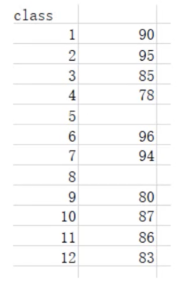
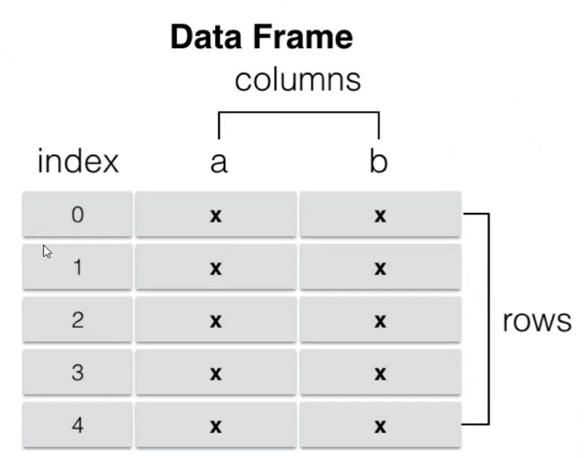

[toc]


# 01.Pandas介绍

## 1.1 Why Pandas？

numpy已经能够帮助我们处理数据，能够结合matplotlib解决我们数据分析的问题，那么pandas学习的目的在什么地方呢？

numpy能够帮我们处理处理数值型数据，但是这还不够， 很多时候，我们的数据除了数值之外，还有字符串，还有时间序列等

> 比如：我们通过爬虫获取到了存储在数据库中的数据

所以，pandas出现了。


## 1.2 What Pandas？

> Pandas的名称来自于面板数据（panel data）

Pandas是一个强大的分析结构化数据的工具集，基于NumPy构建，提供了**高级数据结构**和**数据操作工具**，它是使Python成为强大而高效的数据分析环境的重要因素之一。

- 一个强大的分析和操作大型结构化数据集所需的工具集
- 基础是NumPy，提供了高性能矩阵的运算
- 提供了大量能够快速便捷地处理数据的函数和方法
- 应用于数据挖掘，数据分析
- 提供数据清洗功能

详情请见官网：[Pandas官网](http://pandas.pydata.org/)

## 1.3 How Pandas?

### 1.3.1 安装

```shell
pip install pandas
```

### 1.3.2 导入

```python
import pandas as pd
```


# 02.Pandas数据结构

Pandas有两个最主要也是最重要的数据结构：**Series**和**DataFrame**。

## 2.1 Series

### 2.1.1 介绍

[pandas官网-Series介绍](https://pandas.pydata.org/docs/reference/api/pandas.Series.html)

Series是一种**带标签**的**一维**数组型对象，能够保存任何数据类型(int, float, str, python object...)。

Series包含**数据**和**标签（索引）**两部分：

* 索引(index)在左，数据(values)在右
* 索引是**自动创建**的，默认从0开始编号；当然，也可以像使用字典时指定键一样指定索引


### 2.1.2 创建

#### 1.通过列表创建

```python
>>> import pandas as pd


>>> s1 = pd.Series([1,2,3,4,5])
>>> s1

0    1
1    2
2    3
3    4
4    5
dtype: int64

>>> type(s1)
pandas.core.series.Series
```

#### 2.通过numpy数组创建

```python
>>> import pandas as pd
>>> import numpy as np

>>> arr1 = np.arange(1,6)
>>> arr1
array([1, 2, 3, 4, 5])

>>> s2 = pd.Series(arr1)  # 简单创建，使用默认索引(0~n-1)
>>> s2
0    1
1    2
2    3
3    4
4    5
dtype: int32
    
>>> s2 = pd.Series(arr1, index=['a', 'b', 'c','d','e'])  # 指定索引
>>> s2
a    1
b    2
c    3
d    4
e    5
dtype: int32
    
>>> s2.index  # Series的index属性其实是一个对象
Index(['a', 'b', 'c', 'd', 'e'], dtype='object')

>>> s2.values  # 可通过Series的values属性查看其values
array([1, 2, 3, 4, 5])
```

#### 3.通过字典创建

```python
>>> my_dict = {'name':'张三','age':18, 'height':175}
>>> s3 = pd.Series(my_dict, index=['name','height','age','sex'])  # index指定顺序
# 通过字典创建Series时，索引长度可与数据长度不同哦~若通过数组和列表创建Series时，这种操作直接报错！
>>> s3
name       张三
height    175
age        18
sex       NaN
dtype: object
```

### 2.1.3 索引

#### 1.位置索引

```python
>>> my_dict = {'name':'张三','age':18, 'height':175}
>>> s = pd.Series(my_dict, index=['name','height','age','sex']) 
>>> s
name       张三
height    175
age        18
sex       NaN
dtype: object
    
>>> s[0]  # 1.索引一个
'张三'

>>> s[[1,3]]  # 2.索引多个，返回的是其子Series对象
height    175
sex       NaN
dtype: object
    
>>> s[1:3]  # 3.通过“下标”切片——不包含末端
height    175
age        18
dtype: object 
```

#### 2.标签索引

```python
>>> my_dict = {'name':'张三','age':18, 'height':175}
>>> s = pd.Series(my_dict, index=['name','height','age','sex']) 
>>> s
name       张三
height    175
age        18
sex       NaN
dtype: object
    
    
>>> s['age'] # 1.索引一个
18
>>> s[['name','age']]  # 2.索引多个，返回的是其子Series对象
name    张三
age     18
dtype: object
>>> s['name': 'age']  # 3.通过“标签”切片——包含末端！！！！
name       张三
height    175
age        18
dtype: object
    
```

#### 3.布尔索引

```python
>>> s = pd.Series(arr1, index=['a', 'b', 'c','d','e'])
>>> s
a    1
b    2
c    3
d    4
e    5
dtype: int32

>>> s[s>3]
d    4
e    5
dtype: int32
```


### 2.1.4 常用属性与方法

**(1)构造函数**

```python
>>> help(pd.Series)

class Series(pandas.core.base.IndexOpsMixin, pandas.core.generic.NDFrame)
 |  Series(data=None, index=None, dtype=None, name=None, copy=False, fastpath=False)
    ……
```

**(2)常用属性——`name`和`index.name`**

```python
>>> arr = np.arange(1,6)
>>> arr
array([1, 2, 3, 4, 5])
    
>>> s = pd.Series(arr, index=['a', 'b', 'c','d','e'])  # 指定索引
>>> s
a    1
b    2
c    3
d    4
e    5
dtype: int32
    
>>> s.name = '序列'          # 对象名
>>> s.index.name = '索引'    # 对象索引名
索引
0    1
1    2
2    3
3    4
4    5
Name: 序列, dtype: int32
```


**(3)常用方法——`isnull()`和`notnull()`——检查缺失值**

```python
>>> my_dict = {'name':'张三','age':18, 'height':175}
>>> s = pd.Series(my_dict, index=['name','height','age','sex']) 
>>> s
name       张三
height    175
age        18
sex       NaN
dtype: object
    
>>> s.isnull()
name      False
height    False
age       False
sex        True
dtype: bool

>>> s.notnull()
name       True
height     True
age        True
sex       False
dtype: bool
```

**(4)常用方法——`head()`和`tail()`**

```python
>>> arr = np.arange(1,6)
>>> arr
array([1, 2, 3, 4, 5])
    
>>> s = pd.Series(arr, index=['a', 'b', 'c','d','e'])  # 指定索引
>>> s
a    1
b    2
c    3
d    4
e    5
dtype: int32
    
    
>>> s.head(3)  # 若不指定，则默认取5条数据
a    1
b    2
c    3
dtype: int32

>>> s.tail(3)
c    3
d    4
e    5
dtype: int32
```


### 2.1.5 作业练习

**题目**



1. 按照上表创建Series对象（对象名“score”，索引名“class”）
2. 查看1-5班的数据
3. 查看那个班级的成绩还没有导入
4. 获取11班的平均成绩
5. 有一道题目的参考答案是错误的，所以在每位同学现有的成绩上加2分
6. 找出平均成绩在90分以上的班级


```python
>>> import pandas as pd
>>> import numpy as np

# 1.创建一个Series对象
>>> score = pd.Series(data=[90,95,85,78,np.NAN,96,94,np.NAN,80,87,86,83],index=range(1,13),name='score')
>>> score.index.name = "class"
>>> score
class
1     90.0
2     95.0
3     85.0
4     78.0
5      NaN
6     96.0
7     94.0
8      NaN
9     80.0
10    87.0
11    86.0
12    83.0
Name: score, dtype: float64
        
# 2.查看1-5班的成绩
>>> score[0:5]   # 此时用的是下标切片索引，所以从0开始
class
1    90.0
2    95.0
3    85.0
4    78.0
5     NaN
Name: score, dtype: float64
 
# 3.查看哪个班级的成绩还没有录入
>>> score[score.isnull()]
class
5   NaN
8   NaN
Name: score, dtype: float64

# 4.获取11班的平均成绩
>>> score[11]   # 此时用的就是“标签”索引了
86.0

# 5.有一道题目的参考答案是错误的，所以在每位同学现有的成绩上加2分
>>> score += 2
>>> score
class
1     92.0
2     97.0
3     87.0
4     80.0
5      NaN
6     98.0
7     96.0
8      NaN
9     82.0
10    89.0
11    88.0
12    85.0
Name: score, dtype: float64

# 6.找出平均成绩在90分以上的班级
>>> score[score>=90]
class
1    92.0
2    97.0
6    98.0
7    96.0
Name: score, dtype: float64
```


## 2.2 DataFrame

### 2.2.1 介绍

[pandas官网-DataFrame介绍](https://pandas.pydata.org/docs/user_guide/dsintro.html#dataframe)

DataFrame是一个表格型的数据结构，它含有一组有序的列，每列可以是不同类型的值。DataFrame既有行索引，也有列索引，它可以被看做是由Series组成的字典（共用一个索引），数据是以二维结构存放的。

* 类似多维数组/表格数据（eg：Excel，R中的data.frame）
* 每列数据可以是不同的类型
* 索引包括行索引和列索引（在DataFrame的索引是**列优先**的）



### 2.2.2 创建

#### 1.字典类——一条数据是一列

**(1)数组、列表或元组构成的字典构造DataFrame**

```python
# ==================构造===================
>>> data = {  # 先构造一个字典
    'a': [1,2,3,4],
    'b': (5,6,7,8),
    'c': np.arange(9,13)
}
>>> df1 = pd.DataFrame(data)  # 构造DataFrame
>>> df1
	a	b	c
0	1	5	9
1	2	6	10
2	3	7	11
3	4	8	12

# ==============查看属性：行索引、列索引、值===============
# index属性查看行索引
>>> df1.index  
RangeIndex(start=0, stop=4, step=1)

# columns属性查看列索引
>>> df1.columns  
Index(['a', 'b', 'c'], dtype='object')

# values属性查看值
>>> df1.values
array([[ 1,  5,  9],
       [ 2,  6, 10],
       [ 3,  7, 11],
       [ 4,  8, 12]], dtype=int64)

# =============指定属性：行索引、列索引============
# 指定行索引index
>>> df2 = pd.DataFrame(data,index=['A','B','C','D'])
>>> df2
	a	b	c
A	1	5	9
B	2	6	10
C	3	7	11
D	4	8	12

# 指定列索引columns
>>> df3 = pd.DataFrame(data, index=['A','B','C','D'], columns=['a','b','c','d'])
>>> df3

	a	b	c	d
A	1	5	9	NaN
B	2	6	10	NaN
C	3	7	11	NaN
D	4	8	12	NaN
```


**(2)Series构成的字典构造DataFrame**

```python
>>> df = pd.DataFrame({
    'a': pd.Series(np.arange(3)),
    'b': pd.Series(np.arange(3,5))})
>>> df
	a	b
0	0	3.0
1	1	4.0
2	2	NaN
```


**(3)字典构成的字典构造DataFrame（字典嵌套）**

```python
>>> data = {
        '语文': {'张三': 78, '李四': 87, '王五':92},
        '数学': {'张三': 93, '李四': 67, '王五':84},
        '英语': {'张三': 83, '李四': 99, },
	}

>>> df = pd.DataFrame(data)
>>> df
	语文	数学	英语
张三	78	93	83.0
李四	87	67	99.0
王五	92	84	NaN
```

* 注意：一条数据是**一列**。

#### 2.列表类——一条数据是一行

**(1)二维数组构造DataFrame**

```python
>>> arr = np.arange(12).reshape(4,3)
>>> df = pd.DataFrame(arr)
>>> df
	0	1	2
0	0	1	2
1	3	4	5
2	6	7	8
3	9	10	11
```


**(2)字典构成的列表构造DataFrame**

```python
>>> data = [{'张三': 78, '李四': 87, '王五':92},
    	   {'张三': 93, '李四': 67, '王五':84},
	       {'张三': 83, '李四': 99, }]
>>> df = pd.DataFrame(data)
>>> df
	张三	李四	王五
0	78	87	92.0
1	93	67	84.0
2	83	99	NaN
```

* 注意：此时一条数据是**一行**。


**(3)Series构成的列表构造DataFrame**

```python
>>> data = [pd.Series(np.arange(0,3)), pd.Series(np.arange(3,5))]
>>> df = pd.DataFrame(data)
>>> df
	0	1	2
0	0.0	1.0	2.0
1	3.0	4.0	NaN
```

### 2.2.3 索引

#### 1.使用方括号

```python
import numpy as np
import pandas as pd

>>> df = pd.DataFrame(np.arange(12).reshape(3,4), index=['a','b','c'], columns=['A','B','C','D'])
>>> df
	A	B	C	D
a	0	1	2	3
b	4	5	6	7
c	8	9	10	11


# 1.列索引
>>> df['A']  # 注意：得到的是一个Series对象
a    0
b    4
c    8
Name: A, dtype: int32
        
# 2.元素索引
>>> df['A']['b']
4

# 3.切片行索引（使用切片得到的是行索引结果，但不管几行，得到的均是DataFrame对象）
>>> df[0:1]

	A	B	C	D
a	0	1	2	3
```

#### 2.高级索引

```python
import numpy as np
import pandas as pd

>>> df = pd.DataFrame(np.arange(12).reshape(3,4), index=['a','b','c'], columns=['A','B','C','D'])
>>> df
	A	B	C	D
a	0	1	2	3
b	4	5	6	7
c	8	9	10	11

>>> df.loc['a':'b','B':'C']  # loc用于标签索引（注意最外层是方括号！）
	B	C
a	1	2
b	5	6

>>> df.iloc[0:2,1:3]  # iloc用于位置索引
	B	C
a	1	2
b	5	6
```

* 通过上面的例子可知，`loc[]`和`iloc[]`和numpy数组的**花式索引**及其类似，所以用这个还是相当方便的~


### 2.2.4 基本用法

PS：下面的四种操作用的均是1中的DataFrame。

#### 1.转置

```python
>>> df = pd.DataFrame(np.arange(9).reshape(3,3),index=['a','b','c'],columns=['A','B','C'])
>>> df
	A	B	C
a	0	1	2
b	3	4	5
c	6	7	8

>>> df.T

	a	b	c
A	0	3	6
B	1	4	7
C	2	5	8
```


#### 2.通过列索引获取列数据

```python
>>> df['A']
a    0
b    3
c    6
Name: A, dtype: int32

>>> type(df['A'])
<class 'pandas.core.series.Series'>
```

#### 3.增加列

```python
>>> df['D'] = [100, 101, 102]
>>> df
	A	B	C	D
a	0	1	2	100
b	3	4	5	101
c	6	7	8	102
```

#### 4.删除列

```python
>>> del df['D']
>>> df
	A	B	C
a	0	1	2
b	3	4	5
c	6	7	8
```

### 2.2.5 作业练习


```python
# =======================1.创建表格==========================
>>> data = {
    	"姓名":['张三','李四','王五','小明','小红','小刚','小亮'],
    	"语文":[89,78,79,89,90,87,83],
    	"数学":[59,83,85,92,67,81,77],
    	"英语":[84,97,88,83,67,73,71],
    	"体育":[0,0,0,0,0,0,0]
	}
>>> df = pd.DataFrame(data)
>>>df

	姓名	语文	数学	英语	体育
0	张三	89	59	84	0
1	李四	78	83	97	0
2	王五	79	85	88	0
3	小明	89	92	83	0
4	小红	90	67	67	0
5	小刚	87	81	73	0
6	小亮	83	77	71	0
# =======================2.转置==========================
>>> df.T

	0	1	2	3	4	5	6
姓名	张三	李四	王五	小明	小红	小刚	小亮
语文	89	78	79	89	90	87	83
数学	59	83	85	92	67	81	77
英语	84	97	88	83	67	73	71
体育	0	0	0	0	0	0	0

# =======================3.删除“体育”列==========================
>>> del df['体育']
>>> df
	姓名	语文	数学	英语
0	张三	89	59	84
1	李四	78	83	97
2	王五	79	85	88
3	小明	89	92	83
4	小红	90	67	67
5	小刚	87	81	73
6	小亮	83	77	71

# =======================4.添加“综合”列==========================
>>> df['综合'] = [97, 87, 78, 76, 84, 88, 91]
>>> df

	姓名	语文	数学	英语	综合
0	张三	89	59	84	97
1	李四	78	83	97	87
2	王五	79	85	88	78
3	小明	89	92	83	76
4	小红	90	67	67	84
5	小刚	87	81	73	88
6	小亮	83	77	71	91
```

# 03.对齐运算

## 3.1 数据对齐

### 3.1.1 Series

两个Series对象做运算，只有二者共有的标签所对应的值才会真正运算，只有一方有的标签值全部替换成NaN。

之所以会产生这样的结果，是因为先对齐，后运算，对齐时没有的标签自动添入NAN，又因为NAN和任何值运算都得NAN，所以只有一方有的标签会在运算结果中显示为NAN。

```python
>>> import numpy as np
>>> import pandas as pd


>>> s1 = pd.Series(np.arange(4), index=['a', 'b','c','d'])
>>> s1
a    0
b    1
c    2
d    3
dtype: int32
    
>>> s2 = pd.Series(np.arange(5), index=['a', 'c','e','f','g'])
>>> s2
a    0
c    1
e    2
f    3
g    4
dtype: int32

>>> s1+s2
a    0.0
b    NaN
c    3.0
d    NaN
e    NaN
f    NaN
g    NaN
dtype: float64
```

### 3.1.2 DataFrame

DataFrame的对齐更上一层楼，行索引和列索引都会自动对齐，示例代码如下：

```python
>>> df1 = pd.DataFrame(np.arange(12).reshape(4,3),index=['a','b','c','d'],columns=list('ABC'))
>>> df1
	A	B	C
a	0	1	2
b	3	4	5
c	6	7	8
d	9	10	11

>>> df2 = pd.DataFrame(np.arange(9).reshape(3,3),index=['a','d','f'],columns=list('ABD'))
>>> df2
	A	B	D
a	0	1	2
d	3	4	5
f	6	7	8

>>> df1+df2

	A	B	C	D
a	0.0	2.0	NaN	NaN
b	NaN	NaN	NaN	NaN
c	NaN	NaN	NaN	NaN
d	12.0	14.0	NaN	NaN
f	NaN	NaN	NaN	NaN
```


## 3.2 使用填充值的算术方法

在3.1.1节的示例代码中，如果我想在对齐时没有的标签填充不是NAN，而是指定值，这时候就要使用Series和DataFrame对象自带的算数方法了，示例代码如下（下面代码承接3.1.1节代码）：

```python
>>> s1.add(s2,fill_value=0)
a    0.0
b    1.0
c    3.0
d    3.0
e    2.0
f    3.0
g    4.0
dtype: float64
```

上述运算中，先对齐（没有的标签填写`fill_value`指定的值），型号相同后再进行运算。

可以

## 3.3 DataFrame和Series混合运算

