[toc]

# Matplotlib

## 01.数据分析中常用图(基础)

### 1.1 折线图

折线图用于显示数据在一个连续的时间间隔或者时间跨度上的变化，它的特点是反映事物随时间或有序类别而变化的趋势。示例图如下：
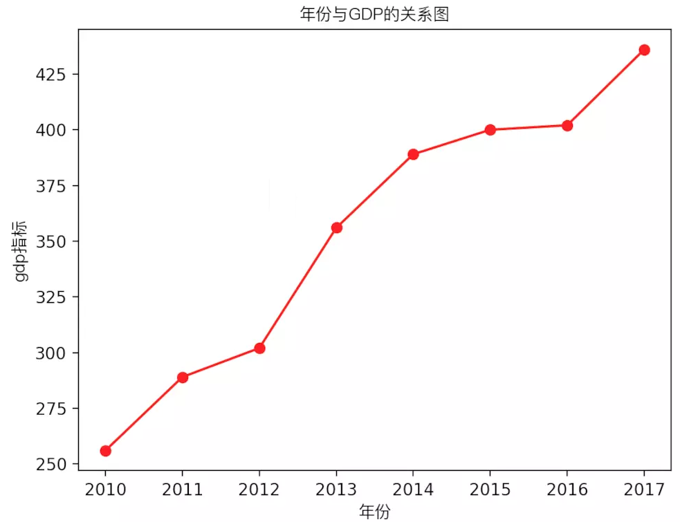

折线图应用场景：

1. 折线图适合`X`轴是一个==连续==**递增**或**递减**的，对于没有规律的，则不适合使用折线图，建议使用柱状图。
2. 如果折线图条数过多，则不应该都绘制在一个图上。

### 1.2 柱状图

典型的柱状图（又名条形图），使用垂直或水平的柱子显示类别之间的数值比较。其中一个轴表示需要对比的分类，另一个轴代表相应的数值。

柱状图有别于直方图，柱状图无法显示数据在一个区间内的连续变化趋势。柱状图描述的是分类数据，回答的是每一个分类中“有多少？”这个问题。 示例图如下：
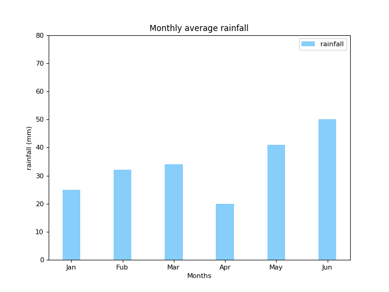

柱状图应用场景：

1. 适用于分类数据对比。

2. 垂直条形图最多不超过12个分类（也就是12个柱形），横向条形图最多不超过30个分类。如果垂直条形图的分类名太长，那么建议换成**横向**条形图。

   

   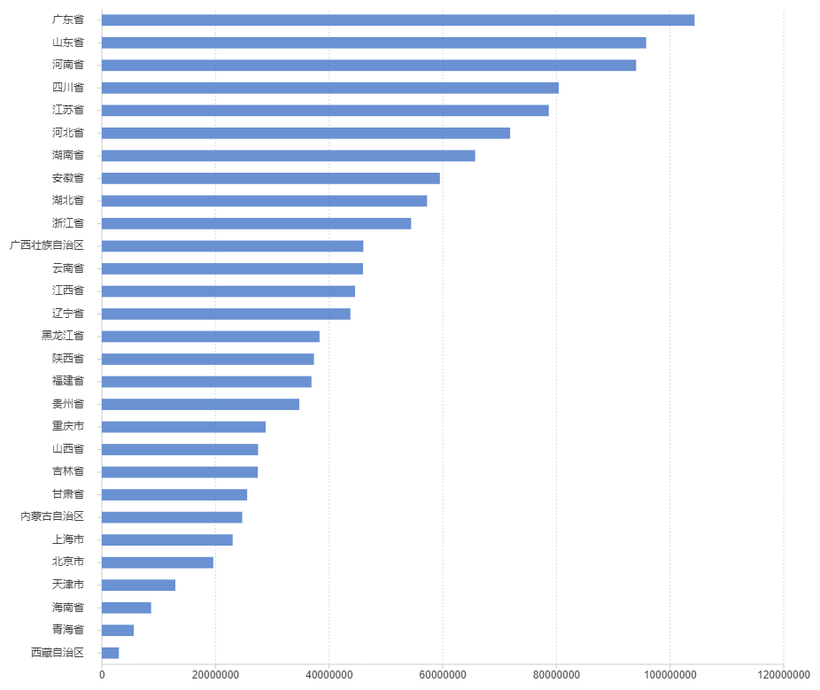

3. 柱状图不适合表示趋势，如果想要表示趋势，应该使用折线图。

### 1.3 直方图

直方图(Histogram)，又称质量分布图，是一种统计报告图，由一系列高度不等的条纹表示数据分布的情况。一般用横轴表示数据类型，纵轴表示分布情况。
直方图是数值数据分布的精确图形表示。为了构建直方图，第一步是将值的范围分段，即将整个值的范围分成一系列间隔，然后计算每个间隔中有多少值。这些值通常被指定为连续的，不重叠的变量间隔。间隔必须**相邻**，并且通常是（但不是必须的）相等的大小。
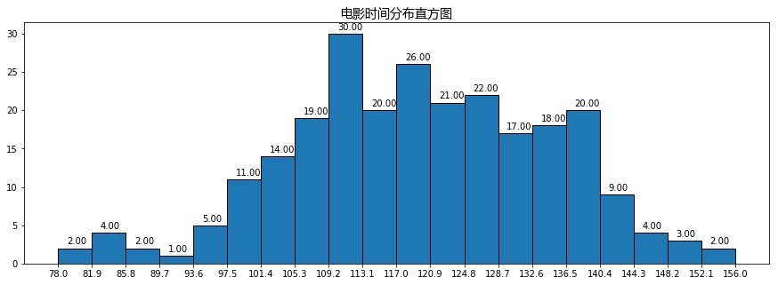


直方图的分类：

* 普通直方图（`plt.hist()`方法默认绘制的就是这种图）
  * 小矩形的高度表示该组内数据的**个数**
* 频数直方图
  * 小矩形的高度表述该组内数据的**频数**（频数=个数/组距）
  * 此时每个小矩形的**面积**表示数据的个数
* 频率直方图（`plt.hist(density=True)`可绘制这种图）
  * 小矩形的高度表示改组内数据的**频率/组距**（频率=该组内数据个数/数据总个数）
  * 此时每个小矩形的面积表示数据的频率


直方图的应用场景：

1. 显示各组数据数量分布的情况。(班级成绩分布直方图、PS中的色阶分布直方图)
2. 用于观察异常或孤立数据。
3. 抽取的样本数量过小，将会产生较大误差，可信度低，也就失去了统计的意义。因此，样本数不应少于50个。

### 1.4 散点图

散点图也叫 X-Y 图，它将所有的数据以点的形式展现在直角坐标系上，以显示变量之间的相互影响程度，点的位置由变量的数值决定。

散点图的基本构成要素如下：


通过观察散点图上数据点的分布情况，我们可以推断出变量间的相关性。如果变量之间不存在相互关系，那么在散点图上就会表现为随机分布的离散的点，如果存在某种相关性，那么大部分的数据点就会相对密集并以某种趋势呈现。数据的相关关系主要分为：正相关（两个变量值同时增长）、负相关（一个变量值增加另一个变量值下降）、不相关、线性相关、指数相关等，表现在散点图上的大致分布如下图所示。那些离点集群较远的点我们称为离群点或者异常点。


示例图如下：
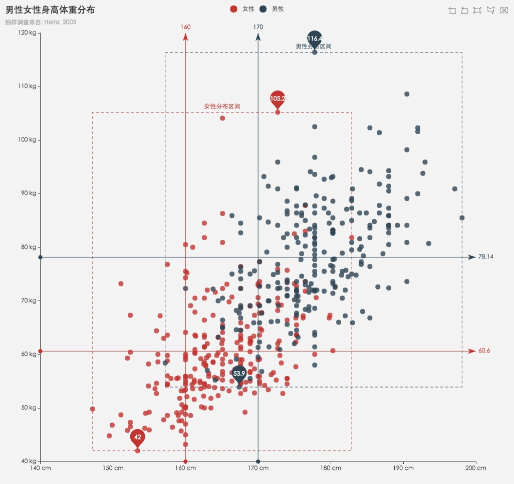

散点图的应用场景：

1. 观察数据集的分布情况。
2. 通过分析规律，根据样本数据特征计算出回归方程。

### 1.5 饼状图

饼状图通常用来描述量、频率和百分比之间的关系。在饼图中，每个扇区的弧长大小为其所表示的数量的比例。
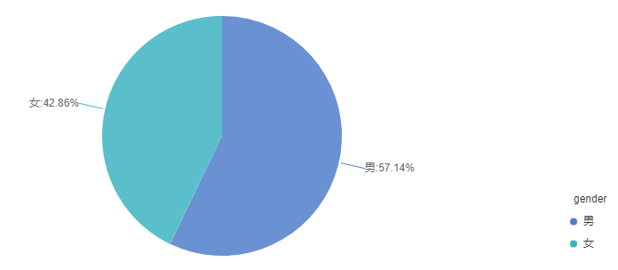

饼状图的应用场景：

1. 展示多个分类的占比情况，分类数量建议不超过9个。
2. 对于一些占比值非常接近的，不建议使用饼状图，可以使用柱状图。

### 1.6 箱线图（加深理解）

箱线图（Box-plot）又称为盒须图、盒式图或箱型图，是一种用作显示一组数据分散情况资料的统计图。因形状如箱子而得名。在各种领域也经常被使用，它主要用于反映原始数据分布的特征，还可以进行多组数据分布特征的比较。箱线图的绘制方法是：先找出一组数据的**上限值、下限值、中位数（Q2）和下四分位数（Q1）以及上四分位数（Q3）**；然后，连接两个四分位数画出箱子；再将最大值和最小值与箱子相连接，中位数在箱子中间。

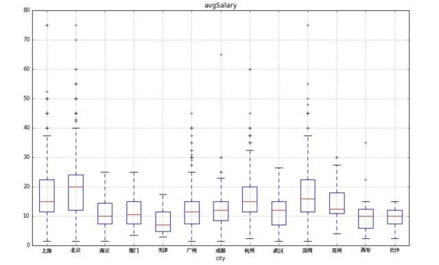

> ##  四分位数
>
> 四分位数（Quartile）也称四分位点，是指在统计学中把所有数值由小到大排列并分成四等份，处于三个分割点位置的数值。多应用于统计学中的箱线图绘制。它是一组数据排序后处于25%和75%位置上的值。四分位数是通过3个点将全部数据等分为4部分，其中每部分包含25%的数据。很显然，中间的四分位数就是中位数，因此通常所说的四分位数是指处在25%位置上的数值（称为下四分位数）和处在75%位置上的数值（称为上四分位数）。与中位数的计算方法类似，根据未分组数据计算四分位数时，首先对数据进行排序，然后确定四分位数所在的位置，该位置上的数值就是四分位数。与中位数不同的是，四分位数位置的确定方法有几种，每种方法得到的结果会有一定差异，但差异不会很大。


> ## 上下限
>
> 上下限并不是静态的最大值和最小值，而是动态计算出来的，其计算规则如下：
> IQR=Q~3~-Q~1~
> 上限=Q~3~+1.5IQR
> 下限=Q~1~-1.5IQR

箱线图的应用场景：

1. 直观明了地识别数据中的异常值。
2. 利用箱线图判断数据的偏态。
3. 利用箱线图比较几批数据的形状。
4. 箱线图适合比较**多组数据**，如果知识要看一组数据的分布情况，建议使用直方图。

### 1.7 更多参考

[蚂蚁金服数据可视化方案-AntV-图表的分类和用法](https://antv-2018.alipay.com/zh-cn/vis/chart/index.html)


## 02.Matplotlib介绍

### 2.1 基本介绍

`Matplotlib`是一个`Python`的`2D`绘图库，通过`Matplotlib`，开发者可以仅需要几行代码，便可以生成折线图，直方图，条形图，饼状图，散点图等。

在anaconda的官网博客中，有这样一篇文章[Python Data Visualization 2018: Why So Many Libraries?](https://www.anaconda.com/blog/python-data-visualization-2018-why-so-many-libraries)，里面的一张图清晰地给出了Python数据可视化库的家族图谱，如下：

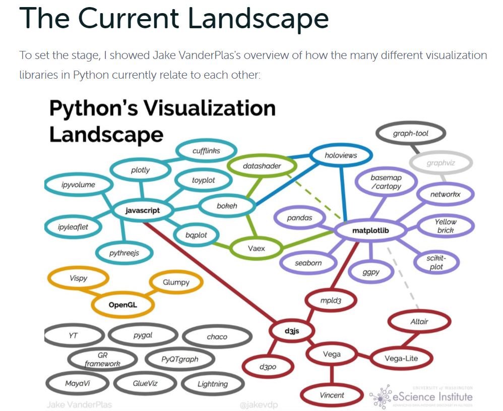

上图右上角紫色部分即我们将要学习的matplotlib家族，可以看到，matplotlib是诸多绘图库的爸爸~

所以，加油认真学习吧！

### 2.2 安装

```shell
pip install matplotlib  # 纯Python环境：使用pip

conda install matplotlib  # Anaconda环境：使用conda
```

### 2.3 使用

下面三个库在以后的案例中是通用的，均不再重复导入。

```python
import numpy as np
import pandas as pd
import matplotlib.pyplot as plt
```

------------

## 03.折线图

### 3.1 快速上手

#### 3.1.1 传入数据

首先先看以下例子：

```python
y = list(np.random.randint(0, 10, size=(10,)))
plt.plot(y)  # 这里我们只穿入了一个数据集，plot函数会把它当做纵坐标数据处理；默认横坐标为range(0,len(y))
plt.show()  # 显示绘制结果
```

那么就会出现以下图：
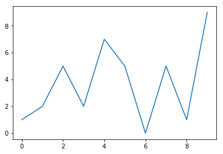

当然，你也可以 传入横坐标数据：

```python
plt.plot(range(10,20) ,y)  # 传入两个参数，plot函数会把第一个当做X轴数据，第二个当做Y轴数据。
```

效果如下：

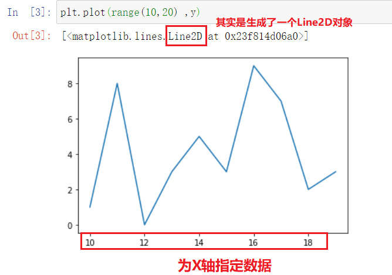

需要注意的是：plt.plot的x和y参数**不能够作为关键字参数**来传递，只能作为**位置参数**来传。

上面我们一直在用列表，元组与之类似，肯定也会支持，那么，plot是否支持字典呢？以及我们之前学的潘大师（pandas）？答案是肯定的~

```python
# =================传入字典======================
my_data = {
    'a':range(10, 20),
    'b':[np.random.randint(0,10) for x in range(10)]
}
plt.plot('a','b','',data=my_data)


# ================传入DataFrame==================
my_df=pd.DataFrame(data=my_data)
plt.plot('a','b','',data=my_df)
```

上面plot()函数的第三个参数有个空字符串，这是干什么的呢？要想弄明白这个，就需要知道plot函数的完整调用格式了（其中待方括号的参数表示可选参数）：

```python
plot([x], y, [fmt], *, data=None, **kwargs)
```

因为`x`和`fmt`均是可选的位置参数，所以若不做出位置限制，容易产生二义性，故用`''`做占位，表示没有任何额外格式。

既然说到了`fmt`，那就简单说说图像格式吧~

#### 3.1.2 图像格式控制

`fmt`可以传一个字符串，用来给这个图做一些样式修改的。默认的绘制样式是`b-`，也就是蓝色实体线条。比如我想将原来的图的线条改成点状，那么可以通过以下代码实现：

```python
plt.plot(range(10),[np.random.randint(0,10) for x in range(10)],":")
```

其中使用`:`代表点线，是`matplotlib`的一个缩写。使用`fmt`参数可以控制线条的3方面格式：线型、颜色、标记。具体如下：

```python
fmt = '[marker][line][color]'
```

关于每个方面有哪些具体格式，下面给出三张表格：

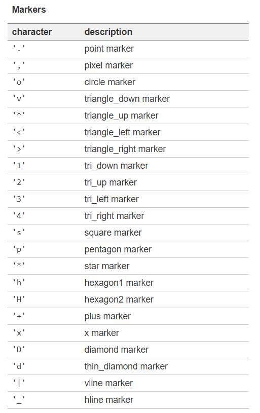

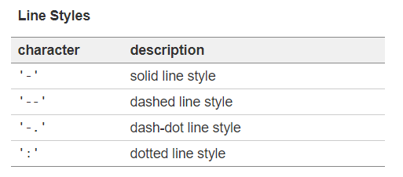

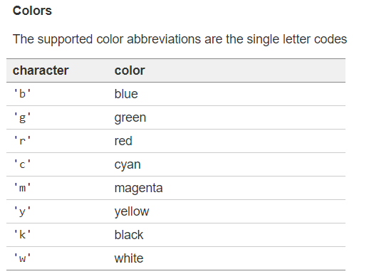

在fmt中能指定的颜色只有上面8中（rgb+cmyk+w），要想指定任意颜色或者设置alpha通道，可以使用关键字参数`color`，如下：

```python
plt.plot([1,2,3,4,5],[1,2,3,4,5],'r') #将颜色线条设置成红色
plt.plot([1,2,3,4,5],[1,2,3,4,5],color='red') #将颜色设置成红色
plt.plot([1,2,3,4,5],[1,2,3,4,5],color='#000000') #将颜色设置成纯黑色
plt.plot([1,2,3,4,5],[1,2,3,4,5],color=(0,0,0,0)) #将颜色设置成纯黑色
```

给线条设置颜色总体来说有三种方式，第一种是使用颜色名称（`r`是`red`的缩写）的形式，第二种是使用十六进制的方式，第三种是使用`RGB`或`RGBA`的方式。如果使用的是颜色名称，那么可以和线的形状写在同一个字符串中。比如使用红色的五角点，那么可以使用如下的方式实现：

```python
plt.plot([1,2,3,4,5],[1,2,3,4,5],'rp') #将颜色线条设置成红色
```

#### 3.1.3 案例小结

1. plt.plot可以只传Y轴的值，如果只传Y轴的值，那么X轴就会默认使用range(0,Y的长度)
2. plt.plot的x和y参数不能够作为关键字参数来传递，只能作为位置参数来传。
3. plt.plot中的data参数可以为一个字典或者DataFrame对象，然后在x和y上指定这个列的名字，那么plot会自动读取。这里有一个细节，因为x,y,fmt都是在前面，所以如果只传x和y，那么可能会产生歧义，这时候我们可以多传一个空的参数作为fmt的参数，就不会有警告了。
4. plt.plot的fmt参数可以设置线条的样式以及颜色。
5. plt.plot的color参数可以使用字母、十六进制，或者是RGBA的方式来设置颜色。
6. 更多关于`plt.plot()`的用法，请看官网：https://matplotlib.org/api/_as_gen/matplotlib.pyplot.plot.html

### 3.2 设置图的信息

现在我们添加图后，没有指定x轴代表什么，y轴代表什么，以及这个图的标题是什么。因此以下我们通过一些属性来设置一下。

#### 3.2.1 设置线条样式

**(1)方法一：绘图之前绘制——指定`plt.plot()`参数**

`plot`方法就是用来绘制线条的，因此可以在绘制的时候就把线条相关的样式通过参数传进去。可以用上面的fmt参数来简单的设置颜色、线型和标记，也可以使用关键字参数，示例代码如下：

```python
plt.plot(x,y,linewidth=2)
```
**(2)方法二：绘图之后设置——通过`Line2D`对象来设置**

`plot`方法会返回一个装有`Line2D`对象的列表，比如`lines=plt.plot(x1,y1,x2,y2)`因为绘制了两根线条，因此`lines`中会有两个2D对象。而如果`plot`只绘制一根线条，那么`lines`中就只有一个`Line2D`对象。拿到这个`Line2D`对象后就可以通过`set_属性名`设置线条的样式了：

```python
lines = plt.plot(x1,y1,x2,y2)
line = lines[0]
line.set_aa(False) #关掉反锯齿
line.set_alpha(0.5) #设置0.5的透明度
```

**(3)方法三：批量设置——使用`plt.setp()`函数**

`setp`的好处是一次性可以设置多根线条的样式。示例代码如下：

```python
lines = plt.plot(x1,y1,x2,y2)
plt.setp(lines,linewidth=10,alpha=0.5)
```

**(4)补充：更多`Line2D`属性**

下面列出了部分Line2D对象的属性，更多乱七八糟的属性请见官网：https://matplotlib.org/api/_as_gen/matplotlib.pyplot.plot.html

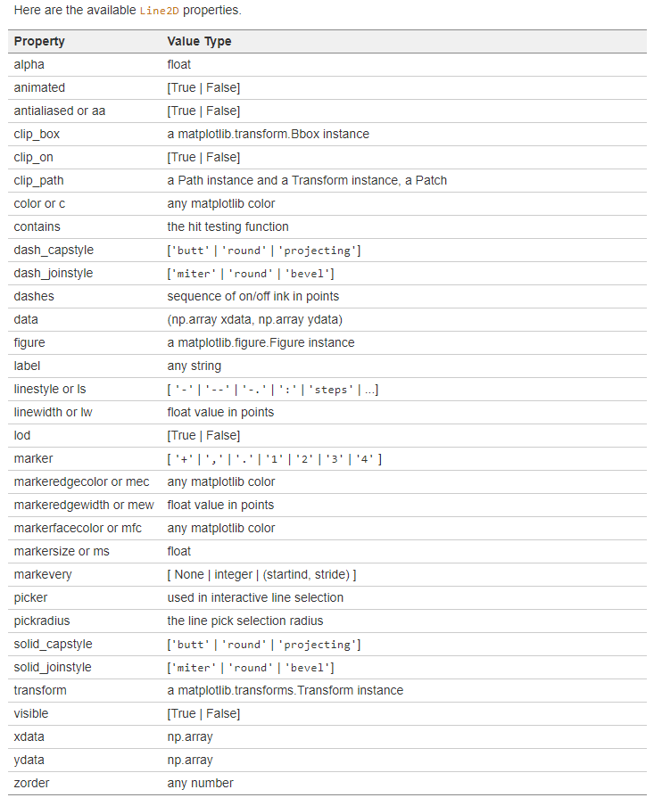

#### 3.2.2 设置轴和标题

**(1)设置标题**

```python
import math
from matplotlib import font_manager

x = np.arange(0,20,0.1)  # 若想设置小数步长，需要用到numpy中的arange()函数
y = [math.sin(i) for i in x]  # 正规求正弦不用这么麻烦，只需用np.sin()
plt.plot(x,y)

# 指定字体——方式一：使用字体代号
# font_family = ["Microsoft YaHei","Arial","Times New Roman"]
# font = font_manager.FontProperties(family=font_family,size=20)

# 设置字体——方式二：指定字体文件路径（比较保险）
font = font_manager.FontProperties(fname=r"C:/Windows/Fonts/msyh.ttc",size=20)

plt.title("sin()函数", fontproperties=font)  # 要想显示中文，需要指定fontproperties属性
plt.show()
```

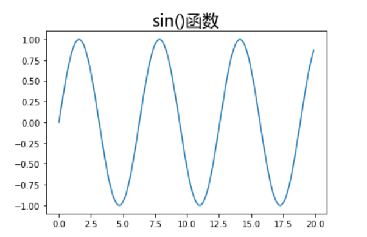

默认情况下是显示不了中文的。需要设置字体。要想指定字体，需要传给`fontproperties`参数一个`matplotlib.font_manager.FontProperties()`对象（详见：[官方文档-FontProperties](https://matplotlib.org/api/font_manager_api.html#matplotlib.font_manager.FontProperties)）。指定字体有两种方式：

1. 通过`family`参数，指定font-family列表
2. 通过`fname`参数，指定本地字体文件

至于font-family，又是一个坑，感兴趣的话可以百科一下，目前只需熟练掌握第2中方式即可。

那么，第二种方式下，我是如何知道字体路径的呢？

加载字体的时候，可以到`C:\Windows\Fonts`中找你喜欢的并且可以显示中文的字体。找到字体后，还需要找到字体的真实名称。方法是右键->属性->安全->对象名称：
 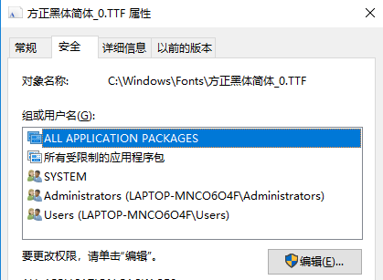

这里还有一个小细节，如果拷贝出来的字体的字符串前面有一个**肉眼看不见**的乱码，matplotlib会报错，此时把那个看不见的乱码删掉即可：

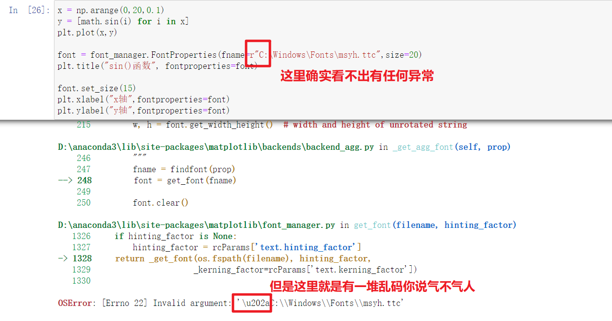


**(2)设置轴名称**
可以通过`plt.xlabel`和`plt.ylabel`来设置`x`轴和`y`轴的的名称。示例代码如下：

```python
x = np.arange(0,20,0.1)
y = [math.sin(i) for i in x]
plt.plot(x,y)

font = font_manager.FontProperties(fname=r"C:\Windows\Fonts\msyh.ttc",size=20)
plt.title("sin()函数", fontproperties=font) 

font.set_size(15)  # 这里重新设置一下字体大小
plt.xlabel("x轴",fontproperties=font)
plt.ylabel("y轴",fontproperties=font)
plt.show()
```

**(3)设置`x`轴和`y`轴的刻度**

之前我们画的图，`x`轴和`y`轴的刻度都是`matplotlib`自动生成的。如果想要在生成图的时候手动的指定，那么可以通过`plt.xticks`和`plt.yticks`来实现：

```python
plt.xticks(range(0,20,2)) #在x轴上的刻度是0,2,4,6...20
```

以上会把那个刻度显示在`x`轴上。如果想要显示字符串类型，那么可以再构造一个数组，这个数组的长度必须和`x`轴刻度的长度保持一致。然后传给`xticks`的第二个参数。示例代码如下：

```python
_x = range(0,20,2)
_xticks = ["%d点"%i for i in _x]
plt.xticks(_x,_xticks,fontproperties=font) #在x轴上的刻度是0坐标,2坐标...20坐标
```

结合上述sin()函数的例子，完整代码如下：

```python
x = np.arange(0,20,0.1)
y = [math.sin(i) for i in x]
plt.plot(x,y)

# 设置标题
font = font_manager.FontProperties(fname=r"C:\Windows\Fonts\msyh.ttc",size=20)
plt.title("sin()函数", fontproperties=font) 

# 设置轴
font.set_size(15)
plt.xlabel("x轴",fontproperties=font)
plt.ylabel("y轴",fontproperties=font)

# 设置刻度
font.set_size(10)
plt.xticks(range(0,20,2),["%d点"%x for x in range(0,20,2)],fontproperties=font)

plt.show() 
```

效果图如下：
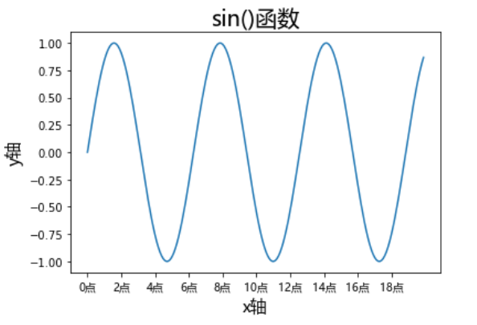

**(4)案例：复仇者联盟电影票房**

```python
avenger = [17974.4,50918.4,30033.0,40329.1,52330.2,19833.3,11902.0,24322.6,47521.8,32262.0,22841.9,12938.7,4835.1,3118.1,2570.9,2267.9,1902.8,2548.9,5046.6,3600.8]
plt.figure(figsize=(15,5))  # 设置图像大小

plt.plot(avenger,marker="o")
font.set_size(10)
plt.xticks(range(20),["第%d天"%x for x in range(1,21)],fontproperties=font)
plt.xlabel("天数",fontproperties=font)
plt.ylabel("票房数(万)",fontproperties=font)
plt.grid()
plt.show()
```

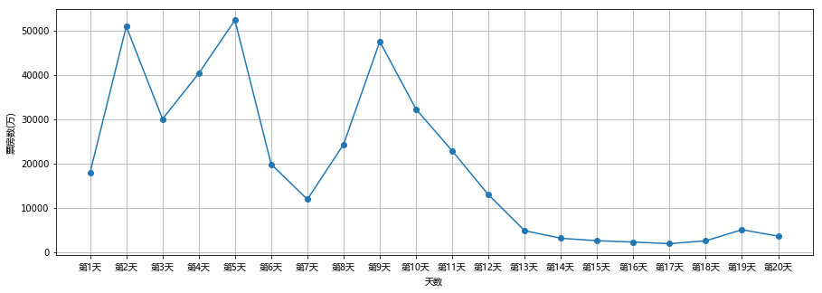

#### 3.2.3 设置marker

有时候，我们想要在一些关键点上重点标记出来。那么我们可以通过设置`marker`来实现。一开始介绍的`fmt`参数功能有限，若想对marker进行更精细的设置，需要使用LIne2D的一下属性，示例代码如下：

```python
x = np.linspace(0,20,21)
y = np.sin(x)  # 这才是求正弦的正确打开方式~
plt.plot(x,y,marker='o',markerfacecolor='red',markersize=8,markeredgecolor='green',markeredgewidth=2)
plt.show()
```

效果图如下：

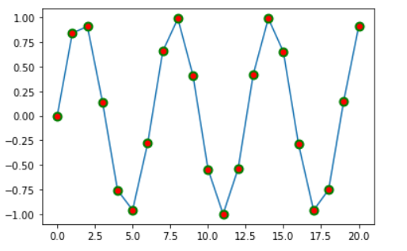


#### 3.2.4 设置注释文本

有时候需要在图形中的某个点标记或者注释一下或者单纯的想要为图形加个水印。那么我们可以使用`plt.annotate(text,xy,xytext,arrowprops={})`来实现，其中`text`是注释的文本，`xy`是需要注释的点的坐标，`xytext`是注释文本的坐标，你还可以设置一个从`xytext`指向`xy`的箭头，`arrowprops`是箭头的样式属性。示例代码如下：

```python
y = np.sin(np.arange(20))
plt.plot(y,marker='o')
plt.annotate("(0,0)",xy=(0,0),xytext=(-0.5,-0.8),arrowprops={"width":10,"headwidth":16,"headlength":20,"shrink":0.3,"facecolor":"r","edgecolor":"y"})
plt.show()
```

效果图如下：

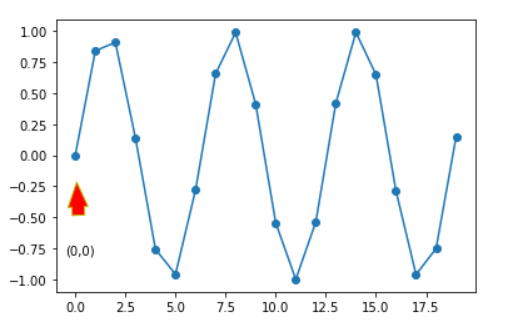

如果我想为每一个点加上坐标点注释呢？循环就完了呗：

```python
y = np.sin(np.arange(20))
plt.plot(y,marker='o')

for index,value in enumerate(y):  # 这里用到了enumerate()函数
    plt.annotate("(%d,%.2f)"%(index,value),xy=(index,value),xytext=(index-0.1,value-0.1))
    
plt.show()
```

效果如下：


更多`plt.annotate()`的详细信息，请看官网：https://matplotlib.org/api/_as_gen/matplotlib.pyplot.annotate.html

#### 3.2.5 设置图形样式

如果想要调整图片的大小和像素，可以通过`plt.figure(num=None, figsize=None, dpi=None, facecolor=None, edgecolor=None, frameon=True)`来实现。
其中`num`是图的编号，`figsize`的单位是英寸，`dpi`是每英寸的像素点，`facecolor`是图片背景颜色，`edgecolor`是边框颜色，`frameon`代表是否绘制画板。
示例代码如下：

```python
# 设置画板(figure对象)样式
plt.figure(figsize=(10,5),facecolor="r",edgecolor="b",linewidth=4,dpi=200,frameon=True) 
plt.plot(np.arange(5,20),linewidth=8)

# 设置坐标轴(Axes对象)样式
ax = plt.gca() # 一个画板（figure）上有多个坐标轴(Axes)
ax.set_facecolor("k")

# 显示网格
plt.grid()

plt.show()
```

效果图如下：

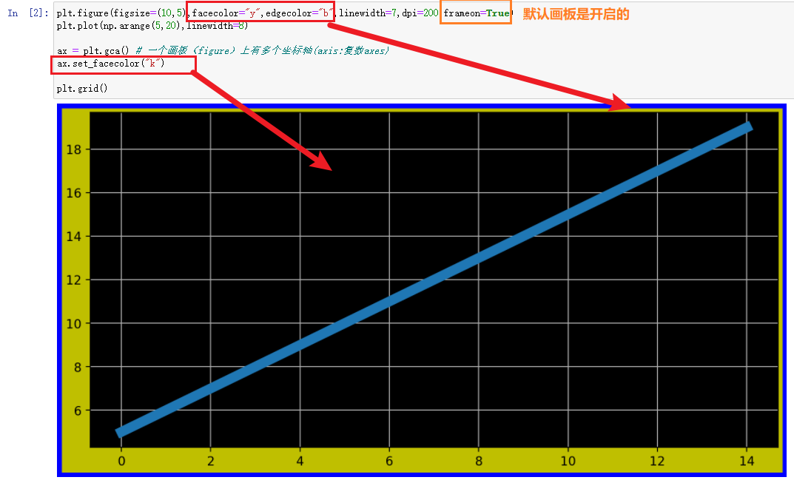

关闭画板后的效果（注意对比上图，加深理解figure和Axes的关系）：

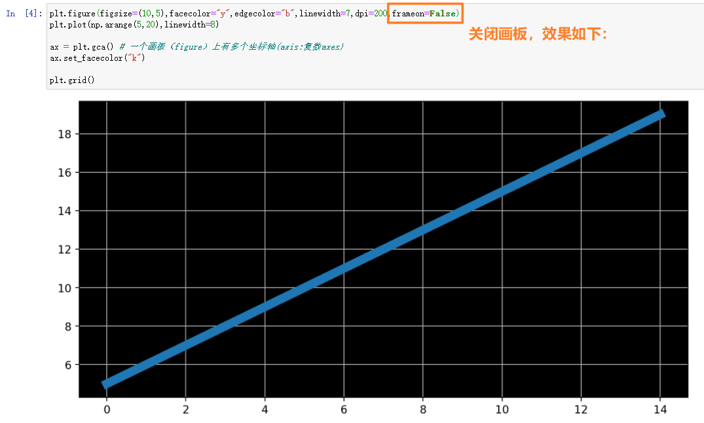

关于`plt.figure()`函数，详情请见：https://matplotlib.org/api/_as_gen/matplotlib.pyplot.figure.html

#### 3.2.6 保存图片

可以调用`plt.savefig(path)`来保存当前的图片。示例代码如下：

```python
plt.savefig("./abc.png")
```

当然，还有一种简单粗暴的方式，在浏览器选中图片后直接右键保存。

### 3.3 绘制多个图

绘制多个图有两种形式，第一种形式是在一张图中绘制多跟线条，第二种形式是绘制多个子图形。以下分别进行讲解。

#### 3.3.1 绘制多根折线

绘制多根线条，只要准备好坐标，重新使用`plt.plot`绘制即可。示例代码如下：

```python
x = np.linspace(0, 20)
plt.plot(x,np.sin(x))
plt.plot(x,np.cos(x))
```

示例图如下：
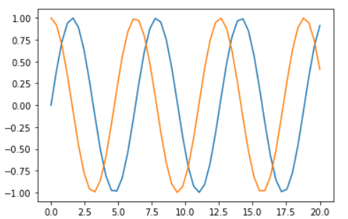


#### 3.3.2 绘制多个子图

绘制子图的时候，我们可以使用`plt.subplot`或`plt.subplots`来实现。我们分别进行举例。

**(1)使用`plt.subplot()`函数**

示例代码如下：

```python
values = np.arange(20)

plt.subplot(221)
plt.plot(values)
plt.plot(values**2)  # 同一个Axes下绘制多条曲线：直接plot就完事了

plt.subplot(222)
plt.plot(np.sin(values),'r')

plt.subplot(223)
plt.plot(np.cos(values), 'g')

plt.subplot(224)
plt.plot(np.tan(values), 'b')
```

效果图如下：
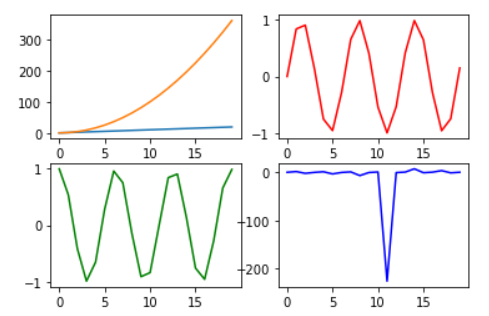
其中`subplot`中的`211`和`212`分别代表的意思是，第一个数表示这个大图中总共有`2`行，第二个数表示总共有`1`列，然后第三个数表示当前绘制第几个图。

更多关于`plt.subplot()`函数的用法，请看：[官方文档-plt.subplot()](https://matplotlib.org/api/_as_gen/matplotlib.pyplot.subplot.html)。

**(2)使用`plt.subplots()`函数**

也可以使用`fig,axes=plt.subplots(rows,cols,*args,**kwargs)`来绘制多个图形，返回值是一个元组，其中的`fig`参数是`figure`对象，`axs`是`axes`对象的`array`。详情请见：[官方文档-plt.subplots()](https://matplotlib.org/api/_as_gen/matplotlib.pyplot.subplots.html)。

示例代码如下：

```python
values = np.linspace(0,20)
plt.style.use('seaborn')  # style()函数可以设置风格

# fig是画板；axes是一个二维数组，每个元素都是一个Axes对象
fig, axes = plt.subplots(2, 2, sharex=True) # sharex=True表示共享X轴

ax1 = axes[0, 0]
ax1.plot(values)

ax2 = axes[0, 1]
ax2.plot(np.sin(values), 'r')

ax3 = axes[1, 0]
ax3.plot(np.cos(values), 'g')

ax4 = axes[1, 1]
ax4.plot(np.tan(values), 'b')
```

效果图如下：

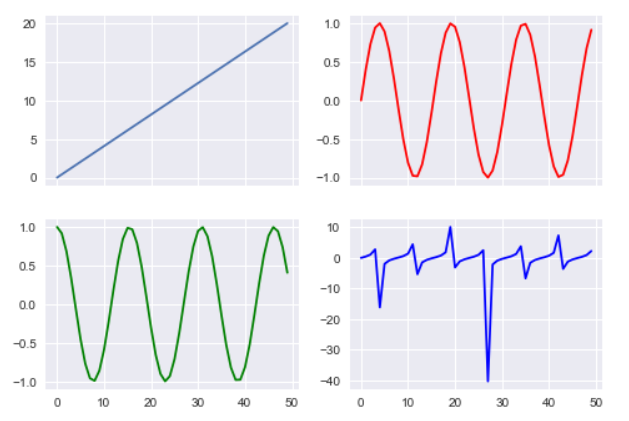

比较这幅图前面的那张图，有两点不同：

* 背景色更好看了。这是因为使用`plt.style()`函数设置了风格。
* 上下图共享X轴，上面的图不再显示坐标值。这是因为设置了`sharex=True`。

#### 3.3.3 风格设置

`matplotlib`图片默认内置了几种风格。我们可以通过`plt.style.available`来查看内置的所有风格:

```python
>>> plt.style.available

['Solarize_Light2',
 '_classic_test_patch',
 'bmh',
 'classic',
 'dark_background',
 'fast',
 'fivethirtyeight',
 'ggplot',
 'grayscale',
 'seaborn',
 'seaborn-bright',
 'seaborn-colorblind',
 'seaborn-dark',
 'seaborn-dark-palette',
 'seaborn-darkgrid',
 'seaborn-deep',
 'seaborn-muted',
 'seaborn-notebook',
 'seaborn-paper',
 'seaborn-pastel',
 'seaborn-poster',
 'seaborn-talk',
 'seaborn-ticks',
 'seaborn-white',
 'seaborn-whitegrid',
 'tableau-colorblind10']
```

上面的这些样式都长什么样呢？看这里：

1. [官方文档-Style sheets reference](https://matplotlib.org/gallery/style_sheets/style_sheets_reference.html)
2. [GitHub-Matplotlib Style Gallery](https://tonysyu.github.io/raw_content/matplotlib-style-gallery/gallery.html)

在绘制的时可以使用`plt.style.use()`方法来使用不同的风格。示例代码如下：

```python
plt.style.use("dark_background")
```

更多关于`matplotlib.style`模块的信息，请见[官方文档-matplotlib.style.api](https://matplotlib.org/api/style_api.html)

### 3.4 练习作业

#### 3.4.1 要求

**(1)要求**

1. 以下是长沙某一个月的天气数据，按照时间的顺序绘制成折线图，其中数据`highest`是最高温度，`lowest`是最低温度。最高温度线条用红色，最低温度线条用蓝色。
2. 具体的坐标点，用圆点marker表示。
3. 把x轴的时间刻度按照`1-31`标记出来，并且标记x轴和y轴的标题。
4. 图的标题是“长沙5月份气温走势”。

**(2)数据**

```python
highest = [26,21,26,26,22,20,17,19,22,28,30,28,24,28,25,26,25,26,25,23,24,30,32,31,30,27,26,27,29,25,25]
lowest =  [17,13,17,18,18,17,14,15,16,18,19,20,18,18,20,20,20,20,20,16,17,19,21,24,24,23,20,18,19,18,19]
```

**(3)效果图参考**

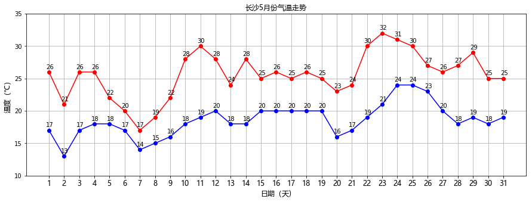

#### 3.4.2 实现

```python
# 数据准备
day = range(1, 32)
highest = [26,21,26,26,22,20,17,19,22,28,30,28,24,28,25,26,25,26,25,23,24,30,32,31,30,27,26,27,29,25,25]
lowest =  [17,13,17,18,18,17,14,15,16,18,19,20,18,18,20,20,20,20,20,16,17,19,21,24,24,23,20,18,19,18,19]


plt.figure(figsize=(15,5))
plt.plot(day,highest,'ro-')
plt.plot(day,lowest,'bo-')

# 设置标题和轴标签
font = font_manager.FontProperties(fname=r"C:\Windows\Fonts\msyh.ttc")
plt.xlabel('日期（天）',fontproperties=font)
plt.ylabel('温度（℃）',fontproperties=font)
plt.title("长沙5月份气温走势",fontproperties=font)

# 设置刻度
plt.xticks(day)

# 添加注释
for index,value in enumerate(highest):
    plt.annotate('%s'%value,xy=(index+1,value),xytext=(index+1-0.2,value+0.5))

for index,value in enumerate(lowest):
    plt.annotate('%s'%value,xy=(index+1,value),xytext=(index+1-0.2,value+0.5))
      
plt.grid()
plt.show()
```


-----------

## 04.条形图

条形图的绘制方式跟折线图非常的类似，只不过是换成了`plt.bar`方法。`plt.bar`方法有以下常用参数：

1. `x`：一个数组或者列表，代表需要绘制的条形图的x轴的坐标点。
2. `height`：一个数组或者列表，代表需要绘制的条形图y轴的坐标点。
3. `width`：每一个条形图的宽度，默认是0.8的宽度。
4. `bottom`：`y`轴的基线，默认是0，也就是距离底部为0.
5. `align`：对齐方式，默认是`center`，也就是跟指定的`x`坐标居中对齐，还有为`edge`，靠边对齐，具体靠右边还是靠左边，看`width`的正负。
6. `color`：条形图的颜色。

返回值为`BarContainer`，是一个存储了条形图的容器，而条形图实际上的类型是`matplotlib.patches.Rectangle`对象。

更多参考：https://matplotlib.org/api/_as_gen/matplotlib.pyplot.bar.html#matplotlib.pyplot.bar

### 4.1 条形图的绘制

比如现在有`2019`年贺岁片票房的数据（数据来源：https://piaofang.maoyan.com/dashboard）：

```python
#票房（单位：亿元）
movies = {
    "流浪地球":40.78,
    "飞驰人生":15.77,
    "疯狂的外星人":20.83,
    "新喜剧之王":6.10,
    "廉政风云":1.10,
    "神探蒲松龄":1.49,
    "小猪佩奇过大年":1.22,
    "熊出没·原始时代":6.71
}
```

用条形图绘制每部电影及其票房的代码如下：

```python
from matplotlib import font_manager
font = font_manager.FontProperties(fname=r"C:\\Windows\\Fonts\\msyh.ttc",size=20)

# =================数据准备===================
x = list(movies.keys())
y = list(movies.values())
plt.figure(figsize=(15,5))

# =================开始绘制===================
# 方式一；直接传入列表
# plt.bar(x,y,width=0.5,color='red',edgecolor='green')

# 方式二：传入DataFrame对象或者字典
movies_df = pd.DataFrame(data={"names":list(movies.keys()),"tickets":list(movies.values())})
plt.bar("names", "tickets",data=movies_df)

# =================设置刻度=================
plt.xticks(fontproperties=font,size=12)
plt.yticks(range(0, 45, 5),['%d亿'%tickets for tickets in range(0, 45, 5)],fontproperties=font,size=12)
plt.show()
```

效果图如下：

其中`xticks`和`yticks`的用法跟之前的折线图一样。注意可以用size参数直接指定字体大小。

这里新出现的方法是`matplotlib.pyplot.bar(x, height, width=0.8, bottom=None, *, align='center', data=None, **kwargs)`，几个参数的含义如下：

* x：X轴的坐标点
* height：条形的高度
* width：条形的宽度
* bottom：底部起始值，后期画堆叠条形图时会用到
* align：对齐方式，共两个选项{'center', 'edge'}, default: 'center' 
* data：传入的数据

欲知更多细节，请见：[官方文档-plt.bar()](https://matplotlib.org/api/_as_gen/matplotlib.pyplot.bar.html?highlight=bar#matplotlib.pyplot.bar)。

### 4.2 横向条形图

横向条形图需要使用`plt.barh()`（[官方文档-plt.barh()](https://matplotlib.org/api/_as_gen/matplotlib.pyplot.barh.html?highlight=barh#matplotlib.pyplot.barh)）。这个方法跟`bar`非常的类似，只不过把方向进行旋转。参数跟`bar`类似，但也有区别。如下：

1. `y`：数组或列表，代表需要绘制的条形图在`y`轴上的坐标点。
2. `width`：数组或列表，代表需要绘制的条形图在`x`轴上的值（也就是长度）。
3. `height`：条形图的高度，默认是0.8。
4. `left`：条形图的基线，也就是距离y轴的距离。
5. 其他参数跟`bar`一样。

返回值也是`BarContainer`容器对象。

还是以以上数据为例，将电影名和票房反转一下。示例代码如下：

```python
movies = {
    "流浪地球":40.78,
    "飞驰人生":15.77,
    "疯狂的外星人":20.83,
    "新喜剧之王":6.10,
    "廉政风云":1.10,
    "神探蒲松龄":1.49,
    "小猪佩奇过大年":1.22,
    "熊出没·原始时代":6.71
}
plt.barh(np.arange(len(movies)),list(movies.values()))
plt.yticks(np.arange(len(movies)),list(movies.keys()),fontproperties=font)
plt.grid()
```

效果图如下：
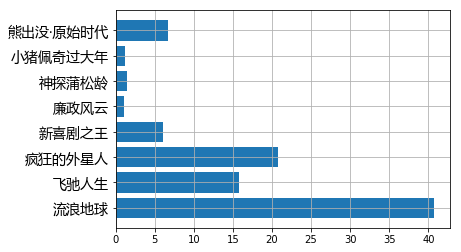

### 4.3 分组条形图

现在有一组数据，是2019年春节贺岁片前五天的电影票房记录。
示例代码如下：

```python
movies = {
    "流浪地球":[2.01,4.59,7.99,11.83,16],
    "飞驰人生":[3.19,5.08,6.73,8.10,9.35],
    "疯狂的外星人":[4.07,6.92,9.30,11.29,13.03],
    "新喜剧之王":[2.72,3.79,4.45,4.83,5.11],
    "廉政风云":[0.56,0.74,0.83,0.88,0.92],
    "神探蒲松龄":[0.66,0.95,1.10,1.17,1.23],
    "小猪佩奇过大年":[0.58,0.81,0.94,1.01,1.07],
    "熊出没·原始时代":[1.13,1.96,2.73,3.42,4.05]
}
plt.figure(figsize=(20,8))
width = 0.75
bin_width = width/5
movie_pd = pd.DataFrame(movies)
ind = np.arange(0,len(movies))

# 第一种方案
# first_day = movie_pd.iloc[0]
# plt.bar(ind-bin_width*2,first_day,width=bin_width,label='第一天')

# second_day = movie_pd.iloc[1]
# plt.bar(ind-bin_width,second_day,width=bin_width,label='第二天')

# third_day = movie_pd.iloc[2]
# plt.bar(ind,third_day,width=bin_width,label='第三天')

# four_day = movie_pd.iloc[3]
# plt.bar(ind+bin_width,four_day,width=bin_width,label='第四天')

# five_day = movie_pd.iloc[4]
# plt.bar(ind+bin_width*2,five_day,width=bin_width,label='第五天')

# 第二种方案
for index in movie_pd.index:
    day_tickets = movie_pd.iloc[index]
    xs = ind-(bin_width*(2-index))
    plt.bar(xs,day_tickets,width=bin_width,label="第%d天"%(index+1))
    for ticket,x in zip(day_tickets,xs):
        plt.annotate(ticket,xy=(x,ticket),xytext=(x-0.1,ticket+0.1))

# 设置图例
plt.legend(prop=font)  # 注意：legend()函数没有fontproperties属性，也没有size属性
plt.ylabel("单位：亿",fontproperties=font)
plt.title("春节前5天电影票房记录",fontproperties=font)
# 设置x轴的坐标
plt.xticks(ind,movie_pd.columns,fontproperties=font)
plt.xlim
plt.grid(True)
plt.show()
```

示例图如下：
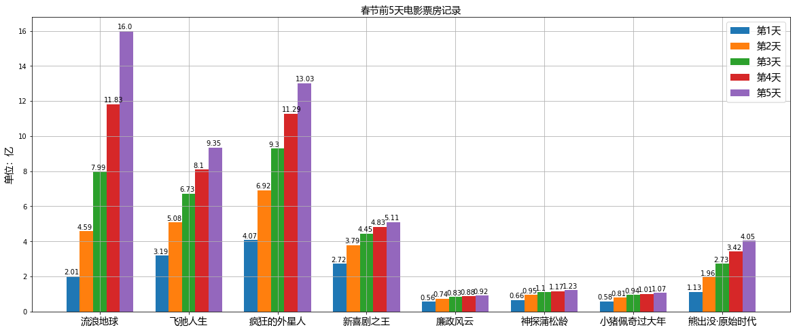

### 4.4 堆叠条形图

堆叠条形图，是将一组相关的条形图堆叠在一起进行比较的条形图。比如以下案例：

```python
menMeans = (20, 35, 30, 35, 27)
womenMeans = (25, 32, 34, 20, 25)
groupNames = ('G1','G2','G3','G4','G5')
xs = np.arange(len(menMeans))
plt.bar(xs,menMeans,label='男性得分')
plt.bar(xs,womenMeans,bottom=menMeans,label='女性得分')
plt.xticks(xs,groupNames)
plt.legend(prop=font)
plt.show()
```

效果图如下：
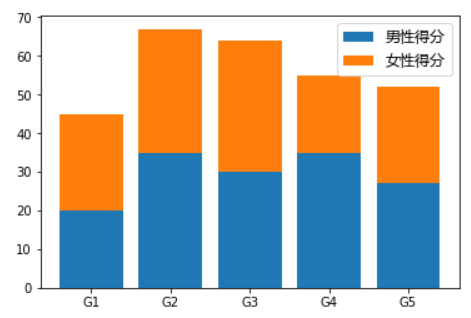
在绘制女性得分的条形图的时候，因为要堆叠在男性得分的条形图上，所以使用到了一个`bottom`参数，就是距离`x`轴的距离。通过对贴条形图，我们就可以清楚的知道，哪一个队伍的综合排名是最高的，并且在每个队伍中男女的得分情况。

### 4.5 条形图应用场景

1. 数量统计。
2. 频率统计。

### 4.6 作业练习

#### 4.6.1 题目要求

**要求**

1. 以下数据是三类学校（普通本科、中等职业教育、普通高中）在2014-2018（包含2018）的报名人数，用DataFrame构建。
2. 把年份当做x轴，报名人数当做y轴的值。
3. 绘制分组条形图，同一个年份的放在一个组。
4. 图例横向排列（提示：用legend的ncol参数，ncol表示的是把图例分成多少列显示）。
5. 把报名人数在图上绘制出来。

**数据：**

```python
data = {
    "普通本科":[721,738,749,761,791],
    "中等职业教育": [620,601,593,582,557],
    "普通高中": [797,797,803,800,793]
}
```

**效果图参考：**
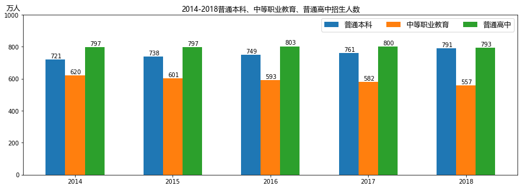

#### 4.6.2 参考答案

```python
bar_width=0.25
# x轴刻度
xticks_pos=np.arange(len(df.index))
xticks=range(2014,2019)
# 设置图的大小
plt.figure(figsize=(15,5))

# 循环列，按年份绘制条形图
for index,name in enumerate(df.columns):
    x_pos = xticks_pos+(index-1)*bar_width
    plt.bar(x_pos,df[name],width=bar_width,label=name)
    for x,y in zip(x_pos,df[name]):
        plt.annotate('%d'%y,xy=(x,y),xytext=(x-0.08,y+20),fontproperties=font)


# 设置图例
font.set_size(12)
plt.legend(prop=font,ncol=3,loc='upper right')
# 设置刻度
plt.xticks(xticks_pos,xticks)
plt.ylim(top=1000) # 这句话等价于下面的一句
# plt.yticks(range(0,1200,200),range(0,1200,200))
# 设置标题
plt.title("2014-2018普通本科、中等职业教育、普通高中招生人数",fontproperties=font)
plt.ylabel('万人',fontproperties=font,rotation='horizontal')
# 通过set_label_coords才能灵活设置ylabel的位置。以下代码可选实现（不懂删掉没有任何关系）
plt.gca().yaxis.set_label_coords(-0.02,1.02) 
plt.show()
```

==TODO==

根据4.3和4.6两节的案例，将绘制分组条形图封装成一个可以直接调用的函数~


## 05.直方图

直方图(Histogram)，又称质量分布图，是一种统计报告图，由一系列高度不等的条纹表示数据分布的情况。一般用横轴表示数据类型，纵轴表示分布情况。
直方图是数值数据分布的精确图形表示。为了构建直方图，第一步是将值的范围**分段**，即将整个值的范围分成一系列间隔，然后计算每个间隔中有多少值。这些值通常被指定为连续的，不重叠的变量间隔。间隔必须相邻，并且通常是（但不是必须的）相等的大小。

### 5.1 绘制直方图

直方图的绘制方法，使用的是`plt.hist`方法来实现，这个方法的参数以及返回值如下：

**参数：**

1. `x`：数组或者可以循环的序列。直方图将会从这组数据中进行分组。
2. `bins`：数字或者序列（数组/列表等）。如果是数字，代表的是要分成多少组。如果是序列，那么就会按照序列中指定的值进行分组。比如`[1,2,3,4]`，那么分组的时候会按照三个区间分成3组，分别是`[1,2)/[2,3)/[3,4]`。
3. `range`：元组或者None，如果为元组，那么指定`x`划分区间的最大值和最小值。如果`bins`是一个序列，那么`range`没有有没有设置没有任何影响。
4. `density`：默认是`False`，如果等于`True`，那么将会使用频率分布直方图。每个条形表示的不是个数，而是`频率/组距`（落在各组样本数据的个数称为频数，频数除以样本总个数为频率）。
5. `cumulative`：如果这个和`density`都等于`True`，那么返回值的第一个参数会不断的累加，最终等于`1`。
6. 其他参数：请参考：[官方文档-plt.hist()](https://matplotlib.org/api/_as_gen/matplotlib.pyplot.hist.html?highlight=hist#matplotlib.pyplot.hist)。

**返回值：**

1. `n`：数组。每个区间内值出现的个数，如果`density=True`，那么这个将返回的是`频率/组距`。
2. `bins`：数组。区间的值。
   * len(bins)=len(n)+1
   * 常用该返回值通过`plt.xticks()`修改坐标轴刻度。
3. `patches`：数组。每根条的对象，类型是`matplotlib.patches.Rectangle`。

### 5.2 案例

比如有一组电影票房时长，想要看下这组票房时长的数据，那么可以通过以下代码来实现：

```python
durations = [131,  98, 125, 131, 124, 139, 131, 117, 128, 108, 135, 138, 131, 102, 107, 114, 119, 128, 121, 142, 127, 130, 124, 101, 110, 116, 117, 110, 128, 128, 115,  99, 136, 126, 134,  95, 138, 117, 111,78, 132, 124, 113, 150, 110, 117,  86,  95, 144, 105, 126, 130,126, 130, 126, 116, 123, 106, 112, 138, 123,  86, 101,  99, 136,123, 117, 119, 105, 137, 123, 128, 125, 104, 109, 134, 125, 127,105, 120, 107, 129, 116, 108, 132, 103, 136, 118, 102, 120, 114,105, 115, 132, 145, 119, 121, 112, 139, 125, 138, 109, 132, 134,156, 106, 117, 127, 144, 139, 139, 119, 140,  83, 110, 102,123,107, 143, 115, 136, 118, 139, 123, 112, 118, 125, 109, 119, 133,112, 114, 122, 109, 106, 123, 116, 131, 127, 115, 118, 112, 135,115, 146, 137, 116, 103, 144,  83, 123, 111, 110, 111, 100, 154,136, 100, 118, 119, 133, 134, 106, 129, 126, 110, 111, 109, 141,120, 117, 106, 149, 122, 122, 110, 118, 127, 121, 114, 125, 126,114, 140, 103, 130, 141, 117, 106, 114, 121, 114, 133, 137,  92,121, 112, 146,  97, 137, 105,  98, 117, 112,  81,  97, 139, 113,134, 106, 144, 110, 137, 137, 111, 104, 117, 100, 111, 101, 110,105, 129, 137, 112, 120, 113, 133, 112,  83,  94, 146, 133, 101,131, 116, 111,  84, 137, 115, 122, 106, 144, 109, 123, 116, 111,111, 133, 150]
plt.figure(figsize=(15,5))
nums,bins,patches = plt.hist(durations,bins=20,edgecolor='k')
plt.xticks(bins,bins)
for num,bin in zip(nums,bins):
    plt.annotate(num,xy=(bin,num),xytext=(bin+1.5,num+0.5))
plt.show()
```

效果图如下：


另外，也可以通过`density=True`，来实现频率分布直方图。示例代码如下：

```python
nums,bins,patches = plt.hist(durations,bins=20,edgecolor='k',density=True)
plt.xticks(bins,bins)
for num,bin in zip(nums,bins):
    plt.annotate("%.4f"%num,xy=(bin,num),xytext=(bin+0.2,num+0.0005))
```

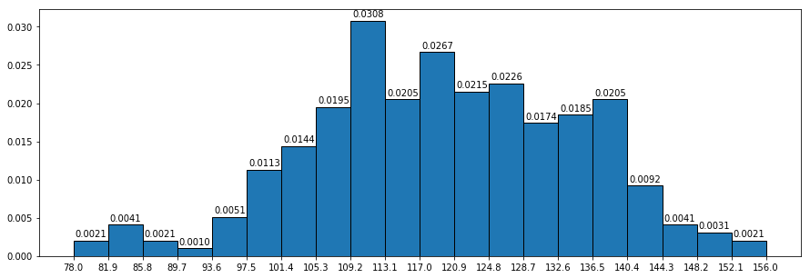

而如果想要让`nums`的总和为`1`，那么就需要设置`cumulative=True`参数，示例代码如下：

```python
nums,bins,patches = plt.hist(durations,bins=20,edgecolor='k',density=True,cumulative=True)
plt.xticks(bins,bins)
for num,bin in zip(nums,bins):
    plt.annotate("%.4f"%num,xy=(bin,num),xytext=(bin+0.2,num+0.0005))
```


### 5.3 直方图的应用场景

1. 显示各组数据数量分布的情况。
2. 用于观察异常或孤立数据。
3. 抽取的样本数量过小，将会产生较大误差，可信度低，也就失去了统计的意义。因此，样本数不应少于50个。


### 5.4 作业练习

#### 5.4.1 题目

**要求**

1. 用pandas从scores.csv（该文件在与此md文件统计目录下的【练习题数据】文件夹中）读取出来，形成一个DataFrame对象。
2. 绘制化学成绩的直方图（chem列）。
3. 标记x轴的坐标。
4. 标记每个条形上的具体数值。

**数据：**
在`matplotlib代码->作业参考`文件夹的`scores.csv`文件中。

**效果图参考：**
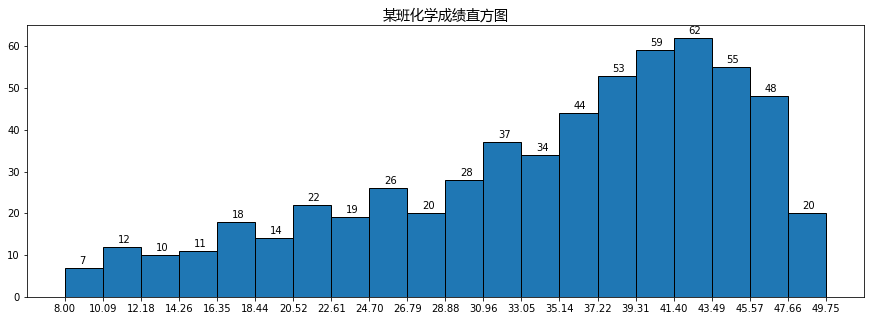


#### 5.4.2 参考答案

```python
import matplotlib.pyplot as plt
import numpy as np
import pandas as pd
from matplotlib import font_manager
font = font_manager.FontProperties(fname=r'C:\Windows\Fonts\msyh.ttc')

# 读成绩
scores = pd.read_csv('scores.csv')
chem = scores['chem']
chem_score = chem.values
# 调画布
plt.figure(figsize=(15,5))
# 绘图
nums,bins,_ = plt.hist(chem_score,20,edgecolor='k')
# 加注释
for score,pos in zip(nums,bins[0:-1]):
    plt.annotate(score,xy=(pos,score),xytext=(pos+0.5,score+1))
# 调刻度
plt.xticks(bins,['%.2f'%x for x in bins])
# 写标题
plt.title('某班化学成绩直方图',fontproperties=font,size=20)
plt.show()
```


-----

## 06.散点图

散点图也叫 X-Y 图，它将所有的数据以点的形式展现在直角坐标系上，以显示变量之间的相互影响程度，点的位置由变量的数值决定。

散点图的基本构成要素如下：


通过观察散点图上数据点的分布情况，我们可以推断出变量间的相关性。如果变量之间不存在相互关系，那么在散点图上就会表现为随机分布的离散的点，如果存在某种相关性，那么大部分的数据点就会相对密集并以某种趋势呈现。数据的相关关系主要分为：正相关（两个变量值同时增长）、负相关（一个变量值增加另一个变量值下降）、不相关、线性相关、指数相关等，表现在散点图上的大致分布如下图所示。那些离点集群较远的点我们称为离群点或者异常点。


示例图如下：


### 6.1 绘制散点图

散点图的绘制，使用的是`plt.scatter`方法，这个方法有以下参数：

1. `x,y`：分别是x轴和y轴的数据集。两者的数据长度必须一致。
2. `s`：点的尺寸。如果是一个具体的数字，那么散点图的所有点都是一样大小，如果是一个序列，那么这个序列的长度应该和x轴数据量一致，序列中的每个元素代表每个点的尺寸。**该参数可用来显示第三个维度的信息**。
3. `c`：点的颜色。可以为具体的颜色，也可以为一个序列或者是一个`cmap`对象。**该参数亦可用来显示第三个维度的信息**。
4. `marker`：标记点，默认是圆点，也可以换成其他的。**该参数亦可用来显示第三个维度的信息**。
5. 综上所述，对于一幅散点图，至少可以有5个观测维度。
6. 其他参数：https://matplotlib.org/api/_as_gen/matplotlib.pyplot.scatter.html#matplotlib.pyplot.scatter。

比如有一组运动员身高和体重以及年龄的数据“new_athlete.csv”（该文件位于与此md文件同级目录下的【练习题数据】文件夹中），那么可以通过以下代码来绘制散点图：

```python
# ==============数据处理部分==============
athletes = pd.read_csv('new_athlete.csv').dropna()

male_athletes = athletes[athletes['Sex'] == 'M']
female_athletes = athletes[athletes['Sex'] == 'F']
male_mean_height = male_athletes['Height'].mean()
female_mean_height = female_athletes['Height'].mean()
male_mean_weight = male_athletes['Weight'].mean()
female_mean_weight = female_athletes['Weight'].mean()

# =============数据可视化部分=============
# -----绘图-------
plt.figure(figsize=(10,5))
plt.scatter(male_athletes['Height'],male_athletes['Weight'],s=male_athletes['Age'],marker='^',color='g',label='男性',alpha=0.5)
plt.scatter(female_athletes['Height'],female_athletes['Weight'],color='r',alpha=0.5,s=female_athletes['Age'],label='女性')
plt.axvline(male_mean_height,color="g",linewidth=1)
plt.axhline(male_mean_weight,color="g",linewidth=1)
plt.axvline(female_mean_height,color="r",linewidth=1)
plt.axhline(female_mean_weight,color="r",linewidth=1)
# ----显示调整-----
plt.xticks(np.arange(140,220,5))
plt.yticks(np.arange(30,150,10))
plt.legend(prop=font)
plt.xlabel("身高（cm）",fontproperties=font)
plt.ylabel("体重（kg）",fontproperties=font)
plt.title("运动员身高和体重散点图",fontproperties=font)
plt.grid()
plt.show()
```

效果图如下：
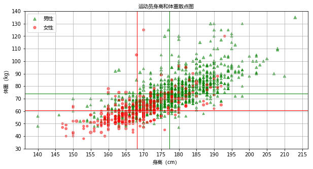

### 6.2 绘制回归曲线

有一组数据后，我们可以对这组数据进行回归分析，回归分析可以帮助我们了解这组数据的大体走向。回归分析按照涉及的变量的多少，分为一元回归和多元回归分析；按照自变量的多少，可分为简单回归分析和多重回归分析；按照自变量和因变量之间的关系类型，可分为线性回归分析和非线性回归分析。如果在回归分析中，只包括一个自变量和一个因变量，且二者的关系可用一条直线近似表示，这种回归分析称为一元线性回归分析。如果回归分析中包括两个或两个以上的自变量，且自变量之间存在线性相关，则称为多重线性回归分析。

| 自变量数量 | 是否线性 | 回归类型       |
| ---------- | -------- | -------------- |
| 1个        | 是       | 一元线性回归   |
| 多个       | 是       | 多元线性回归   |
| 1个        | 否       | 一元非线性回归 |
| 多个       | 否       | 多元非线性回归 |

通过以上运动员散点图的分析，我们总体上可以看出来是满足线性回归的，因此可以在图上绘制一个线性回归的线条。想要绘制线性回归的线条，需要先按照之前的数据计算出线性方程，假如`x`是自变量，`y`是因变量，那么线性回归的方程可以用以下几个来表示：

```
y = 截距+斜率*x+误差
```

只要把这个方程计算出来了，那么后续我们就可以根据`x`的值，大概的估计出`y`的取值范围，也就是预测。如果我们针对以上运动员的身高和体重的关系，只要有身高，那么就可以大概的估计出体重的值。回归方程的绘制我们需要借助`scikit-learn`库，这个库是专门做机器学习用的，我们需要使用里面的线性回归类`sklearn.liear_regression.LinearRegression`。示例代码如下：

```python
from sklearn.linear_model import LinearRegression

male_athletes = athletes[athletes['Sex'] == 'M']
female_athletes = athletes[athletes['Sex'] == 'F']
xtrain = male_athletes['Height']
ytrain = male_athletes['Weight']
# 生成线性回归对象
model = LinearRegression()
# 喂养训练数据，但是需要把因变量转换成1列多行的数据
model.fit(xtrain[:,np.newaxis],ytrain)
# 打印斜率
print(model.coef_)
# 打印截距
print(model.intercept_)
# 根据回归方程和x轴数据进行预测，绘制预测曲线
line_xticks = xtrain
line_yticks = model.predict(xtrain[:,np.newaxis])
plt.plot(line_xticks, line_yticks)
```

效果图如下：
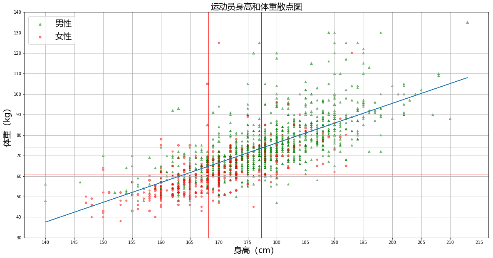

### 6.3 作业练习

#### 6.3.1 题目

**(1)数据**

* guazi_bj.csv
* guazi_gz.csv
* guazi_sh.csv
* guazi_sz.csv

（以上文件位于与此md文件同级目录下的【练习题数据】文件夹中）

**(2)要求**

1. 把guazi_bj（北京）、guazi_gz（广州）、guazi_sh（上海）、guazi_sz（深圳）二手车的数据归类在一个DataFrame中。
2. 新增车辆使用年份（use_year）与保值率（hedge_rate）两个字段。其中使用年份的计算是把当前的时间减去购买的时间，然后再转换成年；保值率的计算是将二手车的价格/新车的价格。
3. 把二手车使用年份与保值率（二手车价/新车价格）绘制成散点图，观察他们的分布情况。
4. 把二手车的行驶距离与保值率（二手车价/新车价格）绘制成散点图，观察他们的分布情况。

**(3)效果图**

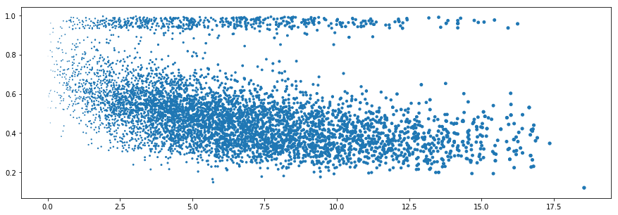

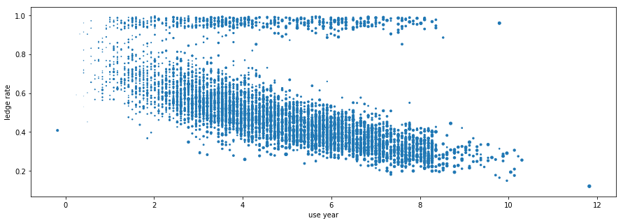

#### 6.3.2 参考答案

**(1)代码实现**

```python
# 导入相关库
import matplotlib.pyplot as plt
import numpy as np
import pandas as pd
from datetime import datetime

# ======================数据处理=========================
guazi_bj = pd.read_csv("guazi_bj.csv")
guazi_gz = pd.read_csv("guazi_gz.csv")
guazi_sh = pd.read_csv("guazi_sh.csv")
guazi_sz = pd.read_csv("guazi_sz.csv")
guazi = pd.concat([guazi_bj,guazi_gz,guazi_sh,guazi_sz],axis=0)


def get_use_year(value):
    if isinstance(value,str):
        datetime_value = datetime.strptime(value,"%Y-%m")
        now = datetime.now()
        yeardelay = (now - datetime_value).total_seconds()/60/60/24/365
        return yeardelay
    return np.NAN
guazi['use_year'] = guazi['buy_time'].apply(get_use_year)
guazi['hedge_rate'] = guazi['es_price'] / guazi['new_price']

# ======================数据可视化=========================
# -----绘制第一幅图---------
plt.figure(figsize=(15,5))
plt.scatter(guazi['km'],guazi['hedge_rate'],s=guazi['km'])
# -----绘制第二幅图---------
plt.figure(figsize=(15,5))
plt.scatter(guazi['use_year'],guazi['hedge_rate'],s=guazi['km'])
plt.xlabel("use year")
plt.ylabel("hedge rate")
```

**(2)观察结果**

1. 通过以上分析，我们可以看到汽车的保值率是随着使用年份和行驶公里数的增加呈现线性下降的。
2. 有一部分数据引起我们的注意，就是保值率大于0.9，并且使用年份和行驶公里数都比较大的数据，我们可以看出这类数据基本上可以算是异常数据了，因此以后在分析的时候就可以处理掉这部分数据了。

**(3)异常处理**

由上述代码便可得到上面的两幅参考图，但观察一下明显有一大堆异常值，可归为两大类：

* 使用年限不断增加，保值率却始终接近1
* 行车里程不断增加，保值率却始终接近1

对于这两类异常值，可用下面的操作将其筛选出来，进而进行删除等操作。

```python
# 筛选异常数据：使用年限大于3年但保值率在0.9以上的认定为异常数据
exception_by_useyear = guazi[(guazi['hedge_rate'] > 0.9) & (guazi['use_year'] > 3)][['new_price','es_price','use_year','km']]
# 筛选异常数据：里程大于6万公里但保值率在0.9以上的认定为异常数据
exception_by_km = guazi[(guazi['hedge_rate'] > 0.9) & (guazi['km'] > 6)][['new_price','es_price','use_year','km']]
```


## 07.饼图

### 7.1 绘制饼图

饼图是一个划分为几个扇形的圆形统计图表，用于描述量、频率或百分比之间的相对关系的。 在`matplotlib`中，可以通过`plt.pie`来实现，其中的参数如下：

1. `x`：饼图的比例序列。
2. `labels`：饼图上每个分块的名称文字。
3. `explode`：设置某几个分块是否要分离饼图。
4. `autopct`：设置比例文字的展示方式。比如保留几个小数等。
5. `shadow`：是否显示阴影。
6. `textprops`：文本的属性（颜色，大小等）。
7. 其他参数：https://matplotlib.org/api/_as_gen/matplotlib.pyplot.pie.html#matplotlib.pyplot.pie

**返回值：**

1. `patches`：饼图上每个分块的对象。
2. `texts`：分块的名字文本对象。
3. `autotexts`：分块的比例文字对象。

假如现在我们有一组数据，用来记录各个操作系统的市场份额的。那么用饼状图表示如下：

```python
oses = {
    'windows7':60.86,
    'windows10': 18.46,
    'windows8': 3.61,
    'windows xp': 10.3,
    'mac os': 6.78,
    '其他': 1.12
}
names = oses.keys()
percents = oses.values()
patches,texts,autotexts = plt.pie(percents,labels=names,autopct="%.2f%%",explode=(0,0.05,0,0,0,0),textprops={'fontproperties':font})
for text in texts+autotexts:
    # 如果上面没有用textprops参数指定字体，则可用下面的plt.setp()进行后期设置
    # plt.setp(text,fontproperties=font)
    text.set_fontsize(10)
for text in autotexts:
    text.set_color("white")
```

效果图如下：


### 7.2 作业练习

#### 7.2.1 题目

1. 把以下数据绘制成饼图。
2. 把Chrome浏览器的模块分割开0.05。
3. 设置阴影。
4. 把百分数的颜色设置成白色，把浏览器的名字颜色设置成黑色。
5. 把Edge和Safari浏览器的比例文字字体大小调成10，其他的12。

效果如下：

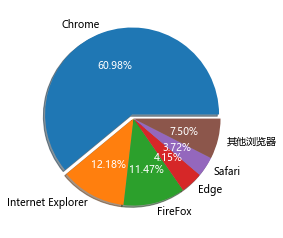

#### 7.2.2 参考答案

```python
from matplotlib import font_manager

font = font_manager.FontProperties(fname=r"C:\\Windows\\Fonts\\msyh.ttc",size=15)

explorer = {
    'Chrome':60.98,
    'Internet Explorer':12.18,
    'FireFox':11.47,
    'Edge':4.15,
    'Safari':3.72,
    '其他浏览器':7.50
}

_,_,autotexts = plt.pie(explorer.values(),autopct='%.2f%%',labels=explorer.keys(),
        explode=(0.05,0,0,0,0,0),textprops={'fontproperties':font},shadow=True)
for index,autotext in enumerate(autotexts):
    autotext.set_color('w')
    if index==3 or index==4:
        autotext.set_size(10)
    else:
        autotext.set_size(12)

plt.show()
```


## 08.箱线图
### 8.1 使用matplotlib绘制箱线图

在`matplotlib`中有`plt.boxplot`来绘制箱线图，这个方法的相关参数如下：

1. `x`：需要绘制的箱线图的数据。
2. `notch`：是否展示置信区间，默认是`False`。如果设置为`True`，那么就会在盒子上展示一个缺口。
3. `sym`：代表异常点的符号表示，默认是小圆点。
4. `vert`：是否是垂直的，默认是`True`，如果设置为`False`那么将水平方向展示。
5. `whis`：上下限的系数，默认是`1.5`，也就是上限是`Q3+1.5IQR`，可以改成其他的。也可以为一个序列，如果是序列，那么序列中的两个值分别代表的就是下限和上限的值，而不是再需要通过`IQR`来计算。
6. `positions`：设置每个盒子的位置。
7. `widths`：设置每个盒子的宽度。
8. `labels`：每个盒子的`label`。
9. `meanline`和`showmeans`：如果这两个都为`True`，那么将会绘制平均值的的线条。

示例代码如下：

```python
data = np.random.rand(100)*100
# 添加两个异常值
data = np.append(data,np.array([-100,100]))
plt.boxplot(data,meanline=True,showmeans=True)
```

效果图如下：
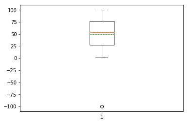

如果有多组数据绘制箱型图，才能更好的提现出箱型图的优势。
假如我们想要获取奥林匹克运动会上不同国家运动员的身高情况，那么可以把每个国家的运动员身高数据绘制成一个箱线图，然后进行对比。示例代码如下：

```python
athletes = pd.read_csv("athlete_events.csv")
# (中国CHN，日本JPN，韩国KOR)，（埃塞俄比亚ETH，肯尼亚KEN，尼日利亚NIG），(美国USA，加拿大CAN，巴西BRA)，(英国GBR，法国FRA，意大利ITA)
countries = {
    'CHN':'中国',
    'JPN':"日本",
    'KOR':'韩国',
    'USA':"美国",
    'CAN':"加拿大",
    'BRA':"巴西",
    'GBR':"英国",
    'FRA':"法国",
    'ITA':"意大利",
    'ETH':"埃塞俄比亚",
    'KEN':"肯尼亚",
    'NIG':"尼日利亚",
}
dfs = []
for code in countries.keys():
    df = athletes[(athletes['NOC'] == code)&(athletes['Age']>18)]['Height'].dropna()
    dfs.append(df)
font = font_manager.FontProperties(fname=r"C:\\Windows\\Fonts\\msyh.ttc",size=14)
plt.figure(figsize=(20,5))
plt.boxplot(dfs,showmeans=True,meanline=True,labels=countries.values())
plt.xticks(range(1,13),countries.values(),fontproperties=font)
plt.ylabel("身高(cm)",fontproperties=font)
plt.title("奥林匹克运动员身高箱线图",fontproperties=font)
```

效果图如下：
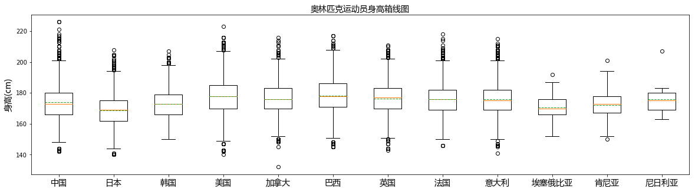

### 8.2 箱线图的应用场景

1. 直观明了地识别数据中的异常值。
2. 利用箱线图判断数据的偏态。
3. 利用箱线图比较几批数据的形状。
4. 箱线图适合比较多组数据，**如果只是要看一组数据的分布情况，建议使用直方图**。

### 8.3 作业练习

#### 8.3.1 题目

1. 读取scores.csv文件。
2. 把所有科目的成绩都在一张图上绘制箱线图。
3. 观察这个图，你能发现什么信息。

效果图：

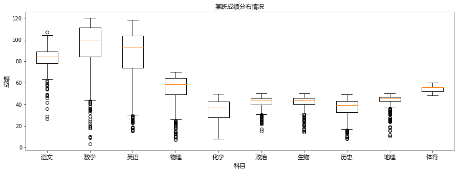

#### 8.3.2 参考答案

**代码**

```python
import matplotlib.pyplot as plt
import numpy as np
import pandas as pd
from matplotlib import font_manager

scores = pd.read_csv("scores.csv").drop(["num","class"],axis=1)

plt.figure(figsize=(15,5))
font = font_manager.FontProperties(fname=r"C:\\Windows\\Fonts\\msyh.ttc",size=12)
plt.boxplot([scores[column] for column in scores.columns])
plt.xticks(range(1,11),scores.columns)
plt.title("某班成绩分布情况",fontproperties=font)
plt.xticks(range(1,11),["语文","数学","英语","物理","化学","政治","生物","历史","地理","体育"],fontproperties=font)
plt.xlabel("科目",fontproperties=font)
plt.ylabel("成绩",fontproperties=font)
plt.show()
```

**结论**

1. 语文成绩盒子比较小，说明其中50%的同学分数相差都不大，但是有许多下限的异常值，说明考得不好的也估计占了20%左右，并且在上限有一个异常值，这个人考得特别好，关注下这个人，分析下他平时的上课表现。
2. 整体来说数学和英语的成绩是比较偏好的，但是也存在很多偏科的学生。
3. 还是数学和英语成绩，数学有75%以上的学生都是在80分以上，英语有75%以上的学生在70分以上，但是剩下的25%的学生的成绩就差别很大了，直接从几分70几分，还有大部分的异常值，说明数学这两个学科有部分人是偏科很厉害的。
4. PE课（体育课）成绩比较最集中，但是也不高，都是在60的边缘。出现这个问题，有可能是学生平时锻炼得少了，需要关注。
5. chem（化学）没有出现异常值，并且盒子的高度也不高，整体的分数也都不高，说明这个学科大家考得都不好，要么是试卷太难，要么就是真的没太多人学好了。
6. 等等


## 09.雷达图


雷达图（Radar Chart）又被叫做蜘蛛网图，适用于显示三个或更多的维度的变量的强弱情况。比如英雄联盟中某个影响的属性（法术伤害，物理防御等），或者是某个企业在哪些业务方面的投入等，都可以用雷达图方便的表示。

### 9.1 使用plt.polar绘制雷达图

在`matplotlib.pyplot`中，可以通过`plt.polar`来绘制雷达图，这个方法的参数跟`plt.plot`非常的类似，只不过是`x`轴的坐标点应该为弧度（2*PI=360°）。其实，**雷达图就是极坐标版的折线图**！

示例代码如下：

```python
properties = ['输出','KDA','发育','团战','生存']
values = [40,91,44,90,95,40]
theta = np.linspace(0,np.pi*2,6)
plt.polar(theta,values)
plt.xticks(theta,properties,fontproperties=font)
plt.fill(theta,values)
```

效果图如下：
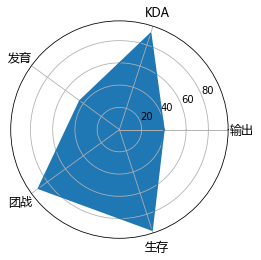

其中有几点需要注意：

1. 因为`polar`并不会完成线条的闭合绘制，所以我们在绘制的时候需要在`theta`中和`values`中在最后多重复添加第0个位置的值，然后在绘制的时候就可以和第1个点进行闭合了。
2. `polar`只是绘制线条，所以如果想要把里面进行颜色填充，那么需要调用`fill`函数来实现。
3. `polar`默认的圆圈的坐标是角度，如果我们想要改成文字显示，那么可以通过`xticks`来设置。

### 9.2 使用子图绘制雷达图

在多子图中，绘图对象不再是`pyplot`而是`Axes`，而`Axes`及其子类绘制雷达图则是通过将直角坐标转换成极坐标，然后再绘制折线图。示例代码如下：

1. 使用`plt.subplot`绘制的子图：

```python
properties = ['输出','KDA','发育','团战','生存']
values = [40,91,44,90,95,40]
theta = np.linspace(0,np.pi*2,6)
# 生成一个子图，并且指定子图的类型为polar
axes = plt.subplot(111,projection="polar")
axes.plot(theta,values)
axes.fill(theta,values)
```

2. 使用`plt.subplots`绘制的子图：

```python
properties = ['输出','KDA','发育','团战','生存']
values = [40,91,44,90,95,40]
theta = np.linspace(0,np.pi*2,6)
figure,axes = plt.subplots(1,1,subplot_kw={"projection":"polar"})
axes.plot(theta,values)
```

3. 使用`fig.add_subplot`绘制的子图：

```python
properties = ['输出','KDA','发育','团战','生存']
values = [40,91,44,90,95,40]
theta = np.linspace(0,np.pi*2,6)
fig = plt.figure(figsize=(10,10))
axes = fig.add_subplot(111,polar=True)  # 其实，plt.polar()底层便是调用了该方法
axes.plot(theta,values)
```

### 9.3 作业练习

#### 9.3.1 题目

**(1)要求**

1. 读取scores.csv文件成DataFrame对象。
2. 计算每个科目的平均成绩。
3. 将每个科目的平均成绩绘制成雷达图。

**(2)效果参考图**

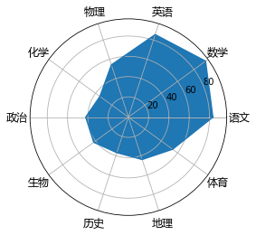

#### 9.3.2 参考答案

```python
import matplotlib.pyplot as plt
import numpy as np
import pandas as pd
from matplotlib import font_manager
font = font_manager.FontProperties(fname=r"C:\\Windows\\Fonts\\msyh.ttc",size=12)


scores = pd.read_csv("scores.csv").drop(['num','class'],axis=1)

theta = np.linspace(0,2*np.pi,11)
means = np.append(scores.mean().values,scores['chn'].mean())
plt.polar(theta,means)
plt.xticks(theta,['语文','数学','英语','物理','化学','政治','生物','历史','地理','体育'],fontproperties=font)
plt.fill(theta,means)
plt.show()
```


----------

## 10.matplotlib绘图分析(重要)


解释：

1. `Figure`：图形绘制的画板，他就相当于一个黑板，所有的图都是绘制在`Figure`上面。
2. `Axes`：每个图都是`Axes`对象。一个`Figure`上可以有多个`Axes`对象。
3. `Axis`：`x`轴、`y`轴的对象。
4. `Tick`：`x`轴和`y`轴上的刻度对象。每一个刻度都是一个`Tick`对象。
5. `TickLabel`：每个刻度上都要显示文字，这个文字的显示就是在`TickLabel`上。
6. `AxisLabel`：`x`轴和`y`轴的名称的文字显示。
7. `Legend`：图例对象。
8. `Title`：`Axes`图的标题对象。
9. `Line2D`：绘制在`Axes`上的线条对象，比如折线图等。
10. `Reactangle`：绘制在`Axes`上的矩形对象，比如条形图等。
11. `Marker`：标记点，比如绘制散点图上的每个点就是这个对象。
12. `Artist`：基类！只要是绘制在`Figure`上的元素（包括Figure），都是`Artist`的子类。

### 10.1 Figure容器

`Figure`容器是最顶层的容器，他几乎包含了这个图的所有对象。通过`add_subplot`和`add_axes`方法可以添加`Axes`对象，这两个方法添加的都是`Axes`及其子类的对象。添加完成后是存储在`figure.axes`中。示例代码如下：

```python
>>> fig = plt.figure()
>>> ax1 = fig.add_subplot(211)
>>> ax2 = fig.add_axes([0.1, 0.1, 0.7, 0.3])  # left,bottom,width,height
>>> ax1
<matplotlib.axes.Subplot instance at 0xd54b26c>

>>> print(fig.axes)
[<matplotlib.axes.Subplot instance at 0xd54b26c>, <matplotlib.axes.Axes instance at 0xd3f0b2c>]
```

#### 10.1.1 添加Axes对象

`Figure`只是一个黑板，如果想要绘图，需要先添加`Axes`。添加`Axes`可以通过`add_axes`和`add_subplot`来实现。示例代码如下：

```python
# 创建一个figure对象
fig = plt.figure()
# 添加一个Axes
ax1 = fig.add_subplot(211)
# 添加一个Axes，其中参数是left,bottom,width,height
ax2 = fig.add_axes([0.1,0.1,0.8,0.3])
```

#### 10.1.2 操作当前Axes对象

可以通过`figure.gca()`以及`figure.sca(axes)`来设置和获取当前的`axes`对象。

* gca：get current axes
* sca：set current axes

示例代码如下：

```python
>>> fig = plt.figure()
>>> ax1 = fig.add_subplot(211)
>>> ax2 = fig.add_axes([0,0,1,0.3])
>>> print(fig.gca())
>>> print(fig.sca(ax1))

Axes(0,0;1x0.3)
AxesSubplot(0.125,0.536818;0.775x0.343182)
```

#### 10.1.3 删除Axes对象

`Figure`上的所有`Axes`对象都是保存在`fig.axes`属性中，但是如果想要删除某个`Axes`对象，那么必须通过`delaxes`来实现：

```python
fig = plt.figure()
ax1 = fig.add_subplot(211)
ax2 = fig.add_axes([0,0,1,0.3])
fig.delaxes(ax1)
print(fig.axes)
```

#### 10.1.4 获取所有的axes

```python
for ax in fig.axes:
    ax.grid(True) # 设置打开网格
```

#### 10.1.5 `Figure`属性


`Figure`**类定义介绍：**https://matplotlib.org/api/_as_gen/matplotlib.figure.Figure.html#matplotlib.figure.Figure


### 10.2 Axes容器

`Axes`容器是用来创建具体的图形的。比如画曲线，柱状图，都是画在上面。所以之前我们学的使用`plt.xx`绘制各种图形（比如条形图，直方图，散点图等）都是对`Axes`的封装。比如`plt.plot()`对应的是`axes.plot()`，比如`plt.hist()`对应的是`axes.hist()`。针对图的所有操作，都可以在`Axes`上找到对应的`API`。另外后面要讲到的`Axis`容器，是轴的对象，也是绑定在`Axes`上面。
**Axes的类定义介绍：**https://matplotlib.org/api/axes_api.html#matplotlib.axes.Axes

#### 10.2.1 设置x和y轴的最大值和最小值

设置完刻度后，我们还可以设置x轴和y轴的最大值和最小值。可以通过`set_xlim/set_ylim`来实现：

```python
fig = plt.figure()  
axes = fig.add_subplot(111)  
axes.plot(np.random.randn(10))

# 设置x轴的最大值和最小值
axes.set_xlim(-2,12)

# 设置y轴的最大值和最小值
axes.set_ylim(-3,3)
```

#### 10.2.2 添加文本

之前添加文本我们用的是`annotate`，但是如果不是需要做注释，其实还有另外一种更加简单的方式，那就是使用`text`方法：

```python
data = np.random.randn(10)
fig = plt.figure()
axes = fig.add_subplot(111)
axes.plot(data)
# 添加文本，比annotate更加方便
axes.text(0,0,"hello")
```

#### 10.2.3. 绘制双`Y`轴

其原理是每个Axes对象都是透明的，所以只需让两个Axes对象共用一条X轴即可。

```python
fig = plt.figure()
ax1 = fig.add_subplot(211)
ax1.bar(np.arange(0,10,2),np.random.rand(5))
ax1.set_yticks(np.arange(0,1,0.25))
ax2 = ax1.twinx() #克隆一个共享x轴的axes对象
ax2.plot(np.random.randn(10),c="b")
plt.show()
```

效果图如下：
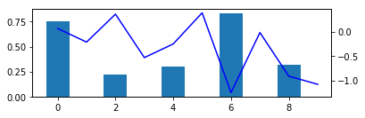


### 10.3 Axis容器

`Axis`代表的是`x`轴或者`y`轴的对象。包含`Tick`（刻度）对象，`TickLabel`刻度文本对象，以及`AxisLabel`坐标轴文本对象。`axis`对象有一些方法可以操作刻度和文本等。

#### 10.3.1 设置x轴和y轴label的位置

```python
fig = plt.figure()
axes = fig.add_subplot(111)
axes.plot(np.random.randn(10))
axes.set_xlabel("x coordate")
# 设置x轴label的位置为(0.-0.1)
axes.xaxis.set_label_coords(0,-0.1)
```

#### 10.3.2 设置刻度上的刻度格式

```python
import matplotlib.ticker as ticker
fig = plt.figure()
axes = fig.add_subplot(111)
axes.plot(np.random.randn(10))
axes.set_xlabel("x coordate")
# 创建格式化对象
formatter = ticker.FormatStrFormatter('%.2f')
# 设置格式化对象
axes.yaxis.set_major_formatter(formatter)
```

#### 10.3.3 设置轴的属性

```python
fig = plt.figure()

ax1 = fig.add_axes([0.1, 0.3, 0.4, 0.4])
ax1.set_facecolor('lightslategray')

# 设置刻度上文本的属性
for label in ax1.xaxis.get_ticklabels():
    # label是一个Label对象
    label.set_color('red')
    label.set_rotation(45)
    label.set_fontsize(16)

# 设置刻度上线条的属性
for line in ax1.yaxis.get_ticklines():
    # line是一个Line2D对象
    line.set_color('green')
    line.set_markersize(25)
    line.set_markeredgewidth(3)

plt.show()
```


### 10.4 Tick容器

`Tick`是用来做刻度的，包括刻度和网格对象。其中可操作的属性如下：

示例代码如下：

```python
import matplotlib.ticker as ticker

# Fixing random state for reproducibility
np.random.seed(19680801)

fig, ax = plt.subplots()
ax.plot(100*np.random.rand(20))

formatter = ticker.FormatStrFormatter('$%.2f')
ax.yaxis.set_major_formatter(formatter)

for tick in ax.yaxis.get_major_ticks():
    tick.label1On = False
    tick.label2On = True
    tick.label2.set_color('green')

plt.show()
```


更多请参考：
[https://matplotlib.org/api/axis_api.html#matplotlib.axis.Axis](https://matplotlib.org/api/axis_api.html#matplotlib.axis.Tick)

### 10.5 参考

Artist对象：https://matplotlib.org/tutorials/intermediate/artists.html

图形对象解剖图：https://matplotlib.org/gallery/showcase/anatomy.html


## 11.多图布局

### 11.1 解决元素重叠的问题

在一个`Figure`上面，可能存在多个`Axes`对象，如果`Figure`比较小，那么有可能会造成一些图形元素重叠，这时候我们就可以通过`fig.tight_layout`或者是`fig.subplots_adjust`方法来帮我们调整。假如现在没有经过调整，那么以下代码的效果图如下：

```python
import matplotlib.pyplot as plt
import numpy as np

def example_plot(ax, fontsize=12):
    ax.plot([1, 2])
    ax.set_xlabel('x-label', fontsize=fontsize)
    ax.set_ylabel('y-label', fontsize=fontsize)
    ax.set_title('Title', fontsize=fontsize)

fig,axes = plt.subplots(2,2)
fig.set_facecolor("y")
example_plot(axes[0,0])
example_plot(axes[0,1])
example_plot(axes[1,0])
example_plot(axes[1,1])
```

效果图如下：


为了避免多个图重叠，可以使用`plt.tight_layout`来实现：

```python
# 之前的代码...
plt.tight_layout()
```

效果图如下：
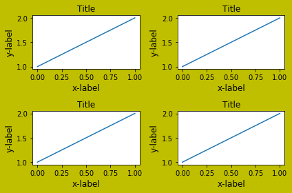

其中`tight_layout`还有两个参数可以使用，分别是`w_pad`和`h_pad`，这两个参数分别表示的意思是在水平方向的图之间的间距，以及在垂直方向这些图的间距。

另外也可以通过`fig.subplots_adjust(left=None,bottom=None,right=None,top=None,wspace=None,hspace=None)`来实现，效果如下：

```python
# 之前的代码...
fig.subplots_adjust(0,0,1,1,hspace=0.5,wspace=0.5)
```

效果图如下： 

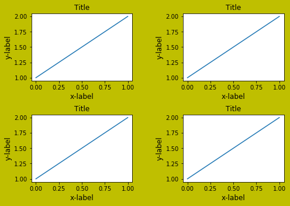

### 10.2 自定义布局方式

如果布局不是固定的几宫格的方式，而是某个图占据了多行或者多列，那么就需要采用一些手段来实现。如果不是很复杂，那么直接可以通过`subplot`等方法来实现。示例代码如下：

```python
ax1 = plt.subplot(221)
ax2 = plt.subplot(223)
ax3 = plt.subplot(122)
```

效果图如下：


但是如果实现的布局比较复杂，那么就需要采用`GridSpec`对象来实现。示例代码如下：

```python
fig = plt.figure()
# 创建3行3列的GridSpec对象
gs = fig.add_gridspec(3,3)
ax1 = fig.add_subplot(gs[0,0:3])
ax1.set_title("[0,0:3]")
ax2 = fig.add_subplot(gs[1,0:2])
ax2.set_title("[1,0:2]")
ax3 = fig.add_subplot(gs[1:3,2])
ax3.set_title("[1:3,2]")
ax4 = fig.add_subplot(gs[2,0])
ax4.set_title("[2,0]")
ax5 = fig.add_subplot(gs[2,1])
ax5.set_title("[2,1]")
plt.tight_layout()
```

效果图如下：


也可以设置宽高比例。示例代码如下：

```python
# 设置宽度比例为1:2:1
widths = (1,2,1)
# 设置高度比例为2:2:1
heights = (2,2,1)
fig = plt.figure()
# 创建GridSpec对象的时候指定宽高的比
gs = fig.add_gridspec(3,3,width_ratios=widths,height_ratios=heights)
for row in range(0,3):
    for col in range(0,3):
        fig.add_subplot(gs[row,col])
plt.tight_layout()
```

效果图如下：


### 10.3 手动设置位置

通过`fig.add_axes()`的方式添加`Axes`对象，可以直接指定位置。也可以在添加完成后，通过`axes.set_position()`的方式设置位置。示例代码如下：

```python
# add_axes的方式
fig = plt.figure()
fig.add_subplot(111)
fig.add_axes([0.2,0.2,0.4,0.4])

# 设置position的方式
fig,axes = plt.subplots(1,2)
axes[1].set_position([0.2,0.2,0.4,0.4])
```

效果图如下：

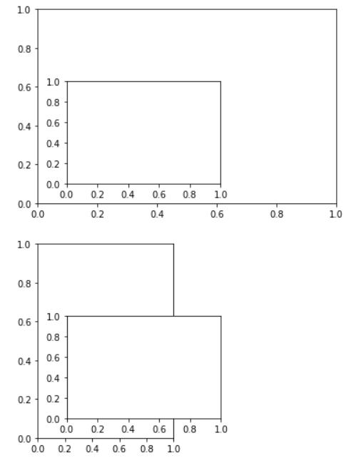


### 10.4 散点图和直方图合并实战

官方参考案例：https://matplotlib.org/gallery/lines_bars_and_markers/scatter_hist.html

PS下面程序用到的数据文件“athlete_events.csv”在与此md文件同级目录下的【练习题数据】文件夹下。

```python
athletes = pd.read_csv("athlete_events.csv")[:4000]
male_athletes = athletes[athletes['Sex'] == 'M'][['Height','Weight']]

fig = plt.figure(figsize=(8,8))
widths = (2,0.5)
heights = (0.5,2)
gs = fig.add_gridspec(2,2,width_ratios=widths,height_ratios=heights)
# 顶部的直方图
ax1 = fig.add_subplot(gs[0,0])
ax1.hist(male_athletes['Height'],bins=20)
for tick in ax1.xaxis.get_major_ticks():
    tick.label1On  False

# 中间的散点图
ax2 = fig.add_subplot(gs[1,0])
ax2.scatter('Height','Weight',data=male_athletes)

# 右边的直方图
ax3 = fig.add_subplot(gs[1,1])
ax3.hist(male_athletes['Weight'],bins=20,orientation='horizontal')
for tick in ax3.yaxis.get_major_ticks():
    tick.label1On = False
fig.tight_layout(h_pad=0,w_pad=0)
```

效果图如下： 


## 12.matplotlib配置

### 12.1 修改默认的配置

修改默认的配置可以通过`matplotlib.rcParams`来设置，比如修改字体，修改线条大小和宽度等。示例代码如下：

```python
import matplotlib.pyplot as plt
# 设置字体为仿宋
plt.rcParams['font.sans-serif'] = ['FangSong']
# 设置字体大小为20
plt.rcParams['font.size'] = 20
# 设置线条宽度
plt.rcParams['lines.linewidth'] = 2
# 设置线条颜色
plt.rcParams['axes.prop_cycle'] = plt.cycler('color', ['r', 'y'])
```

其中`rcParams`中可以设置的属性为如下：

在`Windows`上如果想要显示中文，那么可以通过设置`font.sans-serif`来设置，示例代码如下：

```python
plt.rcParams['font.sans-serif'] = ['FangSong']
```

这个属性可以设置以下字体都可以显示中文：

| 字体名   | 英文名称    |
| -------- | ----------- |
| 黑体     | SimHei      |
| 仿宋     | FangSong    |
| 楷体     | KaiTi       |
| 宋体     | SimSun      |
| 隶书     | LiSu        |
| 幼圆     | YouYuan     |
| 华文细黑 | STXihei     |
| 华文楷体 | STKaiti     |
| 华文宋体 | STSong      |
| 华文中宋 | STZhongsong |
| 华文仿宋 | STFangsong  |
| 方正舒体 | FZShuTi     |
| 方正姚体 | FZYaoti     |
| 华文彩云 | STCaiyun    |
| 华文琥珀 | STHupo      |
| 华文隶书 | STLiti      |
| 华文行楷 | STXingkai   |
| 华文新魏 | STXinwei    |

`Mac`和`Linux`支持的字体可能会不同，如果不行，可以使用`matplotlib.font_manager`来指定具体的字体。

### 12.2 自定义配置文件

有时候我们可能需要设置一大堆参数，并且这个配置在后面很多项目中可能都会用到，那么这时候我们就可以把这些配置信息放到文件中（可配置项见下），文件的命名规则为`[名称].mplstyle`，然后把这个文件放到`matplotlib.get_configdir()/stylelib`的目录中，在写代码的时候根据名称加载这个配置文件，示例代码如下：

```python
plt.style.use("名称")
```

### 12.3 可配置项

更多可配置项请参考：https://raw.githubusercontent.com/matplotlib/matplotlib/master/matplotlibrc.template